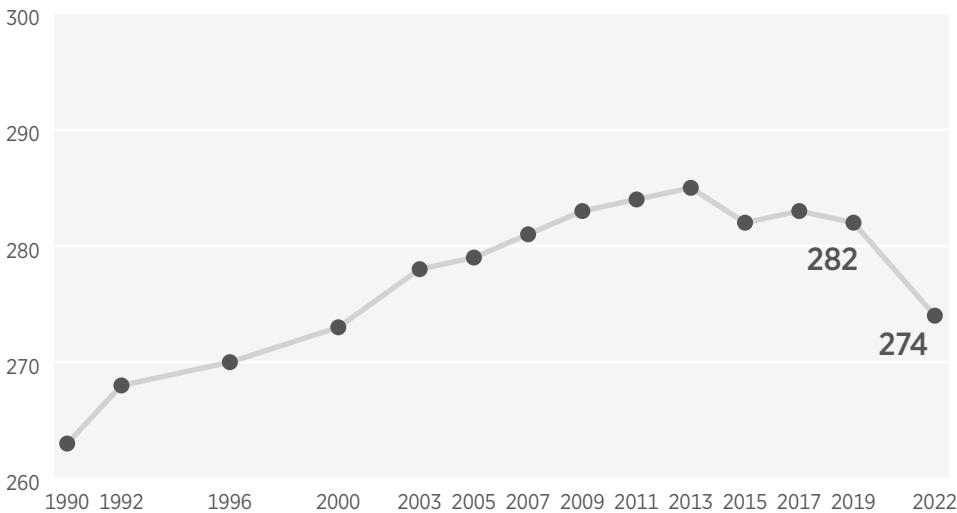

# 11: DEPARTMENT OF EDUCATION

## 11.1: MISSION

Federal education policy should be limited and, ultimately, the federal Department of Education should be eliminated. When power is exercised, it should empower students and families, not government. In our pluralistic society, families and students should be free to choose from a diverse set of school options and learning environments that best fit their needs. Our post-secondary institutions should also reflect such diversity, with room for not only "traditional" liberal arts colleges and research universities but also faith-based institutions, career schools, military academies, and lifelong learning programs.

Elementary and secondary education policy should follow the path outlined by Milton Friedman in 1955, wherein education is publicly funded but education decisions are made by families. Ultimately, every parent should have the option to direct his or her child's share of education funding through an education savings account (ESA), funded overwhelmingly by state and local taxpayers, which would empower parents to choose a set of education options that meet their child's unique needs.

States are eager to lead in K–12 education. For decades, they have acted independently of the federal government to pioneer a variety of constructive reforms and school choice programs. For example, in 2011, Arizona first piloted ESAs, which provide families roughly 90 percent of what the state would have spent on that child in public school to be used instead on education options such as private school tuition, online courses, and tutoring. In 2022, Arizona expanded the program to be available to all families.

The future of education freedom and reform in the states is bright and will shine brighter when regulations and red tape from Washington are eliminated. Federal money is inevitably accompanied by rules and regulations that keep the influx of funds from having much, if any, impact on student outcomes. It raises the cost of education without raising student achievement. To the extent that federal taxpayer dollars are used to fund education programs, those funds should be block-granted to states without strings, eliminating the need for many federal and state bureaucrats. Eventually, policy-making and funding should take place at the state and local level, closest to the affected families.

Although student loans and grants should ultimately be restored to the private sector (or, at the very least, the federal government should revisit its role as a guarantor, rather than direct lender) federal post-secondary education investments should bolster economic growth, and recipient institutions should nourish academic freedom and embrace intellectual diversity. That has not, however, been the track record of federal higher education policy or of the many institutions of higher education that are hostile to free expression, open academic inquiry, and American exceptionalism. Federal post-secondary policy should be more than massive, inefficient, and open-ended subsidies to "traditional" colleges and universities. It should be re-balanced to focus far more on bolstering the workforce skills of Americans who have no interest in pursuing a four year academic degree. It should reflect a fuller picture of learning after high school, placing apprenticeship programs of all types and career and technical education on an even playing field with degrees from colleges and universities. Rather than continuing to buttress a higher education establishment captured by woke "diversicrats" and a _de facto_ monopoly enforced by the federal accreditation cartel, federal post-secondary education policy should prepare students for jobs in the dynamic economy, nurture institutional diversity, and expose schools to greater market forces.[^11_1]

## 11.2: OVERVIEW

For most of our history, the federal government played a minor role in education. Then, over a 14-month period beginning in 1964, Congress planted the seeds for what would become the U.S. Department of Education (ED or the department). In July of that year, President Lyndon B. Johnson signed into law the Civil Rights Act of 1964, after Congress reached a consensus that the mistreatment of black Americans was no longer tolerable and merited a federal response. In the case of the Elementary and Secondary Education Act of 1965 (ESEA)[^11_2] and the Higher Education Act of 1965 (HEA),[^11_3] Congress sought to improve educational outcomes for disadvantaged students by providing additional compensatory funding for low-income children and lower-income college students.

Spending on ESEA and the HEA—part of Johnson's "War on Poverty"—grew exponentially in the years that followed. By Fiscal Year 2022, ESEA programs received $27.7 billion in appropriations, in addition to $190 billion that came through the pandemic's Elementary and Secondary Schools Emergency Relief (ESSER) Funds,[^11_4] which relied on ESEA formulas. The same year, the department spent more than $2 billion just to administer Title IV of the HEA, which authorizes federal student loans and Pell grants. It provided $22.5 billion in Pell grants, and it oversaw outlays of close to $100 billion in direct student loans.

Since 1965, Congress has continued to layer on dozens of new laws and programs as federal "solutions" to myriad education problems. In 1973, it passed the Rehabilitation Act,[^11_5] and, in 1975, the Individuals with Disabilities Education Act (IDEA)[^11_6] to address educational neglect of students with disabilities. In 2002, it created the Institute for Education Sciences to consolidate education data collection and fund research. Congress has also enacted a series of Carl D. Perkins Career and Technical Education Acts, including Perkins V in 2018.[^11_7]

Congress could have, and once did, distribute management of federal education programs outside of a single department. But for those interested in expanding federal funding and influence in education, this unconsolidated approach was less than ideal, because a single, captive agency would allow them to promote their agenda more effectively across Administrations. Eventually, the National Education Association made a deal and backed the right presidential candidate— Jimmy Carter—who successfully lobbied for and delivered the Cabinet-level agency.

When it was established in 1979—becoming operational in 1980—the agency was supposed to act as a "corralling" mechanism. Carter signed the Department of Education Organization Act[^11_8] into law in 1979, believing in part that it would reduce administrative costs and improve efficiency by housing most of the federal education programs that had proliferated in the wake of Johnson's War on Poverty under one roof.

It has had the opposite effect. Instead, special interest groups like the National Education Association (NEA), American Federation of Teachers (AFT), and the higher education lobby have leveraged the agency to continuously expand federal expenditures—a desirable funding stream from their vantage point because federal budgets are not constrained like state and local budgets that must be balanced each year. By FY 2022, the department's discretionary and mandatory appropriation topped $80 billion, not including student loan outlays. Each of its programs has attendant federal strings and red tape.

One recent example is the Biden Administration's requirement that state education agencies and school districts submit "equity" plans as a condition of receiving COVID recovery ESSER funds in the American Rescue Plan (ARP).[^11_9] This exercise led to the hiring of numerous new government employees as the rules were promulgated, plans were created after collecting public feedback, and those plans were eventually deemed satisfactory.

The next Administration will need a plan to redistribute the various congressionally approved federal education programs across the government, eliminate those that are ineffective or duplicative, and then eliminate the unproductive red tape and rules by entrusting states and districts with flexible, formula-driven block grants. This chapter details that plan.

As the next Administration executes its work, it should be guided by a few core principles, including:

- Advancing education freedom. Empowering families to choose among a diverse set of education options is key to reform and improved outcomes, and it can be achieved without establishing a new federal program. For example, portability of existing federal education spending to fund families directly or allowing federal tax credits to encourage voluntary contributions to K–12 education savings accounts managed by charitable nonprofits, could significantly advance education choice.
- Providing education choice for "federal" children. Congress has a special responsibility to children who are connected to military families, who live in the District of Columbia, or who are members of sovereign tribes. Responsibility for serving these students should be housed in agencies that are already serving these families.
- Restoring state and local control over education funding. As Washington begins to downsize its intervention in education, existing funding should be sent to states as grants over which they have full control, enabling states to put federal funding toward any lawful education purpose under state law.
- Treating taxpayers like investors in federal student aid. Taxpayers should expect their investments in higher education to generate economic productivity. When the federal government lends money to individuals for a post-secondary education, taxpayers should expect those borrowers to repay.
- Protecting the federal student loan portfolio from predatory politicians. The new Administration must end the practice of acting like the federal student loan portfolio is a campaign fund to curry political support and votes. The new Administration must end abuses in the loan forgiveness programs. Borrowers should be expected to repay their loans.
- Safeguarding civil rights. Enforcement of civil rights should be based on a proper understanding of those laws, rejecting gender ideology and critical race theory.
- Stopping executive overreach. Congress should set policy—not Presidents through pen-and-phone executive orders, and not agencies through regulations and guidance. National emergency declarations should expire absent express congressional authorization within 60 days after the date of the declaration.

Bolstered by an ever-growing cabal of special interests that thrive off federal largess, the infrastructure that supports America's costly federal intervention in education from early childhood through graduate school has entrenched itself. But, unlike the public sector bureaucracies, public employee unions, and the higher education lobby, families and students do not need a Department of Education to learn, grow, and improve their lives. It is critical that the next Administration tackle this entrenched infrastructure.

## 11.3: NEEDED REFORMS

Federal intervention in education has failed to promote student achievement. After trillions spent since 1965 on the collective programs now housed within the walls of the department, student academic outcomes remain stagnant. On the main National Assessment of Educational Progress (NAEP), reading outcomes on the 2022 administration have remained unchanged over the past 30 years. _Declines_ in math performance are even more concerning than students' lack of progress on reading outcomes. Fourth and eighth-grade math scores saw the largest decline since the assessments were first administered in 1990. Average fourth-grade math scores declined five points, and average eighth-grade math scores declined eight points. Just one-third of eighth graders nationally are proficient in reading and math. Just 27 percent of eighth graders were proficient in math in 2022, and just 31 percent of eighth graders scored proficient in reading in 2022.

The NAEP Long-term Trend Assessment shows academic stagnation since the 1970s, with particular stagnation in the reading scores of 13-year-old students since 1971, when the assessment was first administered. Math scores, though modestly improved, are still lackluster.

Additionally, the department has created a "shadow" department of education operating in states across the country. Federal mandates, programs, and proclamations have spurred a hiring spree among state education agencies, with more than 48,000 employees currently on staff in state agencies across the country. Those employees are more than 10 times the number of employees (4,400)[^11_10] at the federal Department of Education, and their jobs largely entail reporting back to Washington. Research conducted by The Heritage Foundation's Jonathan Butcher finds that the federal government funds 41 percent of the salary costs of state education agencies.[^11_11]

### 11.3.1: Trends in Fourth and Eighth-Grade Reading

#### 11.3.1.1: EIGHTH-GRADE READING, AVERAGE SCORES

> [!NOTE] Accessible Description
  > A small line graph tracks a measurement from 1992 through 2021 on a scale that runs from 255 to 270.
  >
  > • The line begins around 260 in 1992, stays flat through 1994, and then climbs gradually to about 264 by 2002.
  > • It dips slightly in 2003 and 2005, recovers to 265 by 2011, and peaks near 268 in 2013.
  > • After a brief drop, it rises again to roughly 267 in 2017, falls to 263 in 2019 (labeled), and ends at 260 in 2021
  (also labeled).
  > • Overall, the pattern is a mild rise through the mid‑2010s followed by a decline back to the starting level.

#### 11.3.1.2: FOURTH-GRADE READING, AVERAGE SCORES

> SOURCES: The Nation's Report Card, "National Average Scores," Grade 4, <https://www.nationsreportcard.gov/reading/nation/scores/?grade=4> (accessed March 17, 2023), and The Nation's Report Card, "National Average Scores," Grade 8, <https://www.nationsreportcard.gov/reading/nation/scores/?grade=4> (accessed March 17, 2023).

<!-- Accessible Description -->
> [!NOTE] Accessible Description
  > A gray line graph tracks a value from 1992 to 2021 on a vertical scale spanning 210 to 225.
  >
  > • The series starts just above 217 in 1992, dips to about 214 in 1994, inches up to 215 in 1998, then drops to roughly 212 in 2000.
  > • From 2001 onward the line climbs, reaching around 219 by 2002–03, 221 by 2005, and holding near 221 through 2011.
  > • It continues upward to a high near 224 in 2015, slips slightly to 223 in 2017, and then declines.
  > • A label marks the 2019 point at 220, and the final 2022 point is labeled 217, bringing the series back close to where it began.

This bloat has persisted for decades. In 1998, a commission led by Representative Pete Hoekstra released a critical report based on extensive fieldwork, interviews, and analysis of the Department of Education. The report, _Education at a Crossroads: What Works and What's Wasted in Education Today_, detailed the suffocating bureaucratic red tape Carter's agency had wrapped around states.[^11_12] The commission estimated that states completed nearly 50 million hours of paperwork just to get their federal education spending, which at that time, they estimated, resulted in just 65 cents to 70 cents of each federal taxpayer dollar making its way to the classroom. The situation has only worsened since the Hoekstra report. More recent evidence of Washington's bureaucratic paperwork burden can be found in the growing number of _non-teaching_ staff in public schools across the country, which doubled relative to growth in student enrollment from 1992 to 2015.

The labyrinthine nature of federal education programs—convoluted funding formulas, competitive grant applications, reporting requirements, etc.—has likely contributed to the considerable bureaucratic bloat in state and local school districts across the country and is one of the key areas of needed reform. Streamlining existing programs and funding so that dollars are sent to states through straightforward per-pupil allocations or in the form of grants that states can put toward any lawful education purpose under state law would bring a needed easing of the federal compliance burden. The federal government should confine its involvement in education policy to that of a statistics-gathering agency that disseminates information to the states.

To improve educational opportunities for all Americans, the next Administration should work with Congress to pass a Department of Education Reorganization Act to reform, eliminate, or move the department's programs and offices to appropriate agencies. The following is an overview of what should happen within each of the offices and to each of the programs currently operated by the department.

## 11.4: PROGRAM AND OFFICE PRIORITIZATION WITHIN THE DEPARTMENT

### 11.4.1: Office of Elementary and Secondary Education (OESE)

The OESE is comprised of 36 programs, ranging from Title I, Part A, of the Elementary and Secondary Education Act and Impact Aid, to programs for Native American students and the D.C. Opportunity Scholarship Program.

- Reduce the number of programs managed by OESE, and transfer some remaining programs to other federal agencies.
- Transfer Title I, Part A, which provides federal funding for lower-income school districts, to the Department of Health and Human Services, specifically the Administration for Children and Families. It should be administered as a no-strings-attached formula block grant.

### 11.4.2: Restore Revenue Responsibility for Title I Funding to the States over a 10-year Period

OESE also currently manages the federal Impact Aid program, which provides funding to school districts to compensate for reductions in property tax revenue due to the presence of federal property (such as that associated with a military base or tribal lands).

- Eliminate Impact Aid not tied to students.
- Move student-driven Impact Aid programs to the Department of Defense Education Authority (DoDEA) or the Department of Interior's Bureau of Indian Education.
- Transfer all Indian education programs to the Bureau of Indian Education.
- The D.C. Opportunity Scholarship Program, which provides vouchers to low-income children living in the nation's capital—appropriate as D.C. is under the jurisdiction of Congress—should be expanded into a universal program, formula-funded, and moved to the Department of Health and Human Services.
- All other programs at OESE should be block-granted or eliminated.

### 11.4.3: Office of Career, Technical, and Adult Education

- Transfer the Office of Career, Technical, and Adult Education's few programs to the Department of Labor, but
- Move the Tribally-Controlled Post-secondary Career and Technical Education Program to the Bureau of Indian Education.

### 11.4.4: Office of Special Education and Rehabilitative Services (OSERS)

The Office of Special Education and Rehabilitative Services (OSERS) houses nearly two dozen programs, ranging from funding for the Individuals with Disabilities Education Act (IDEA) and the National Technical Institute for the Deaf to Special Olympics Funding and the American Printing House for the Blind.

- Most IDEA funding should be converted into a no-strings formula block grant targeted at students with disabilities and distributed directly to local education agencies by Health and Human Service's Administration for Community Living.
- Transfer the Vocational Rehabilitation Grants for Native American students to the Bureau of Indian Education.
- Phase out earmarks for a variety of special institutions, as originally envisioned.
- To the extent that OSERS supports federal efforts to enforce our laws against discrimination of individuals with disabilities, those assets should be moved to the Department of Justice (DOJ) along with the Office for Civil Rights (OCR).

### 11.4.5: Office for Post-secondary Education (OPE)

- The next Administration should work with Congress to eliminate or move OPE programs to ETA at the Department of Labor.
- Funding to institutions should be block-granted and narrowed to Historically Black Colleges and Universities (HBCUs) and tribally-controlled colleges.
- Move programs deemed important to our national security interests to the Department of State.

### 11.4.6: Institute of Education Sciences (IES)

- Move ED's statistical office, the National Commission for Education Statistics (NCES), to the Department of Commerce's Census Bureau. If Congress believes the federal government can play a valuable research role, those research centers can be moved to the National Science Foundation. If Congress decides to maintain IES as an independent agency, it needs to address major governance and management issues that keep it from being a productive contributor to the knowledge base related to teaching and learning.

### 11.4.7: Office of Federal Student Aid (FSA)

- The next Administration should completely reverse the student loan federalization of 2010 and work with Congress to spin off FSA and its student loan obligations to a new government corporation with professional governance and management.

With a statutory charge that it preserve the federal student loan portfolio for the benefit of the taxpayers and students, this new entity would be (1) professionally governed by an agency head and board of trustees appointed by the President with the advice and consent of the Senate; (2) funded with annual appropriations from Congress; and (3) operated by professional managers. Federal loans would be assigned directly to the Treasury Department, which would manage collections and defaults. The new federal student loan authority would manage the loan portfolio, handle borrower relations, administer loan applications and disbursements, monitor institutional participation and accountability issues, and issue regulations.

### 11.4.8: Trends in Fourth and Eighth-Grade Mathematics

#### 11.4.8.1: EIGHTH-GRADE MATH, AVERAGE SCORES

<!-- Accessible Description -->
> [!NOTE] Accessible Description
> image is a simple gray line graph showing average values from 1990 to 2021. The vertical scale runs roughly from 260 to 300—so the changes are subtle—and each year is marked by a small dark dot connected by a pale line.
>
> - In 1990 the series starts just above 260.
> - It rises steadily through the 1990s, reaching about 270 by 2000.
> - Growth continues more slowly during the 2000s, topping out around 282–284 between 2011 and 2013.
> - After that high point the line wiggles downward: it stays close to 282 in 2015 and 2017 (a label “282” marks that plateau), slips a little by 2019, and then drops more sharply to 274 in 2021 (marked “274”).
>
> Overall the chart shows a long, gentle climb through the early 2010s followed by a gradual decline in the most recent years.

#### 11.4.8.2: FOURTH-GRADE MATH, AVERAGE SCORES

> SOURCES: The Nation's Report Card, "National Average Scores," Grade 4, <https://www.nationsreportcard.gov/mathematics/nation/scores/?grade=4> (accessed March 17, 2023), and The Nation's Report Card, "National Average Scores," Grade 8, <https://www.nationsreportcard.gov/mathematics/nation/scores/?grade=4> (accessed March 17, 2023).

<!-- Accessible Description -->
> [!NOTE] Accessible Description
  > A gray line chart plots values from 1990 through 2022 on a vertical scale running from 210 to 250.
  >
  > • The series begins near 212 in 1990, rises steadily, and reaches about 225 around 2000.
  > • It climbs more sharply to roughly 239 by 2005 and flattens just above 240 through 2013, with a gentle peak labeled 241 in 2019, then dropping to 236 in 2022 (also labeled), ending slightly lower than the 2013 high but well above the early 1990s levels.

### 11.4.9: Long-Term Trends for Nine– and 13–Year-Olds

#### 11.4.9.1: READING, AVERAGE SCORES

> [!NOTE] Accessible Description
  > The figure shows two stacked line charts covering 1971 to 2020 on a vertical scale from 200 to 300.
  >
  > • The top line traces scores for 13-year-olds. It stays near 260 throughout the entire period, wavering within a narrow band. A label marks 263 around 2012 and 260 in 2020, emphasizing that recent results remain close to the long-term average.
  > • The lower line tracks nine-year-olds. It begins near 210 in 1971, rises toward 218 by 1980, then plateaus just above 210 through the 1990s. Scores climb again to about 221 in 2012, before easing slightly to 220 in 2020.
  > • Overall, both age groups exhibit relatively stable scores with only modest gains and slight pullbacks over five decades.

#### 11.4.9.2: MATH, AVERAGE SCORES

> SOURCE: The Nation's Report Card, "NAEP Data Explorer," <https://www.eia.gov/dnav/pet/hist/LeafHandler.ashx?n=PET&s=WCSSTUS1&f=W> (accessed March 17, 2023).

<!-- Accessible Description -->
> [!NOTE] Accessible Description
  > Two horizontal line charts appear on the same axes, each tracking scores from 1978 to 2020 on a vertical scale ranging from 200 to 300.
  >
  > • The upper line represents 13‑year‑olds. It starts just above 260 in 1978, rises steadily through the 1980s and 1990s, reaches a high of 285 around 2012, and settles back to 280 in 2020.
  > • The lower line represents nine‑year‑olds. It begins near 220 in 1978, climbs gradually to about 244 in 2012, and then slips to 241 in 2020.
  > • Labels mark the most recent points—280 for 13‑year‑olds and 241 for nine‑year‑olds—highlighting a modest decline from their earlier peaks.

### 11.4.10: Office for Civil Rights (OCR)

- OCR should move to the Department of Justice. The federal government has an essential responsibility to enforce civil rights protections, but Washington should do so through the Department of Justice and federal courts. The OCR at DOJ should be able to enforce only through litigation.

### 11.4.11: Additional Bureaus and Offices

For those attorneys, accountants, experts, and specialists in the department's remaining offices subject to closure whose positions might nevertheless be a key component of serving the mission—positions that might include the Office of the Secretary/Deputy Secretary, Office of the Undersecretary, Office of the General Counsel, Office of the Inspector General, Office of Finance and Operations, Office of the Chief Information Officer, Office of Communications and Outreach, and Office of Legislative and Congressional Affairs—the opportunity to join other agencies based on their expertise and the needs of other agencies should be made available. For example, OGC higher education lawyers would join the newly independent Federal Student Aid Office or the Department of Labor, and OGC civil rights attorneys would join DOJ. These positions must first be determined to serve a continued mission need prior to being transferred.

- Attorneys, accountants, experts, and specialists in the department's remaining offices subject to closure, and whose positions are indispensable to serving the mission, should have the opportunity to join other agencies.

### 11.4.12: Current Laws Relating to the Department of Education That Require Repeal

In order to fully wind down the Department of Education, Congress must pass and the President must sign into law a Department of Education Reorganization Act (or Liquidating Authority Act) to direct the executive branch on how to devolve the agency as a stand-alone Cabinet-level department.

- Congress should pass and the next President should sign a Department of Education Reorganization Act.

### 11.4.13: Current Regulations Promulgated by or Relevant to the Agency That Should Be Rolled Back or Eliminated

While the next Administration works to distribute department programs across the federal government, it will need to thoroughly review the many education-related regulations promulgated by the Biden Administration. There are five primary regulatory targets (as of December 2022) that require the next Administration's attention: regulations on (1) Charter School Grant Program Priorities; (2) Civil Rights Data Collection; (3) Student Assistance General Provisions, Federal Perkins Loan Program, and William D. Ford Federal Direct Loan Program Final Regulations; (4) Nondiscrimination on the Basis of Sex in Education Programs or Activities Receiving Federal Financial Assistance (Title IX); and (5) Assistance to States for the Education of Children with Disabilities, Preschool Grants for Children with Disabilities (Equity in IDEA). The next Administration should also review regulatory changes to the school meals program (under the Department of Agriculture) and changes to the Income-Driven student loan program. Additional Biden Administration regulations on (1) gainful employment, administrative capability, and financial responsibility for institutions that participate in the federal student loans and grant programs; (2) Title VI, (3) accreditation of post-secondary institutions, and (4) female athletics are expected in to be released in 2023.

- Thoroughly review the many education-related regulations promulgated by the Biden Administration, as well as the school meals program and the Income-Driven student loan program.

### 11.4.14: Charter School Grant Programs

Congress first authorized the Charter School Program (CSP) in 1994 Title X, Part C of the Elementary and Secondary Education Act of 1965 (ESEA), as amended, 20 U.S.C. § 8061 et seq. (1994). It most recently reauthorized the program in 2015 as part of the Every Student Succeeds Act.[^11_13] On March 14, 2022, the department published a notice concerning proposed priorities, requirements, definitions, and grant selection criteria relating to the award of federal grants to applicants in CSP. This proposal increases the federal footprint in the charter school sector by ignoring statute and adding to the list of requirements imposed on charter schools.

- The new Administration must take immediate steps to rescind the new requirements and lessen the federal restrictions on charter schools.

### 11.4.15: Civil Rights Data Collection

On December 13, 2021, OCR published a notice concerning proposed revisions to OCR's Mandatory Civil Rights Data Collection (CRDC) in which it proposed to create and collect data on a new "non-binary" sex category (in addition to the current "male" or "female" sex categories) and to retire data collection that indicates the number of (1) high school–level interscholastic athletics sports in which only male and female students participate, (2) high school–level athletics teams in which only male or female students participate, and (3) participants on high school–level interscholastic athletics sports teams in which only male or only female students participate. These poorly conceived changes are contrary to law, fail to take account of student privacy interests and statutory protections favoring parental rights under the Protection of Pupils Rights Amendment, and jettison longstanding data collections that assist in the enforcement of Title IX.

- The new Administration must quickly move to rescind these changes, which add a new "non-binary" sex category to OCR'S data collection and issue a new CRDC that will collect data directly relevant to OCR's statutory enforcement authority.

### 11.4.16: Student Assistance General Provisions, Federal Perkins Loan Program, and William D. Ford Federal Direct Loan Program Final Regulations

Effective July 1, 2023, the department promulgated final regulations addressing loan forgiveness under the HEA's provisions for borrower defense to repayment ("BDR"), closed school loan discharge ("CSLD"), and public service loan forgiveness ("PSLF"). The regulations also included prohibitions against pre-dispute arbitration agreements and class action waivers for students enrolling in institutions participating in Title IV student loan programs. Acting outside of statutory authority, the current Administration has drastically expanded BDR, CSLD, and PSLF loan forgiveness without clear congressional authorization at a tremendous cost to the taxpayers, with estimates ranging from $85.1 to $120 billion.

- The new Administration must quickly commence negotiated rule-making and propose that the department rescind these regulations.
- The next Administration should also rescind Dear Colleague Letter (DCL) GEN 22-11 and DCL GEN 22-10 and its letters to accreditation agencies dated July 19, 2022, which are attempts to undercut Florida's SB 7044, providing universities more flexibility on accreditation.

### 11.4.17: Nondiscrimination on the Basis of Sex in Education Programs or Activities Receiving Federal Financial Assistance (Title IX)

With its Notice of Proposed Rule-making published on July 12, 2022, the Biden Education Department seeks to gut the hard-earned rights of women with its changes to the department's regulations implementing Title IX, which prohibits discrimination on the basis of sex in educational programs and activities. Instead, the Biden Administration has sought to trample women's and girls' athletic opportunities and due process on campus, threaten free speech and religious liberty, and erode parental rights in elementary and secondary education regarding sensitive issues of sex. The new Administration should take the following steps:

- Work with Congress to use the earliest available legislative vehicle to prohibit the department from using any appropriations or from otherwise enforcing any final regulations under Title IX promulgated by the department during the prior Administration.
- Commence a new agency rule-making process to rescind the current Administration's Title IX regulations; restore the Title IX regulations promulgated by then-Secretary Betsy DeVos on May 19, 2020; and define "sex" under Title IX to mean only biological sex recognized at birth.
- Work with Congress to amend Title IX to include due process requirements; define "sex" under Title IX to mean only biological sex recognized at birth; and strengthen protections for faith-based educational institutions, programs, and activities.

The Trump Administration's 2020 Title IX regulation protected the foundational right to due process for those who are accused of sexual misconduct. The Biden Administration's proposed change to the interpretation of Title IX disposes of these rights.

- The next Administration should move quickly to restore the rights of women and girls and restore due process protections for accused individuals.

At the same time, there is no scientific or legal basis for redefining "sex" to "sexual orientation and gender identity" in Title IX. Such a change misrepresents the U.S. Supreme Court's opinion in _Bostock_, threatens the American system of federalism, removes important due process protections for students in higher education, and puts girls and women in danger of physical harm. Facilitating social gender transition without parental consent increases the likelihood that children will seek hormone treatments, such as puberty blockers, which are experimental medical interventions. Research has not demonstrated positive effects and long-term outcomes of these treatments, and the unintended side effects are still not fully understood.

- The next Administration should abandon this change redefining "sex" to mean "sexual orientation and gender identity" in Title IX immediately across all departments.
- On its first day in office, the next Administration should signal its intent to enter the rule-making process to restore the Trump Administration's Title IX regulation, with the additional insistence that "sex" is properly understood as a fixed biological fact. Official notice-and-comment should be posted immediately.
- At the same time, the political appointees in the Office for Civil Rights should begin a full review of all Title IX investigations that were conducted on the understanding that "sex" referred to gender identity and/or sexual orientation.
- All ongoing investigations should be dropped, and all school districts affected should be given notice that they are free to drop any policy changes pursued under pressure from the Biden Administration.
- The OCR Assistant Secretary should prepare a report of OCR's actions for the new Secretary of Education, who should—by speech or letter publicize the nature of the overreach engaged in by his predecessor.
- The Secretary should make it clear that FERPA allows parents full access to their children's educational records, so any practice of paperwork obfuscation on this front violates federal law.

### 11.4.18: Title VI—School Discipline and Disparate Impact

Assuring a safe and orderly school environment should be a primary consideration for school leaders and district administrators. Unfortunately, federal overreach has pushed many school leaders to prioritize the pursuit of racial parity in school discipline indicators—such as detentions, suspensions, and expulsions over student safety. In 2014, the Obama Administration issued a Dear Colleague Letter that muddied the standard for civil rights enforcement under Title VI for student discipline cases. Before the DCL, a school would be in violation of federal law for treating black and white students differently for the same offense (disparate treatment); under the Obama Administration schools were at risk of losing federal funding if they treated black and white students equally but had aggregate differences in the rates of school discipline by race (disparate impact).

OCR leveraged federal civil rights investigations as policy enforcement tools; these investigations could only end when school districts agreed to adopt lenient discipline policies, commonly known as "restorative justice." Academic studies, as well as student and teacher surveys, suggest that academics and school climate have been harmed substantially by this push.

The Trump Administration rescinded the Obama Administration's guidance on school discipline and corrected the Obama Administration's overreach in Title VI enforcement.

- The next Administration should continue the policy of the Trump Administration in this area and direct the department to conduct a comprehensive review of all Title VI cases to ascertain to what extent these cases include allegations of disparate impact.
- OCR should also review all resolution agreements with school districts to conform with this policy.
- As part of this effort, the new Administration should also direct the department and DOJ jointly to issue enforcement guidance stating that the agencies will no longer investigate Title VI cases that exclusively rest on allegations of disparate impact.
- To the extent that the Biden Administration publishes guidance or promulgates a regulation on this topic, the next Administration should rescind the guidance and commence rule-making to rescind the regulation.

Getting the federal government out of the business of dictating school discipline policy is a good start. But if the next conservative Department of Education simply rescinds the Biden-era regulation, it could very easily be enforced again on Day One through a Dear Colleague Letter by another leftist Administration.

- In addition to rescinding the policy and any related guidance, the next Secretary should work with the next Attorney General on a regulation that would clarify current regulations to state that Title VI of the Civil Rights Act does not include a disparate impact standard.

As law professor Gail Heriot has noted, the alleged existence of a disparate impact standard under Title VI makes everything presumed illegal unless given special dispensation by the federal government.

- Although it would require political capital from the White House, given that mainstream news outlets are sure to frame it as an attack **on civil rights, the next conservative Administration should take sweeping action to assure that the purpose of the Civil Rights Act is not inverted through a disparate impact standard to provide a pretext for theoretically endless federal meddling.**

### 11.4.19: Assistance to States for the Education of Children with Disabilities; Preschool Grants for Children with Disabilities (Equity in IDEA)

- Effective January 18, 2017, the department issued final regulations under Part B of IDEA that require states to consider race and ethnicity in the identification, placement, and discipline of students with disabilities. The new Administration should rescind this regulation.

Students should never be denied access to special education services because of their race or ethnicity, but this is happening in school districts across the country thanks to the Obama Administration's Equity in IDEA regulation. This was not the intent of the regulation, but it is an inevitable byproduct of its flawed assumptions. The Obama Administration looked at the racial statistics on special education assignment and made two assumptions: that African American students were disproportionately over-represented, and that this over-representation constituted a harm that required federal pressure to ameliorate.

School districts deemed to over-represent minority students in special education assignment, or in discipline among special education students, are tagged by their state education agencies as engaging in "significant dis-proportionality," and are required to reallocate 15 percent of their IDEA Part B money into coordinated early intervening services that are intended to address the "root causes of dis-proportionality." In practice, this can mean raiding special education funding to pay for CRT-inspired "equity" consultants and professional development.

This is especially problematic given that both of the assumptions behind Equity in IDEA are flawed. Special education services provide extra assistance to students; they do not harm them. And according to the most rigorous research on the subject, conducted by Penn State's Paul Morgan, black students are actually underrepresented in special education once adequate statistical controls are made. That means that this regulation effectively further depresses the provision of valuable services to an already under-served group.

- The next Administration should immediately commence rule-making to rescind the Equity in IDEA regulation. No replacement regulation is required.
- The Office of Special Education and Rehabilitative Services (OSERS) should prepare a digest of the best research on this subject and share it Directly with State Superintendents and State Special Education Leaders across the Country, Who Have Been Led by This Regulation to Believe a False Problem Diagnosis. Every Effort Should Be Made to Dissuade States from Continuing to Operate on the Assumption that Over-representation Requires State Intervention after the Federal Pressure is Rescinded

### 11.4.20: Provide School Meals to Children in Need; Do Not Use Federal Meals to Support Radical Ideology

In May 2022, the U.S. Department of Agriculture (USDA) tried to advance a radical political agenda using the federal school meal program. Nearly a century ago, federal lawmakers adopted the National School Lunch Program (NSLP) and School Breakfast Program (SBP) and other services that provide meals for K–12 students to give children from low-income families access to food while at school.

Since the 1940s, federal lawmakers have greatly expanded these meal programs, creating an entitlement for nearly all students, regardless of family income levels, and have turned the meal programs into some of the most wasteful federal programs in Washington. Now, the USDA is threatening to withhold federal taxpayer spending for these meals from schools that do not implement Title IX of the Education Amendments of 1972 so that the term "sex" is replaced with "sexual orientation and gender identity" (SOGI).

- The next Administration should prohibit the USDA or any other federal agency from withholding services from federal or state agencies—including but not limited to K–12 schools—that choose not to replace "sex" with "SOGI" in that agency's administration of Title IX.

The Administration will have significant support for this policy change among state officials and Members of Congress. Twenty-two state attorneys general filed a lawsuit after the USDA's announcement that the agency intended to withhold spending from schools that do not replace sex with SOGI. Members of Congress also introduced legislation in 2022 that would prohibit the agency from carrying out its intentions regarding Title IX.

### 11.4.21: Phase Out Existing Income-Driven Repayment Plans

While income-driven repayment (IDR) of student loans is a superior approach relative to fixed payment plans, the number of IDR plans has proliferated beyond reason. And recent IDR plans are so generous that they require no or only token repayment from many students.

- The Secretary should phase out all existing IDR plans by making new loans (including consolidation loans) ineligible and should implement **a new IDR plan.** The new plan should have an income exemption equal to the poverty line and require payments of 10 percent of income above the exemption. If new legislation is possible, there should be no loan forgiveness, but if not, existing law would require forgiving any remaining balance after 25 years.

President Biden has proposed a new income-driven repayment program that would be extremely generous to borrowers, requiring only nominal payments from most students. It would turn every policy lever to the most generous setting on record (e.g., lowering the percentage of income owed from 10 percent to 25 percent under existing plans to 5 percent, lowering the number of years of payment required from 20 or 25 years to 10 years, and increasing income exemption from 150 percent to 225 percent of the poverty line). The median borrower who earns an associate degree would owe only $15 a month, regardless of how much he or she had borrowed. The median bachelor's degree borrower would owe only $68 a month. This plan essentially converts these student loans into delayed grant programs.

## 11.5: OTHER STRUCTURAL REFORMS THAT THE DEPARTMENT OF EDUCATION REQUIRES

### 11.5.1: Reform Federal Education Data Collection

The National Assessment of Educational Progress (NAEP) and other data collections currently release data by race, ethnicity, socioeconomic status, English language proficiency, disability, and sex. However, one of the most important—if not the most important—factor influencing student educational achievement and attainment is family structure. As education scholar Ian Rowe has noted, NAEP already collects data on students' family structure; it just does not make those data publicly available.

- The Department of Education (or whichever agency collects such data long term) should make student data available by family structure to the public, including as part of its Data Explorer tool.
- As discussed above, data collection efforts should be consolidated under the Census Bureau.
- Data collection efforts in higher education should also be improved by housing higher education data at the Department of Labor. This would provide more transparency in evaluating post-secondary education and workforce training program outcomes; contextualize those results based on trends observed more generally; enable the adjusting of real wages to account for regional differences in earnings and cost of living; and develop a reliable methodology for risk adjusting institutional and program outcomes to more accurately reflect the value added of education programs (as opposed to their admissions selectivity).

Currently the Department of Education relies on graduation rates and average earnings as proxies for educational quality. Both of those outcomes, however, are highly dependent upon a student's socioeconomic background, sex, family status, and other factors. Colleges and universities with selective admissions policies post the strongest outcomes, primarily because they admit mostly low-risk, traditional students. Open enrollment institutions post the weakest outcomes, largely because life is challenging and complicated for low-income and non-traditional students, who may be forced to drop out when a work schedule changes, a child needs more attention, or an unexpected repair or medical bill makes continuing impossible. Such confounding factors make it difficult to isolate the impact of educational quality versus socioeconomic factors on student outcomes. The Department of Health and Human Services faced similar challenges in trying to evaluate healthcare outcomes since social determinants of health result in worse health outcomes among those who are socioeconomically disadvantaged, have low educational attainment levels, have struggled with addiction, or have poor diet and exercise habits. Without risk adjustment of outcomes, hospitals treating wealthy patients will always appear to be delivering good care, and hospitals treating low-income patients will appear to be delivering poor care. Higher education outcomes data should be similarly "risk adjusted" to more carefully isolate the impact of educational quality versus socioeconomic status and other factors on college outcomes.

### 11.5.2: Reform the Negotiated Rule-making Process at ED

The U.S. Department of Education is required by statute[^11_14] to engage in negotiated rule-making prior to promulgating new regulations under Subchapter 1 of the Elementary and Secondary Education Act as well as Subchapters II (Teacher Quality Enhancements) and IV of the Higher Education Act of 1964 (Student Assistance). The purpose of negotiated rule-making is to engage a committee of stakeholders early in the drafting of proposed regulations to ensure that the regulation can be implemented as written, to understand any potential unintended consequences, and to seek suggestions from stakeholders on alternative solutions. The goal is for the negotiators to reach a consensus, thus smoothing the way to promulgate a new rule.

Although it is helpful for the department to receive stakeholder input, the negotiated rule-making process has become an expensive and time-consuming undertaking. Consensus is only rarely reached, enabling the department to pursue its own path. The department's master calendar (which requires final rules to be published by October 1 if they are to be implemented by July 1st of the subsequent year) compounds the problem, making it unduly challenging to update regulations as needed to keep pace with changes in education, finance, accounting, pedagogy, and student assessment.

In recent decades, negotiated rule-making has become a veritable three-ring circus, replete with negotiators who use their Twitter accounts and other social media feeds during negotiations to denigrate the process and their peer negotiators in real time. A few Members of Congress use the public comment process to deliver political speeches, apparently to raise their own profiles but without adding any new information to the process. Some advocacy groups have latched onto the process for fundraising purposes, sometimes misrepresenting negotiation language to agitate followers and supporters and encourage them to make financial contributions. At times, the department itself has appeared to sabotage consensus, which enables them to write the regulation as they wish and without regard to the concerns raised by negotiators.

- The Department of Education should work with Congress to amend the HEA to eliminate the negotiated rule-making requirement. At a minimum, Congress should allow the department to use public hearings rather than negotiated rule-making sessions.

### 11.5.3: Reform the Office of Federal Student Aid

This proposal urges the new Administration to end the abuse of FSA's loan forgiveness programs, to manage the federal student loan portfolio in a professional way, and to work with Congress for a long-term overhaul of the program for the benefit of students and taxpayers.

- The new Administration must end the prior Administration's abuse of the agency's payment pause and HEA loan forgiveness programs, including borrower defense to repayment, closed school discharge, and Public Service Loan Forgiveness.
- The new Administration should also take immediate steps to commence the rule-making process to rescind or substantially modify the prior Administration's HEA regulations.
- The federal government does not have the proper incentives to make sound lending decisions, so the new Administration should consider returning to a system in which private lenders, backed by government guarantees, would compete to offer student loans, including subsidized and un-subsidized, loans. This would allow for market prices and signals to influence educational borrowing, introducing consumer-driven accountability into higher education. Pell grants should retain their current voucher-like structure.

If Congress is unwilling to reform federal student aid, then the next Administration should consider the following reforms:

- Switch to fair-value accounting from FCRA accounting, and
- Consolidate all federal loan programs into one new program that
  1. Utilizes income-driven repayment,
  2. Includes no interest rate subsidies or loan forgiveness,
  3. Includes annual and aggregate limits on borrowing, and
  4. Requires "skin in the game" from colleges to help hold them accountable for loan repayment.

The Biden Administration has mercilessly pillaged the student loan portfolio for crass political purposes without regard to the needs of current taxpayers or future students. This must never happen again.

- As detailed in Section III, the next Administration should work with Congress to spin off federal student aid into a new government corporation with professional governance and management.

## 11.6: NEW POLICY PRIORITIES FOR 2025 AND BEYOND

### 11.6.1: New Legislation That Should Be Prioritized

For nearly 250 years, Congress has incorporated public and private institutions, including banks, the District of Columbia's city government, and other organizations that federal officials deem to be conducting operations in the public interest. Such charters offer a certain status to organizations, often viewed as a "seal of approval" according to one Congressional Research Service report, which can help these organizations in their fundraising and other advocacy efforts.

When the nation's largest teacher association, the National Education Association (NEA), cites its federal charter, it lends the NEA a level of significance and suggests an effectiveness that is not supported by evidence. In fact, the NEA and the nation's other large teacher union, the American Federation of Teachers (AFT),

use litigation and other efforts to block school choice and advocate for additional taxpayer spending in education. They also lobbied to keep schools closed during the pandemic. All of these positions run contrary to robust research evidence showing positive outcomes for students from education choice policies; there is no conclusive evidence that more taxpayer spending on schools improves student outcomes; and evidence finds that keeping schools closed to in-person learning resulted in negative emotional and academic outcomes for students. Furthermore, the union promotes radical racial and gender ideologies in schools that parents oppose according to nationally representative surveys.

- Congress should rescind the National Education Association's congressional charter and remove the false impression that federal taxpayers support the political activities of this special interest group.

  This move would not be unprecedented, as Congress has rescinded the federal charters of other organizations over the past century. The NEA is a demonstrably radical special interest group that overwhelmingly supports left-of-center policies and policymakers.

- Members should conduct hearings to determine how much federal taxpayer money the NEA has used for radical causes favoring a single political party.

### 11.6.2: Parental Rights in Education and Safeguarding Students

- Federal officials should protect educators and students in jurisdictions under federal control from racial discrimination by reinforcing the Civil Rights Act of 1964 and prohibiting compelled speech. Specifically, no teacher or student in Washington, D.C., public schools, Bureau of Indian Education schools, or Department of Defense schools should be compelled to believe, profess, or adhere to any idea, but especially ideas that violate state and federal civil rights laws.

By its very design, critical race theory has an "applied" dimension, as its founders state in their essays that define the theory. Those who subscribe to the theory believe that racism (in this case, treating individuals differently based on race) is appropriate—necessary, even—making the theory more than merely an analytical tool to describe race in public and private life. The theory disrupts America's Founding ideals of freedom and opportunity. So, when critical race theory is used as part of school activities such as mandatory affinity groups, teacher training programs in which educators are required to confess their privilege, or school assignments in which students must defend the false idea that America is systemically racist, the theory is actively disrupting the values that hold communities together such as equality under the law and colorblindness.

- As such, lawmakers should design legislation that prevents the theory from spreading discrimination.
- For K–12 systems under their jurisdiction, federal lawmakers should adopt proposals that say no individual should receive punishment or benefits based on the color of their skin.
- Furthermore, school officials should not require students or teachers to believe that individuals are guilty or responsible for the actions of others based on race or ethnicity.

  Educators should not be forced to discuss contemporary political issues but neither should they refrain from discussing certain subjects in an attempt to protect students from ideas with which they disagree. Proposals such as this should result in robust classroom discussions, not censorship. At the state level, states should require schools to post classroom materials online to provide maximum transparency to parents.

- Again, specifically for K–12 systems under federal authority, Congress and the next Administration should support existing state and federal civil rights laws and add to such laws a prohibition on compelled speech.

### 11.6.3: Advancing Legal Protections for Parental Rights in Education

While the U.S. Supreme Court and other federal courts have consistently recognized that parents have the right and duty to direct the care and upbringing of their children, they have not always treated parental rights as co-equal to other fundamental rights—like free speech or the free exercise of religion. As a result, some courts treat parental rights as a "second-tier" right and do not properly safeguard these rights against government infringement. The courts vary greatly over which species of constitutional review (rational basis, intermediate scrutiny, and strict scrutiny) to apply to parental rights cases.

This uncertainty has emboldened federal agencies to promote rules and policies that infringe parental rights. For example, under the Biden Administration's proposed Title IX regulations, schools could be required to assist a child with a social or medical gender transition without parental consent or to withhold information from parents about a child's social transition (e.g., changing their names or pronouns). The federal government could demand that schools include curriculum or lessons regarding critical race or gender theory in a way that violates parental rights, especially if it requires minors to disclose information about their religious beliefs, or beliefs about race or gender in violation of the Protection of Pupil Rights Amendment (20 USC Sec. 1232h).

To remedy the lack of clear and robust protection for parental rights, the next Administration should:

- Work to pass a federal Parents' Bill of Rights that restores parental rights to a "top-tier" right. Such legislation would give families a fair hearing in court when the federal government enforces any policy against parents in a way that undermines their right and responsibility to raise, educate, and care for their children. The law would require the government to satisfy "strict scrutiny"—the highest standard of judicial review—when the government infringes parental rights.
- Further ensure that any regulations that could impact parental rights contain similar protections and require federal agencies to demonstrate that their action meets strict scrutiny before a final rule is promulgated.

  At the same time, Congress should also consider equipping parents with a private right of action. Two federal laws provide certain privacy protections for students attending educational institutions or programs funded by the department. The Family Educational Rights and Privacy Act (FERPA) protects the privacy of student education records and allows parents and students over the age of 18 to inspect and review the student's education records maintained by the school and to request corrections to those records. FERPA also authorizes a number of exceptions to this records privacy protection that allow schools to disclose the student's education records without the consent or knowledge of the parent or student. The Protection of Pupil Rights Amendment (PPRA) requires schools to obtain parental consent before asking questions, including surveys, about political affiliations or beliefs; mental or psychological issues; sexual behaviors or attitudes; critical appraisals of family members; illegal or self-incriminating behavior; religious practices or beliefs; privileged relationships, as with doctors and clergy; and family income, unless for program eligibility.

  The difficulty for parents is that FERPA and PPRA do not authorize a private right of action. If a school refuses to comply with either statute, the only remedy is for the parent or student (if over the age of 18) to file an administrative complaint with the U.S. Department of Education, which must then work with the school to obtain compliance before taking any action to suspend or terminate federal financial assistance. Investigations can take months if not years. The department has never suspended or terminated the funding for an educational institution or agency for violating FERPA or PPRA. In essence, Congress has granted parents and students important statutory rights without an effective remedy to assert those rights.

- The next Administration should work with Congress to amend FERPA and PPRA to provide parents and students over the age of 18 years with a private right of action to seek injunctive and declaratory relief, together with attorneys' fees and costs if a prevailing party, against educational institutions and agencies that violate rights enshrined in these statutes. This will empower parents and students, level the playing field between families and education bureaucracies, and encourage institutional compliance with these statutory requirements.

### 11.6.4: Protect Parental Rights in Policy

In addition to strengthening legal protections for parents, the next Administration should:

- Prioritize legislation advancing such rights. Promising ideas have appeared in bills introduced in the 117th Congress such as H.R.8767, the Empowering Parents Act,[^11_15] sponsored by Representative Bob Good (R-VA); H.R. 6056, the Parents' Bill of Rights Act,[^11_16] sponsored by Representative Julia Letlow (R-LA); and H.J.Res. 99,[^11_17] proposing an amendment to the Constitution relating to parental rights, sponsored by Representative Debbie Lesko (R-AZ).
- These congressional actions should be carefully reviewed to make sure they complement state Parents' Bills of Rights, such as those passed in Georgia (2022), Florida (2021), Montana (2021), Wyoming (2017), Idaho (2015), Oklahoma (2014), Virginia (2013), and Arizona (2010).

  As documented by writers such as Abigail Shrier and others, the American Society of Plastic Surgeons documented a four-fold increase in the number of biological girls seeking gender surgery between 2016 and 2017. Larger increases were found in the U.K. from 2009 to 2019 and 2017 to 2018. These statistics and others point to a social contagion in which minor children, especially girls, are attempting to make life-altering decisions using puberty blockers and other hormone treatments and even surgeries to remove or alter vital body parts. Heritage Foundation research finds that providing easier access to such treatments and surgeries without parental involvement does not reduce the suicidality of these young people and may even increase suicide rates.

- The next Administration should take particular note of how radical gender ideology is having a devastating effect on school-aged children today—especially young girls.

  School officials in some states are requiring teachers and other school employees to accept a minor child's decision to assume a different "gender" while at school—without notifying parents. In California, New Jersey, and certain districts in Kansas and elsewhere, educators are prohibited from informing parents about children's confusion over their sex if the children do not want their parents to know. Such policies allow schools to drive a wedge between parents and children. The next Administration should work with Congress to provide an example to state lawmakers by requiring K–12 districts under federal jurisdiction, including Washington, D.C., public schools, Bureau of Indian Education schools, and Department of Defense schools, with legislation stating that:

- No public education employee or contractor shall use a name to address a student other than the name listed on a student's birth certificate, without the written permission of a student's parents or guardians.
- No public education employee or contractor shall use a pronoun in addressing a student that is different from that student's biological sex without the written permission of a student's parents or guardians.
- No public institution may require an education employee or contractor to use a pronoun that does not match a person's biological sex if contrary to the employee's or contractor's religious or moral convictions.

State lawmakers should use this model and adopt similar provisions for public schools within their borders. Federal lawmakers should not allow public school employees to keep secrets about a child from that child's parents.

### 11.6.5: Advance School Choice Policies

The D.C. Opportunity Scholarship Program, a voucher program providing scholarships to children from low-income families living in the nation's capital to attend a private school of choice, is capped at $20 million annually and limited to students at or below 185 percent of the federal poverty line. The maximum scholarship amount is $9,401 for students in kindergarten through eighth grade and $14,102 for students in grades nine through 12. The average scholarship amount is around $10,000, or less than half of the current per-student funding amount in D.C. Public Schools.

- Congress should expand eligibility to all students, regardless of income or background, and raise the scholarship amount closer to the funding students receive in D.C. Public Schools (spending per student in 2020 was $22,856).
- All families should be able to take their children's taxpayer-funded education dollars to the education providers of their choosing whether it be a public school or a private school.
- Congress should additionally deregulate the program by removing the requirement of private schools to administer the D.C. Public Schools assessment and allowing private schools to control their admissions processes.

### 11.6.6: Provide Education Choice for Populations Under the Jurisdiction of Congress

The federal government oversees three school systems that Washington should transform into examples of quality learning environments for every child in those systems: students attending schools in Washington, D.C.; students in active-duty military families, including students attending schools operated by the U.S. Department of Defense; and students attending schools on tribal lands, which include schools under the Bureau of Indian Education. In each of these systems, federal lawmakers should allow every student the option of using an education savings account so that parents can select different education products and services to meet their child's needs.

Nearly 50,000 students attended public schools in the District of Columbia in the 2021–2022 school year. In 2022, fourth grade math students scored 11 points lower than fourth graders in 2019, which means District children lost an entire year of learning over the course of the pandemic. Eighth graders also lost an entire year of learning in math.

- Federal lawmakers should offer District students the opportunity to use education savings accounts. A portion of a child's federal education spending should be deposited in a private spending account that parents can use to pay for personal tutors, education therapists, books and curricular materials, private school tuition, transportation and more—accounts modeled after the accounts in Arizona, Florida, West Virginia, and seven other states.
- Members of Congress should design the same account system for students in active-duty military families, including students attending schools that receive funding under the National Defense Authorization Act (NDAA).[^11_18]

Heritage Foundation research found that if even 10 percent of the students eligible for accounts under such a proposal transferred from an assigned school to an education savings account, the change for the sending district would be 0.1 percent of that school district's K–12 budget. Even in heavily impacted districts (districts with a large number of students receiving Impact Aid), the budgetary effect would be less than 2 percent. Yet these children would then have the chance to receive a customized education that meets their unique needs. As with state ESA programs, families who are homeschooling are distinct in statute from families who use an ESA to customize an education at home.

Furthermore, research from the Claremont Institute used documents provided by a whistleblower demonstrating how educators at Department of Defense schools around the world are using radical gender theory and critical race theory in their lessons. This instructional material discards biology in favor of political indoctrination and applies critical race theory's core tenets advocating for more racial discrimination. Such ideas are highly unpopular among parents, according to nationally representative surveys, and the course material attempts to indoctrinate students with radical ideas about race and the ambiguous concept of "gender."

Finally, schools on tribal lands and under the auspices of the Bureau of Indian Education (BIE) are among the worst-performing public schools in the country. Research from Rep. Burgess Owens' office reports that the graduation rate for BIE students is 53 percent, lower than the average for Native American students in public schools around the country, and nearly 30 percentage points lower than the national average for all students. In 2015, Arizona lawmakers expanded the state's education savings account program to include children living on tribal lands, and by 2021, nearly 400 Native American children were using the accounts.

### 11.6.7: Federal Officials Should Design a Federal Education Savings account Option for All Children Attending BIE Schools

The next Administration should make the K–12 systems under federal jurisdiction examples of quality learning opportunities and education freedom. Washington should convert some of the lowest-performing public school systems in the country into areas defined by choices, creating rigorous learning options for all children and from all backgrounds, income levels, and ethnicities.

### 11.6.8: Expand Education Choice Through Portability of Existing Federal Funds

Setting education policy on the right track long term would require sun-setting the U.S. Department of Education altogether. Doing so would not result in fewer resources and less assistance for children with special needs or from low-income families. Rather, closing the federal behemoth would better target existing taxpayer resources already set aside for these students by shifting oversight responsibilities to federal and state agencies that have more expertise in helping these populations.

The Individuals with Disabilities Education Act (IDEA) is the federal law governing taxpayer spending on K–12 students with special needs. The law stipulates that students have a right to a "free and appropriate education," and 95 percent of children with special needs attend assigned public schools. The education is not always appropriate, however: Special education is fraught with legal battles. Some argue that the education of children with special needs is the most litigated area of K–12 education. Thus, despite a nearly 50-year-old federal law that sees regular revision and re-authorization and approximately $13.5 billion per year in federal taxpayer spending, parents still struggle to establish intervention plans for their students with public school district officials regarding the physical and educational requirements for their children with special needs.

State-level education options often exclusively serve children with special needs for these very reasons. Florida, Oklahoma, Tennessee, Mississippi, South Carolina, and North Carolina, to name a few states, all have education savings accounts or K–12 private school scholarship options for children with special needs.

- Federal lawmakers should move IDEA oversight and implementation to the U.S. Department of Health and Human Services.
- Officials should then consider revising IDEA to require that a child's portion of the federal taxpayer spending under the law be made available to families so parents can choose how and where a child learns.
- IDEA already allows families to choose a private school under certain conditions, but federal officials should update the law so that families can use their child's IDEA spending for textbooks, education therapies, personal tutors, and other learning expenses, similar to the way in which parents use education savings accounts in states such as Arizona and Florida. These micro-education savings accounts would give the families of children with special needs approximately $1,800 per child to help meet a child's unique learning needs.
- Members of Congress and the White House should consider a similar update to Title I of the Elementary and Secondary Education Act (ESEA). Title I is the largest portion of federal taxpayer spending under this federal education law, and the section provides additional taxpayer resources to schools or groups of schools in lower income areas. Federal taxpayers committed $16.3 billion to Title I in FY 2019, spending that is dedicated to students in low-income areas of the U.S. Per student, this spending amounts to more than $1,400 for a child in a large city and approximately $1,300 for a student in a remote, rural area.[^11_19]

  Research finds, though, that this enormous investment has not produced positive results for children in need. The achievement gap between children from the highest and lowest income deciles has not improved over the past 50 years. And recent, dismal outcomes on the National Assessment of Educational Progress showed declines for all students, with math scores registering declines for the first time in history.

- Initially, the responsibilities for administering and overseeing Title I should be moved to HHS, along with IDEA.
- Students attending schools that receive Title I spending should also have access to micro-education savings accounts that allow families to choose how and where their children learn according to their needs.
- Parents should be allowed to use their child's Title I resources to help pay for private learning options including tutoring services and curricular materials.
- Over a 10-year period, the federal spending should be phased out and states should assume decision-making control over how to provide a quality education to children from low-income families.

### 11.6.9: Additional School Choice Options

House Republicans included school choice in their "Commitment to America" agenda.

- Though actions by state lawmakers are essential and any federal policies should be strictly designed so they do not conflict with state activities, Congress could consider school choice legislation such as the Educational Choice for Children Act. This bill would create a federal scholarship tax credit that would incentivize donors to contribute to non-profit Scholarship Granting Organizations (SGOs). Eligible families could then use that funding from the SGOs for their children's education expenses including private school tuition, tutoring, and instructional materials.

## 11.7: ADDITIONAL K–12 REFORMS

### 11.7.1: Allowing States to Opt Out of Federal Education Programs

States should be able to opt out of federal education programs such as the Academic Partnerships Lead Us to Success (APLUS) Act. Much of the red tape and regulations that hinder local school districts are handed down from Washington. This regulatory burden far exceeds the federal government's less than 10 percent financing share of K–12 education. In the most recent fiscal year (FY 2022), states and localities financed 93 percent of K–12 education costs, and the federal government just 7 percent. That 7 percent share should not allow the federal government to dictate state and local education policy.

To restore state and local control of education and reduce the bureaucratic and compliance burden, Congress should allow states to opt out of the dozens of federal K–12 education programs authorized under the Elementary and Secondary Education Act, and instead allow states to put their share of federal funding toward any lawful education purpose under state law. This policy has been advanced over the years via a proposal known as the Academic Partnerships Lead Us to Success (APLUS) Act.

## 11.8: HIGHER EDUCATION REFORM

### 11.8.1: HEA: Accreditation Reform

Congress established two primary responsibilities for the U.S. Department of Education in the HEA: 1) to ensure the "administrative capacity and financial responsibility" of colleges and universities that accept Title IV funds; and 2) to ensure the quality of those institutions. Congress did not endow the Department of Education with the authority to involve itself in academic quality issues relating to colleges and universities that participate in the Title IV student aid program; the HEA allows the agency only to recognize accreditors, which are then supposed to provide quality assurance measures.

Unfortunately, the Biden Administration has followed closely in the footsteps of the Obama Administration by engaging in a politically motivated and inconsistent administration of the accrediting agency recognition process. As a result, accreditors have transformed into _de facto_ government agents. Despite claims by the department and accreditation agencies that accreditation is voluntary, the fact that Americans are denied access to an otherwise widely available entitlement benefit if the institution "elects" to not be accredited makes accreditation anything but voluntary. Today, accreditation determines whether Americans can access federal student aid benefits, transfer academic credits, enroll in higher-level degree programs, and even qualify for federal employment.

Unnecessarily focused on schools in a specific geographic region, institutional accreditation reviews have also become wildly expensive audits by academic "peers" that stifle innovation and discourage new institutions of higher education. Of particular concern are efforts by many accreditation agencies to leverage their Title IV (student loans and grants) gatekeeper roles to force institutions to adopt policies that have nothing to do with academic quality assurance and student outcomes. One egregious example of this is the extent to which accreditors have forced colleges and universities, many of them faith-based institutions, to adopt diversity, equity, and inclusion policies that conflict with federal civil rights laws, state laws, and the institutional mission and culture of the schools. Perhaps more distressingly, accreditors, while professing support for academic freedom and campus free speech, have presided over a precipitous decline in both over the past decade. Despite maintaining criteria that demand such policies, accreditors have done nothing to dampen the illiberal chill that has swept across American campuses over the past decade.

The current system is not working. A radical overhaul of the HEA's accreditation requirements is thus in order. The next Administration should work with Congress to amend the HEA and should consider the following reforms:

- Prohibit accreditation agencies from leveraging their Title IV gatekeeper role to mandate that educational institutions adopt diversity, equity, and inclusion policies.
- Protect the sovereignty of states to decide governance and leadership issues for their state-supported colleges and universities by prohibiting accreditation agencies from intruding upon the governance of state-supported educational institutions.
- Protect faith-based institutions by prohibiting accreditation agencies from:

  1. Requiring standards and criteria that undermine the religious beliefs of, or require policies or conduct that conflict with, the religious mission or religious beliefs of the institution; and
  2. Intruding on the governance of colleges and universities controlled by a religious organization.

- Revamp the system for recognizing accreditation agencies for Title IV purposes by removing the department's monopoly on recognition by (1) authorizing states to recognize accreditation agencies for Title IV gate-keeping purposes and/or (2) authorizing state agencies to act as accreditation agencies for institutions throughout the United States.

The next Administration and Congress might also consider amending the HEA to remove accreditors from the program triad entirely to allow accreditation to return to its original role of voluntary quality assurance. This would permit accreditors to put some "teeth" back into their standards without creating high-stakes disasters, such as institutional loss of Title IV access through paperwork submission errors, a state exercising its constitutional authority to administer its public colleges and universities, or an institution freely exercising the religious beliefs of its founders. With this option, neither the department nor the states would oversee or recognize accrediting agencies. The department's role would be limited to evaluating the institution's compliance with federal accounting requirements pursuant to evaluations conducted by appropriately credentialed auditors who have no conflicts of interest in performing the review paid for by the federal agency charged with overseeing compliance—not the institutions being reviewed.

### 11.8.2: HEA: Student Loans

- Beyond immediate policy moves and rule-making to end the current Administration's abuse of the department's payment pause and HEA loan forgiveness programs, the department should work with Congress to overhaul the federal student loan program for the benefit of taxpayers and students.

The federal government does not have the proper incentives to make sound lending decisions. The new Administration should consider:

- Privatizing all lending programs, including subsidized, un-subsidized, and PLUS loans (both Grad and Parent). This would allow for market prices and signals to influence educational borrowing, introducing consumer-driven accountability into higher education. Pell grants should retain their current voucher-like structure.

If privatizing student lending is not feasible, then the next Administration should consider the following reforms:

- Switch to fair-value accounting from FCRA accounting.
- Consolidate all federal loan programs into one new program that a) utilizes income-driven repayment, b) includes no interest rate subsidies or loan forgiveness, c) includes annual and aggregate limits on borrowing, and d) includes skin in the game to hold colleges accountable.
- Eliminate Grad PLUS loans (for graduate students) and Parent PLUS loans (for parents of undergraduates).

  Graduate students are already eligible for un-subsidized Stafford student loans; Grad PLUS loans are redundant. They also lack some of the safeguards of Stafford loans, such as annual and aggregate borrowing limits. Parent PLUS loans are also redundant because there are many privately provided alternatives available.

- The Public Service Loan Forgiveness program, which prioritizes government and public sector work over private sector employment, should be terminated.

Whatever Congress chooses to do with future loans, there is still the question of the government's responsible stewardship of the existing student loan portfolio—a substantial taxpayer asset. The current Administration has recklessly engaged in the policy fetish of forgiving and canceling student loans with abandon.

- The next Administration should work with Congress to amend the HEA to ensure that no Administration engages in this kind of abuse in the future.
- Specifically, the new Administration should urge the Congress to amend the HEA to abrogate, or substantially reduce, the power of the Secretary to cancel, compromise, discharge, or forgive the principal balances of Title IV student loans, as well as to modify in any material way the repayment amounts or terms of Title IV student loans.
- Further, the next Administration should propose that Congress amend the HEA to remove the department's authority to forgive loans based on borrower defense to repayment; instead, the department should be authorized to discharge loans only in instances where clear and convincing evidence exists to demonstrate that an educational institution engaged in fraud toward a borrower in connection with his or her enrollment in the institution and the student's educational program or activity at the institution.

### 11.8.3: Cap indirect costs at universities

Currently, the federal government pays a portion of the overhead expenses associated with university-based research. Known as "indirect costs," these reimbursements cross-subsidize leftist agendas and the research of billion-dollar organizations such as Google and the Ford Foundation. Universities also use this influx of cash to pay for Diversity, Equity, and Inclusion (DEI) efforts. To correct course,

- Congress should cap the indirect cost rate paid to universities so that it does not exceed the lowest rate a university accepts from a private organization to fund research efforts. This market-based reform would help reduce federal taxpayer subsidization of leftist agendas.

## 11.9: NEW REGULATIONS

### 11.9.1: Attacking the Accreditation Cartel

For a college to participate in federal financial aid programs, it must be accredited, but accreditors have been abusing their quasi-regulatory power to impose non-educational requirements and ideological preferences on colleges.

- The Secretary of Education should refuse to recognize all accreditors that abuse their power.
- New accreditors should also be encouraged to start up.

### 11.9.2: Confronting the Chinese Communist Party's Influence on Higher Education

According to media reports, more than 100 universities in the U.S. received nearly $100 billion in gifts and grants from China-based sources between 2013 and 2020. Much of this money derives from the Chinese Communist Party and its proxies. The next Administration must:

- Reverse the Biden Administration's refusal to enforce Section 117 of the HEA, which directs colleges and universities to report gifts from, and contracts with, sources outside the U.S. worth $250,000 or more.
- Investigate post-secondary institutions that fail to honor their Section 117 obligations and make appropriate referrals to DOJ.
- Work with Congress to amend the HEA to tie the HEA's foreign source reporting requirements to an institution's ability to receive federal financial assistance, particularly participation in programs funded under Titles IV and VI of the HEA.

### 11.9.3: Allowing Competency-Based Education to Flourish

Competency-based education is a promising approach that could provide a high-quality and affordable education to many students. Since the credit hour, which measures the time in the classroom, is inappropriate for such programs, the direct assessment method was introduced to allow competency-based programs to participate in the federal financial aid programs. However, over-regulation has hampered the usage of direct assessment, with the leading competency-based university choosing to instead convert their courses into credit hours for compliance purposes. One of the leading obstacles is the requirement that courses include "regular and substantive" interaction between faculty and students.

- New regulations should clarify the definition and requirements of regular and substantive interaction for competency-based education, as well as for online programs.

### 11.9.4: Reforming "Area Studies" Funding

- Congress should wind down so-called "area studies" programs at universities (Title VI of the HEA), which, although intended to serve American interests, sometimes fund programs that run counter to those interests.
- In the meantime, the next Administration should promulgate a new regulation to require the Secretary of Education to allocate at least 40 percent of funding to international business programs that teach about free markets and economics and require institutions, faculty, and fellowship recipients to certify that they intend to further the stated statutory goals of serving American interests.

## 11.10: NEW EXECUTIVE ORDERS THAT THE PRESIDENT SHOULD ISSUE

### 11.10.1: Guidance Documents

- The President should immediately reinstate and reissue Executive Order 13891: Promoting the Rule of Law Through Improved Agency Guidance Documents, 84 Fed. Reg. 55235 (Oct. 9, 2019), and Executive Order 13892: Promoting the Rule of Law Through Transparency and Fairness in Civil Administrative Enforcement and Adjudication (Oct. 15, 2019).

These executive orders required all federal agencies to treat guidance documents as non-binding in law and practice and also forbade federal agencies from imposing new standards of conduct on persons outside the executive branch through guidance documents. They required all federal agencies to apply regulations and statutes instead of guidance documents in any enforcement action. President Biden revoked these executive orders on January 20, 2021, demonstrating that these executive orders effectively restrained the abuses of an expansive administrative state.

- Require APA notice and comment. The President should issue an executive order requiring the Office for Civil Rights' Case Processing Manual to go through APA (Administrative Procedures Act) notice and comment.
- Protect the First Amendment. The President should issue an executive order requiring grant applications (SF-424 series) to contain assurances that the applicant will uphold the First Amendment in funded programs and work.
- Minimize bachelor's degree requirements. The President should issue an executive order stating that a college degree shall not be required for any federal job unless the requirements of the job specifically demand it.
- Eliminate the "list of shame." Educational institutions can claim a religious exemption with the Office for Civil Rights at the Department of Education from the strictures of Title IX. In 2016, the Obama Administration published on the Department of Education's website a list of colleges that had applied for the exemption. This "list of shame" of faith-based colleges, as it came to be known, has since been archived on ED's website, still publicly available. The President should issue an executive order removing the archived list and preventing such a list from being published in the future.

## 11.11: NEW AGENCY POLICIES THAT DON'T REQUIRE NEW LEGISLATION OR REGULATIONS TO ENACT

### 11.11.1: Transparency of FERPA and PPRA Complaints

- The Department of Education should be transparent about complaints filed on behalf of families regarding the Family Educational Rights and Privacy Act (FERPA) and the Protection of Pupil Rights Amendment (PPRA).
- At the same time, the Department of Education should develop a portal and resources for parents on their rights under FERPA and PPRA. This portal should also contain an explanation of the Health Insurance Portability and Accountability Act (HIPPA) and public school procedures to demonstrate that the law does not deprive parents of their right to access any school health records.

### 11.11.2: The D.C. Opportunity Scholarship Program

In 2011, Congress added new requirements to the D.C. Opportunity Scholarship Program stating that participating private schools must submit to site visits by the program administrator, inform prospective students about the school's accreditation status, mandate that teachers of core subjects have bachelor's degrees, and require participating students to take some form of nationally norm-referenced test. Notably, the 2011 re-authorization also required, for the first time, that participating private schools be accredited or be on a path to accreditation. The 2017 re-authorization went further, requiring that each participating school supply a certificate of accreditation to the administering entity upon program entry, demonstrating that the school is fully accredited before being allowed to participate. The list of approved accreditors is entirely too small to serve the mission of the diverse schools in the nation's capital.

- Although the accreditation regulations should be removed entirely by Congress, in the meantime, the next President should issue an executive order expanding the list of allowable accreditors.

### 11.11.3: Transparency Around Program Performance and DEI Influence The next President Should Issue a Series of Executive Orders Requiring

- An accounting of how federal programs/grants spread DEI/CRT/ gender ideology,
- A review of outcomes for GEAR UP and the 21st Century grants programs,
- The reissuing of the report on school safety from 2018 with updated information,
- The release of a report to Congress on how to consolidate the department and trim nonessential employees,
- A report on the negative influence of action civics on students' understanding of history and civics and their disposition toward the United States,
- An update of the Coleman report to show the impact of family structure on student achievement,
- A full accounting of CARES Act education expenditures, and
- A report on how many dollars make their way to the classroom in every federal education grant and program.

### 11.11.4: Pursue Antitrust Against Accreditors

- The President should issue an executive order pursuing antitrust against college accreditors, especially the American Bar Association (ABA).

## 11.12: NEW POLICIES/REGULATIONS THAT REQUIRE COORDINATION WITH OTHER AGENCIES AND/OR THE WHITE HOUSE

The department must coordinate any rule-making with the White House, the Office of Management and Budget (OMB), DOJ, and other agencies that share responsibility with the department in the administration or enforcement of statute, such as Titles VI and IX. Moreover, regarding regulations arising under civil rights laws administered by the department, Executive Order 12550 requires the Attorney General to approve final regulations; the Assistant Attorney General for Civil Rights must approve notices of proposed rule-making.

### 11.12.1: Organizational Issues

### 11.12.2: Historical Budget Information. Congressional Appropriations for the U.S. Department of Education Have Risen from $14 Billion in 1980 to $95.5 Billion in 2021, an Astounding Increase, Especially in light of the lack of Improvements in Student Outcomes

### 11.12.3: Recommend Budget Cuts, Shifts, and Augmentations, If Any. Transferring Most of the Programs at the U.S. Department of Education to other Agencies and Eliminating Duplicative and Ineffective Programs Would Yield Significant Taxpayer Savings. The Proposal Would Immediately save More than $17 Billion Annually in Various Programs. Savings over a Decade Would Be far More Robust, as the Revenue Responsibility for Many Formula Grant Programs Would Be Returned to the States. Some Highlights Include

#### 11.12.3.1: U.S. Department of Education, Total Appropriations

> SOURCE: U.S. Department of Education, "Budget History Tables," Education Department Budget History Table, <https://www2.ed.gov/about/overview/budget/history/index.html> (accessed March 17, 2023).

<!-- accessible note -->
> [!NOTE] Accessible Description
> The image is a shaded line chart showing how spending (in billions of dollars) changes from 1980 through 2020. At the left, 1980 starts around $14 billion, and the line slopes upward overall, with occasional dips, toward the right. The peaks become more pronounced after 2000; there’s a tall spike a little past 2015 that approaches roughly $115 billion. The series ends near 2020 at about $95.5 billion. A note underneath indicates that the totals combine both mandatory and discretionary appropriations.

- Eliminate competitive grant programs and reduce spending on formula grant programs. Competitive grant programs operated by the Department of Education should be eliminated, and federal spending should be reduced to reflect remaining formula grant programs authorized under Title I of the Elementary and Secondary Education Act (ESEA) and the handful of other programs that do not fall under the competitive/ project grant category. Remaining programs managed by the Department of Education, such as large formula grant programs for K–12 education, should be reduced by 10 percent. This would cut approximately 29 programs, most of which are discretionary spending. In total, this would generate approximately $8.8 billion in savings.
- Eliminate the PLUS loan program. As mentioned above, the PLUS loan program, which provides graduate student loans and loans to the parents of undergraduate students, should be eliminated. This would generate an estimated $2.3 billion in savings.
- End time-based and occupation-based student loan forgiveness. A low estimate suggests ending current student loan forgiveness schemes would save taxpayers $370 billion.
- Eliminate GEAR-UP. It is not the responsibility of the federal government to provide taxpayer dollars to create a pipeline from high school to college. GEAR UP should be eliminated, and its functions should instead be handled privately or at the state and local levels, where policymakers are better equipped to increase college preparedness within their school districts.

## 11.13: Personnel

The Department of Education currently employs approximately 4,400 individuals. As programs are eliminated or transferred to other agencies, those employees whose positions are determined to be essential to the mission would move with their constituent programs. Current salaries and expenses at ED total $2.2 billion annually.

> Author's Note: The preparation of this chapter was a collective enterprise of individuals involved in the 2025 Presidential Transition Project. All contributors to this chapter are listed at the front of this volume, but Jonathan Butcher, Bob Eitel, Jim Blew, Diane Auer Jones, Erin Valdez, Andrew Gillen, and Max Eden deserve special mention. The author alone assumes responsibility for the content of this chapter, and no views expressed herein should be attributed to any other individual.

## 11.14: ENDNOTES

[^11_1]: Milton Friedman, _The Role of Government in Education_ (1955), <https://la.utexas.edu/users/hcleaver/330T/350kPEEFriedmanRoleOfGovttable.pdf> (accessed February 28, 2023).
[^11_2]: Elementary and Secondary Education Act of 1965, Public Law 89-10.
[^11_3]: Higher Education Act of 1965, Public Law 89-329.
[^11_4]: Elementary and Secondary Schools Emergency Relief Funds.
[^11_5]: Rehabilitation Act of 1973, Public Law 93-112.
[^11_6]: Individuals with Disabilities Education Act, Public Law 94-142.
[^11_7]: Perkins Career and Technical Education Acts, Perkins IV, Public Law 109-270.
[^11_8]: S. 510, Department of Education Organization Act, Public Law 96-88.
[^11_9]: Ambassador Susan Rice, Gene Sperling, and Clarence Wardell III, _Advancing Equity through the American Rescue Plan_, pg. 26. May 2022, at <https://www.whitehouse.gov/wp-content/uploads/2022/05/ADVANCING-EQUITY-THROUGH-THE-AMERICAN-RESCUE-PLAN.pdf> (accessed February 28, 2023).
[^11_10]: U.S. Department of Education, Overview and Mission Statement, <https://www2.ed.gov/about/landing.jhtml#:~:text=ED> (accessed February 28, 2023).
[^11_11]: Jonathan Butcher, "Who Signs Your Paycheck?" Education Next, <https://www.educationnext.org/who-signs-your-paycheck-federal-influence-state-education-agencies/#_edn1> (last updated, April 9, 2018).
[^11_12]: _Education at a Crossroads: What Works and What's Wasted in Education Today_, Subcommittee on Oversight and Investigations, Committee on Education and the Workforce, U.S. House of Representatives, 105th Cong., 2nd Sess., July 17, 1998, pp. xiii and xiv.
[^11_13]: Every Student Succeeds Act, 20 U.S.C. § 6301 et seq. (2015).
[^11_14]: 20 U.S.C. §6571. Under subchapter I of the Elementary and Secondary Education Act (Improving the Academic Achievement of the Disadvantaged) and Section 20 U.S.C. §1022f; 20 U.S.C. §1098a. Under Title 20, Section 1098a, of the _U.S. Code_, the Secretary is authorized to waive the requirement for negotiated rule-making if he or she "determines that applying such a requirement with respect to given regulations is impracticable, unnecessary, or contrary to the public interest (within the meaning of section 553(b)(3)(B) of the APA), and publishes the basis for such determination in the Federal Register at the same time as the proposed regulations in question are first published." 20 U.S.C. §1098a(b)(2). Congressional Research Service, "Negotiated Rule-making: In Brief," April 12, 2021,<https://crsreports.congress.gov/product/pdf/R/R46756> (accessed March 13, 2023).
[^11_15]: H.R. 8767, Empowering Parents Act, 117th Congress.
[^11_16]: H.R. 5, Parents Bill of Rights Act.
[^11_17]: H.J.Res. 99, Public Law 115-30.
[^11_18]: National Defense Authorization Act for Fiscal Year 2022.
[^11_19]: National Center for Education Statistics, "Fast Facts: Title I,"<https://nces.ed.gov/fastfacts/display.asp?id=158> (accessed February 28, 2023).
