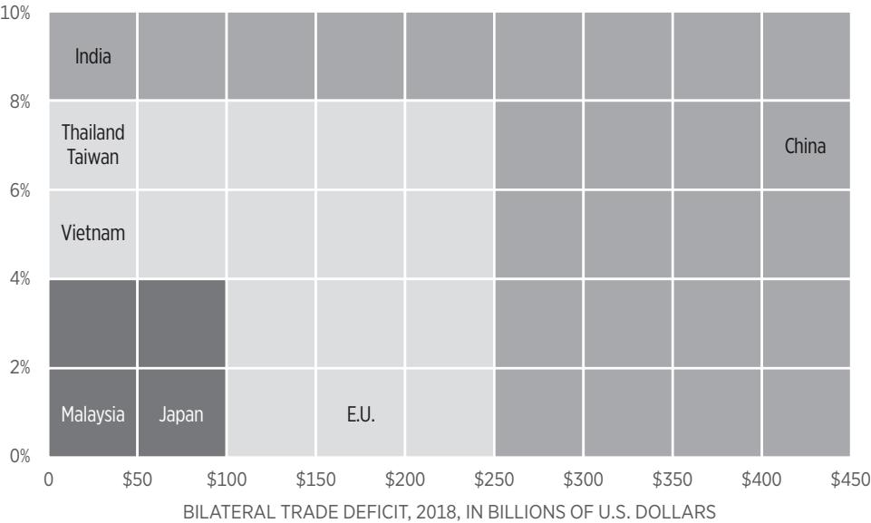
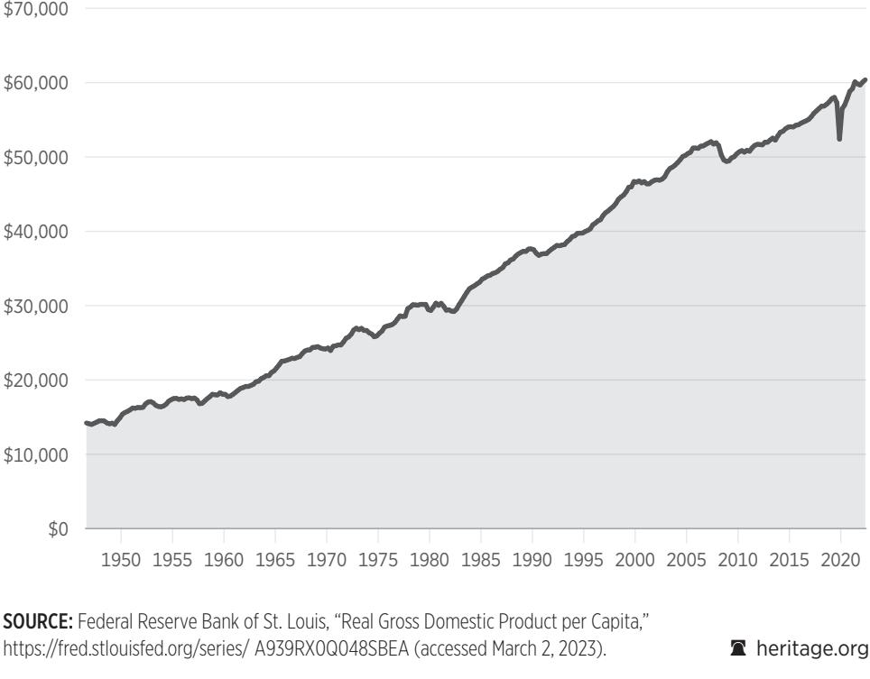
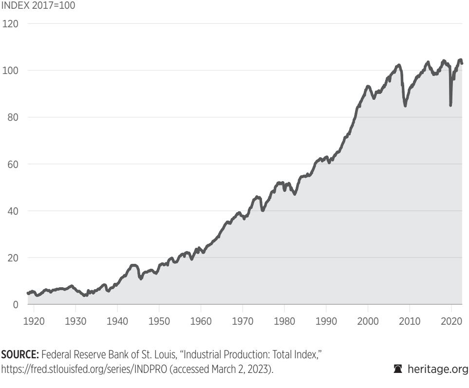

# 26: TRADE

## 26.1: THE CASE FOR FAIR TRADE

### 26.1.1: Peter Navarro

> _For decades the world has struggled with a shifting maze of punitive tariffs, export subsidies, quotas, dollar-locked currencies, and the like. Many of these import-inhibiting and export-encouraging devices have long been employed by major exporting countries trying to amass ever larger trade surpluses._
>
> Warren Buffett, CEO, Berkshire Hathaway[^26_1]

<!--end quote-->

> _The Chinese government is implementing a comprehensive, long-term industrial strategy to ensure its global dominance…. Beijing's ultimate goal is for domestic companies to replace foreign companies as designers and manufacturers of key technology and products first at home, then abroad._
>
> U.S.–China Economic and Security Review Commission[^26_2]

The United States of America is the world's dominant superpower and remains the world's arsenal of democracy. To maintain that global positioning—and thereby best protect the homeland and our own democratic institutions—it is critical that the United States strengthen its manufacturing and defense industrial base at the same time that it increases the reliability and resilience of its globally dispersed supply chains. That will necessarily require the onshoring of a significant portion of production currently offshored by American multinational corporations.

Trade policy can and must play an essential role in an American manufacturing and defense industrial base renaissance. However, several major challenges in the international trading environment are pushing America in the opposite direction.

The first challenge is rooted in MFN: the "most favored nation" rule of the World Trade Organization (WTO). According to the MFN rule, WTO members must apply the lowest tariffs that they apply to the products of any one country to the products of every other country.[^26_3] However, WTO members can charge higher tariffs if they apply these nonreciprocal tariffs to all countries.

The practical result has been the systematic exploitation of American farmers, ranchers, manufacturers, and workers through higher tariffs institutionalized by MFN. In turn, this unfair and nonreciprocal trade has resulted in chronic U.S. trade deficits with much of the rest of the world. This systemic trade imbalance serves as a brake and bridle on both GDP growth and real wages in the American economy while encumbering the U.S. with significant foreign debt.

The second challenge is part of the broader existential threat posed by the Chinese Communist Party (CCP) in its quest for global dominance. That challenge is rooted in the CCP's continued economic aggression, which begins with mercantilist and protectionist trade policy tools such as tariffs, nontariff barriers, dumping, counterfeiting and piracy, and currency manipulation. However, Communist China's economic aggression also extends to an intricate set of industrial policies and technology transfer–forcing policies that have dramatically skewed the international trading arena.

Both the unfair, unbalanced, and nonreciprocal trade institutionalized by the WTO and Communist China's economic aggression are weakening America's manufacturing and defense industrial base even as the fragility of globally dispersed supply chains has been brought into sharp relief by the COVID-19 pandemic with its associated lock-downs and other disruptions and by the Russian invasion of Ukraine. Russian revanchism, in particular, has demonstrated once again how bad actors on the world stage can use trade policy (for example, export restraints on natural gas) as a weapon of war.

## 26.2: LAYING THE TRADE DEFICIT PREDICATE

The great football coach Bill Parcells once said, "You are what your record says you are." America's record on trade—specifically American's chronic and ever-expanding trade deficit—says that America is the globe's biggest trade loser and a victim of unfair, unbalanced, and nonreciprocal trade.

During the first year of the Biden Administration, the overall U.S. trade deficit, including goods and services, soared by 29 percent, from $654 billion in 2020 to $845 billion in 2021. [^26_4] Over the same time period, imports of consumer goods, capital goods, and the category of foods, feeds, and beverages were the highest on record, and imports of industrial supplies and materials were the highest since 2014.

---

### 26.2.1: TABLE 1: America's Trade Deficit in Goods and Services with Major Trading Partners

FY 2022 figured for selected areas, in billions of dollars

| Country         | Deficit  |
| --------------- | -------- |
| Communist China | -338.1   |
| European Union  | -192.6   |
| Mexico          | -108.2   |
| Vietnam         | -99.8    |
| Canada          | -72.4    |
| Japan           | -55.0    |
| Ireland         | -54.6    |
| Taiwan          | -41.1    |
| Thailand        | -36.6    |
| South Korea     | -35.6    |
| India           | -33.8    |
| Malaysia        | -30.9    |
| Indonesia       | -21.1    |
| Switzerland     | -19.0    |
| Total           | -1,138.0 |

**SOURCE**: Exhibit 14, "U.S. Trade in Goods by Selected Countries and Areas: 2022," in press release, "Monthly U.S. International Trade in Goods and Services, October 2022," U.S. Department of Commerce, U.S. Census Bureau, December 6, 2022, <https://www.census.gov/foreign-trade/Press-Release/ft900/ft900_2210.pdf> (accessed March 21, 2023).

---

As for the U.S. trade deficit in goods, which primarily measures manufacturing output, Table 1 catalogues that deficit for the top 13 countries plus the European Union (EU) in fiscal year (FY) 2022. Note that the trade deficit in goods with Communist China is by far the largest: It accounts for fully one-third of that deficit and is more than twice the size of the deficit with the EU.

These trade deficit statistics implicitly measure the large amounts of America's manufacturing and defense industrial base and supply chains that have been offshored to foreign lands. Such offshoring not only suppresses the real wages of American blue-collar workers and denies millions of Americans the opportunity to climb up the rungs of the ladder to the middle class, but also raises the specter of a manufacturing and defense industrial base that, unlike our experience in World Wars I and II, will not be able to provide the weapons and matériel that would be needed should America enter another major world war or seek to assist a major ally like Europe, Japan, or Taiwan. It is wise to recall Stalin's admonition that "quantity has a quality of its own." In World War II in particular, it was not just the brave soldiers, sailors, and pilots who beat the Nazis and Imperial Japan. It was America's factories—its "arsenal of democracy"—that overwhelmed the Axis forces.

In the wake of the COVID-19 pandemic, almost certainly spawned in a CCP biological weapons lab in Wuhan, China,[^26_5] global supply chains have been under significant pressures from lockdown policies, energy price shocks, and other disruptions, including labor market disruptions. At the height of the pandemic, the rising geopolitical risk associated with globalized supply chains was underscored when Communist China, which controls much of the world's pharmaceutical production and supply chains, threatened to plunge America "into a mighty sea of coronavirus" through pharmaceutical export controls [^26_6] if American politicians dared to investigate what happened at the Wuhan lab.

Add all this up, and America's trade situation and massive trade imbalances pose not only a severe economic security threat, but also a national security threat. As President Donald Trump indicated in announcing his 2017 National Security Strategy, "economic security _is_ national security."[^26_7]

## 26.3: CHALLENGE #1: UNFAIR AND NONRECIPROCAL TRADE INSTITUTIONALIZED IN WTO RULES

> _Tonight, I am also asking you to pass the United States Reciprocal Trade Act, so that if another country places an unfair tariff on an American product, we can charge them the exact same tariff on the exact same product that they sell to us._
>
> President Donald J. Trump, 2019 State of the Union Address[^26_8]

The World Trade Organization, with its 164 members, governs international trade rules. Under its most favored nation (MFN) rule, each WTO member must apply the lowest tariffs it applies to the products of any one country to the products of every other WTO country. Importantly, nothing in the MFN rule requires a WTO member to provide equal—that is, reciprocal or mirror—tariff rates to its trading partners. Rather, under MFN, WTO members can charge systematically higher tariffs to other countries to the extent negotiated in their WTO tariff schedules so long as they apply those same higher tariffs to all countries.

As a poster child for the kind of nonreciprocal tariffs that American manufacturers often face, the MFN tariff for automobiles applied by the U.S. is only 2.5 percent. In contrast, the EU charges 10 percent, Communist China 15 percent, and Brazil 35 percent. Similarly, while the U.S. applies an MFN tariff rate of 6.2 percent on the rice it buys from Malaysia, Malaysia applies an ad-valorem equivalent tariff of 40 percent on rice from the U.S. Meanwhile, European milk producers are shielded by 67 percent tariffs while American milk producers benefit only from a 15 percent tariff on foreign imports. [^26_9]

---

### 26.3.1: TABLE 2: Nonreciprocal Tariff Rates Under "Most Favored Nation" Rule

| 132-Country Sample           | Foreign Partner Applies Higher Tariff | U.S. Applies Higher Tariff | U.S. and Foreign Partner Apply Same Tariff |
| ---------------------------- | ------------------------------------- | -------------------------- | ------------------------------------------ |
| Number of HS6 Product Lines  | 467,015                               | 141,736                    | 87,319                                     |
| Percent of HS6 Product Lines | 67%                                   | 20%                        | 13%                                        |
| Tariff Differential          | 12.3%                                 | 8.7%                       | 0.0%                                       |

**NOTE**: HS6—Harmonized Commodity Description and Coding System.

**SOURCE**: United Nations Conference on Trade and Development, "Trade Analysis Information System," <https://databank.worldbank.org/source/unctad-%5E-trade-analysis-information-system-(trains)> (accessed March 21, 2023).

From the perspective of strategic game theory, the WTO's MFN rule provides little or no incentive for higher-tariff countries to lower their tariffs. Rather, under these conditions, the dominant strategy of any relatively high-tariff country is simply to maintain those high tariffs while free riding off the lower-tariff countries.

The U.S. is disproportionately harmed by the WTO's nonreciprocal tariff regime. The countries that are hurt most by the WTO's nonreciprocal tariff regime are those like the United States that charge the lowest tariffs on average. This point is illustrated in Table 2, which reports information on nonreciprocal tariffs that are applied under the MFN rule on product lines at the six-digit level of the Harmonized Commodity Description and Coding System (HS6). [^26_10]

Table 2 presents results for a broad sample of 132 countries that account for more than 60 percent of total U.S. trade and 98 percent of U.S. trade that is not covered by free trade agreements (FTAs). Within this broad sample of 132 countries, U.S. exporters face higher tariffs in 467,015 different cases compared to 141,736 cases in which the U.S. charges higher nonreciprocal rates. In other words, U.S. exporters face higher tariffs more than three times as often as the U.S. applies higher tariffs.

Moreover, when American exporters face higher tariffs, the nonreciprocal tariffs are typically much higher. As row 4 of Table 2 indicates, in the 467,015 cases in which foreign partners charge higher tariffs, the average rate applied by the foreign partners is 12.3 percentage points above the rate applied by the U.S. In contrast, in the 141,736 cases in which the U.S. charges the higher tariff, the average U.S. applied rate is only 8.7 percentage points higher than the average applied tariff of the foreign partner.

Separately, Communist China levies higher tariffs on 10 products for every one Chinese product that is subject to a U.S.-applied higher tariff.[^26_11] India's ratio is even higher at 13 to one. Further, both Communist China and India also feature significant nontariff barriers. Collectively, these higher nonreciprocal tariffs in Communist China and India block American exporters from selling goods at competitive prices to more than one-third of the world's population.

### 26.3.2: Trade Deficit Impacts of the U.S. Reciprocal Trade Act

Under current United States laws and regulations, an American President has limited ability to fight back against the higher MFN tariffs now being levied against American workers, farmers, ranchers, and manufacturers. Accordingly, behind the WTO's protective MFN shield, America's free-riding trading partners have little or no incentive to come to the bargaining table to negotiate lower tariffs.

To address this nonreciprocity stalemate, President Trump urged Congress in his 2019 State of the Union address to pass the United States Reciprocal Trade Act (USRTA).[^26_12] Under the USRTA, the President would have the authority to bring any American trading partner that is currently applying higher nonreciprocal tariffs to the negotiating table. If that trading partner refused to lower tariffs to U.S. levels, the President then would have the authority to raise U.S. tariffs to match or "mirror" the foreign partner's tariffs.

The USRTA was introduced on January 24, 2019, by then-Representative Sean Duffy (R–WI). The following month, a Harvard–Harris poll of 1,792 registered voters found that 80 percent of respondents supported the USRTA.[^26_13] As Representative Duffy noted at the time, the purpose of granting the President these authorities was not to raise tariffs. Rather, it was to give the President, working in close consultation with Congress, a sophisticated and targeted tool that he could use to force other countries to lower their tariffs and nontariff barriers.[^26_14]

Following the introduction of the USRTA, the White House Office of Trade and Manufacturing Policy (which the author directed) ran simulations to estimate the impact that implementation of the USRTA might have on the overall U.S. trade deficit in goods and the large bilateral trade deficits the U.S. runs with many of its major trading partners. The sample consisted of the same 132 trading partners used in Table 2 above. [^26_15] The results underscore the unfair and unbalanced nonreciprocal trade the U.S. is forced to accept under WTO MFN rules.

### 26.3.3: Two Scenarios

Scenario One in Table 3 assumes that our trading partners lower their applied tariff rates on specific products to U.S. levels in cases where their applied tariffs are higher. Scenario Two assumes that our trading partners refuse to lower their tariff rates to match those of the U.S. Instead, in order to uphold the principle of reciprocity, the U.S. raises its tariffs to mirror levels. To calculate the trade deficit reductions under Scenario One and Scenario Two, the analysis relied on the World Bank's SMART tariff simulator. Table 3 provides the simulation results.

#### 26.3.3.1: TABLE 3: Trade Deficit Reductions Under Alternative USRTA Scenarios (REDUCTION IN U.S. TRADE DEFICIT WITH WORLD)

| Metric                        | Scenario One: Partner Countries Match U.S. Tariff Rate | Scenario Two: U.S. Matches Partner Tariff Rates |
| ----------------------------- | ------------------------------------------------------ | ----------------------------------------------- |
| In Billions of Dollars        | $58.3                                                  | $63.6                                           |
| As Percentage of 2018 Deficit | 9.4%                                                   | 10.2%                                           |

**NOTE**: USRTA—U.S. Reciprocal Trade Act.

**SOURCE**: White House Offce of Trade and Manufacturing Policy, _The United States Reciprocal Trade Act: Estimated Job & Trade Deficit Effects_, May 2029, p. 18, <https://www.wsj.com/public/resources/documents/RTAReport.pdf?mod=article_inline> (accessed March 21, 2023).

In Scenario One, if all 132 countries were to lower their higher nonreciprocal tariffs to U.S. levels, the overall U.S. trade deficit in goods would be reduced by $58.3 billion, or about 9.4 percent of that deficit. In contrast, in Scenario Two, if these countries were to refuse to reciprocate and the U.S. were to raise its tariffs to mirror those countries' levels, the reduction in the U.S. trade deficit would be slightly larger: an estimated $63.6 billion, or 10.2 percent of the deficit. This suggests that implementing the USRTA would help to create between 350,000 and 380,000 jobs.

The slightly larger reduction in the trade deficit in Scenario Two as a result of the U.S. raising its tariffs to mirror those of its partners, as opposed to foreign countries lowering their tariffs to U.S. levels, may seem surprising to those who are steeped in Ricardian dogma and the textbook lessons of free trade. However, this result speaks to the fact that so many of America's trading partners are applying significantly higher tariffs to thousands of American products.

#### 26.3.3.2: Estimated Impacts on Key U.S. Bilateral Trade Deficits

If the USRTA were enacted, a President would likely have to prioritize which countries he should negotiate with first. One way to create such a priority list would be to choose those countries that have relatively large trade deficits with the U.S. and apply relatively high tariffs. This is illustrated in Figure 1, which maps bilateral trade deficits against tariff differentials for eight major U.S. trading partners, which account for 47.6 percent of total U.S. trade and 88.6 percent of the U.S. trade deficit in goods.

##### 26.3.3.2.1: FIGURE 1: Mapping Bilateral Trade Deficits Against Tariff Differentials (AVERAGE MOST-FREE-NATION DIFFERENTIAL, SIMPLE MEAN)

- Largest bilateral trade deficit and/or largest tariff differential (medium gray, outer cells)
  - India: 8–10%, $0–50 billion
  - China: 6–8%, $400–500 billion
- Second-to-largest bilateral trade deficit and/or second-to-largest bilateral tariff differential (light gray, inner cells)
  - Thailand: 6–8%, $0–50 billion
  - Taiwan: 6–8%, $0–50 billion
  - Vietnam: 4–6%, $0–50 billion
  - European Union: 0–2%, $150–200 billion
- Smallest bilateral trade deficit and/or smallest tariff differential (dark gray, lower-left cells)
  - Malaysia: 0–2%, $0–50 billion
  - Japan: 0–2%, $50–100 billion

> **SOURCE**: White House Office of Trade and Manufacturing Policy, _The United States Reciprocal Trade Act: Estimated Job & Trade Deficit Effects_, May 2019, p. 20, <https://www.wsj.com/public/resources/documents/RTAReport.pdf?mod=article_inline> (accessed March 21, 2023).

<!-- Accessible Description -->
> [!NOTE] Accessible Description
  > The image is a tiled scatter-plot-style grid. The horizontal axis measures the U.S. bilateral trade deficit with individual partners in 2018, labeled from $0 to $450 billion. The vertical axis ranges from 0% at the bottom to 10% at the top, reflecting the average most-free-nation differential as a simple mean. Each partner is shown as a shaded square positioned at the intersection of its deficit and percentage.
  >
  > • Countries or regions with relatively small deficits (under $100 billion) cluster on the left: Malaysia and Japan appear on the bottom row, Vietnam around the 6% line, and Thailand, Taiwan, and India at higher percentage rows (8–10%).
  > • The European Union occupies a square roughly midway along the x-axis at about $150 billion and close to the 2% line.
  > • China is the farthest to the right, near the $420–$430 billion mark and around the 8% row, indicating the largest trade deficit in the graphic.

Figure 1 shows that the USRTA priority list would include the countries in red—Communist China and India—along with trading partners in the yellow zone. This yellow zone includes the European Union, which features a very high deficit, along with Thailand, Taiwan, and Vietnam, which feature particularly high tariff differentials.

Table 4 estimates the improvement in the U.S. trade deficit under Scenario One, in which partner countries match the U.S. tariff rate under pressure from the American President, and then under Scenario Two, in which the U.S. matches the tariffs of partners that refuse to lower their tariffs. Columns 2 and 4 in Table 4, when the USRTA is applied first to Communist China and then to the EU, show the largest absolute dollar reductions in bilateral trade deficits. This results in bilateral deficit reductions in Scenario One of $18.5 billion for China and $8.0 billion for the EU. In Scenario Two, the impacts for Communist China and the EU are substantially larger: $70.6 billion and $25.3 billion, respectively.

##### 26.3.3.2.2: TABLE 4: Trade Deficit Reductions for Target Countries

|                 | SCENARIO ONE: MATCH U.S. TARIFF RATE                     | PARTNER COUNTRIES                                              | SCENARIO TWO: TARIFF RATES                               | U.S. MATCHES PARTNER                                           |
| --------------- | -------------------------------------------------------- | -------------------------------------------------------------- | -------------------------------------------------------- | -------------------------------------------------------------- |
| Country         | Projected Change in Bilateral Trade Balance ($ Billions) | Bilateral Deficit Reduction as Share of 2018 Bilateral Deficit | Projected Change in Bilateral Trade Balance ($ Billions) | Bilateral Deficit Reduction as Share of 2018 Bilateral Deficit |
| India           | 5.0                                                      | 24%                                                            | 18.7                                                     | 88%                                                            |
| Taiwan          | 1.0                                                      | 6%                                                             | 9.2                                                      | 59%                                                            |
| Vietnam         | 0.7                                                      | 2%                                                             | 17.2                                                     | 44%                                                            |
| Thailand        | 3.2                                                      | 17%                                                            | 6.4                                                      | 34%                                                            |
| Communist China | 18.5                                                     | 4%                                                             | 70.6                                                     | 17%                                                            |
| European Union  | 8.0                                                      | 5%                                                             | 25.3                                                     | 15%                                                            |
| **Total**       | **35.4**                                                 | **4%**                                                         | **45.6**                                                 | **5%**                                                         |

SOURCE: White House Office of Trade and Manufacturing Policy, _The United States Reciprocal Trade Act: Estimated Job & Trade Deficit Effects_, May 2029, p. 21, <https://www.wsj.com/public/resources/documents/RTAReport.pdf?mod=article_inline> (accessed March 21, 2023).

Note further that the largest relative dollar reductions in percent terms come from applying the USRTA first to India and then to Taiwan and Vietnam. For example, if India were to reduce its tariffs to U.S. levels, as in Scenario One, this would reduce the bilateral trade deficit with India by 24 percent. If the U.S. raised its tariffs to mirror India's levels, the result would be a far more dramatic 88 percent reduction in the U.S. bilateral trade deficit with India. Similarly, if Taiwan were to reduce its tariffs to U.S. levels, the size of the U.S. bilateral trade deficit with Taiwan would fall by 6 percent. If the U.S. imposed a mirror tariff, its bilateral trade deficit with Taiwan would fall by 59 percent.

##### 26.3.3.2.3: TABLE 5: Communist China's Categories of Economic Aggression

| China's Acts, Policies, and Practices of Economic Aggression                     | Protect China's Home Market from Competition and Imports | Expand China's Share of Global Markets | Secure and Control Core Natural Resources Globally | Dominate Traditional Manufacturing Industries | Acquire Key Technologies and IP from Other Countries and the U.S. | Capture Emerging High-Tech Industries that Drive Future Growth and Advancements in Defense Industry |
| :------------------------------------------------------------------------------- | :------------------------------------------------------: | :------------------------------------: | :------------------------------------------------: | :-------------------------------------------: | :---------------------------------------------------------------: | :-------------------------------------------------------------------------------------------------: |
| Adverse Administrative Approvals and Licensing Processes                         |                            ✓                             |                                        |                                                    |                                               |                                 ✓                                 |                                                  ✓                                                  |
| Anti-monopoly Law Extortion                                                      |                            ✓                             |                   ✓                    |                                                    |                                               |                                 ✓                                 |                                                  ✓                                                  |
| Bid-Rig Foreign Government Procurement Contracts                                 |                                                          |                   ✓                    |                                                    |                       ✓                       |                                                                   |                                                  ✓                                                  |
| "Brand Forcing" — Forced Use of Chinese Brands                                   |                            ✓                             |                                        |                                                    |                                               |                                                                   |                                                                                                     |
| Burdensome and Intrusive Testing                                                 |                            ✓                             |                                        |                                                    |                                               |                                 ✓                                 |                                                  ✓                                                  |
| Chinese Communist Party Co-opts Corporate Governance                             |                            ✓                             |                                        |                                                    |                                               |                                 ✓                                 |                                                  ✓                                                  |
| Chinese Nationals as Non-Traditional Information Collectors                      |                                                          |                   ✓                    |                                                    |                       ✓                       |                                 ✓                                 |                                                  ✓                                                  |
| Claim Sovereign Immunity on U.S. Soil to Prevent Litigation                      |                                                          |                   ✓                    |                                                    |                                               |                                                                   |                                                                                                     |
| Consolidate State-Owned Enterprises into National Champions                      |                            ✓                             |                   ✓                    |                         ✓                          |                       ✓                       |                                 ✓                                 |                                                  ✓                                                  |
| Counterfeiting and Piracy Steals Intellectual Property                           |                                                          |                   ✓                    |                                                    |                                               |                                 ✓                                 |                                                  ✓                                                  |
| Currency Manipulation and Undervaluation                                         |                            ✓                             |                   ✓                    |                                                    |                       ✓                       |                                                                   |                                                                                                     |
| Cyber-Enabled Espionage and Theft                                                |                                                          |                   ✓                    |                                                    |                       ✓                       |                                 ✓                                 |                                                  ✓                                                  |
| Data Localization Mandates                                                       |                            ✓                             |                                        |                                                    |                                               |                                 ✓                                 |                                                  ✓                                                  |
| "Debt-Trap" Financing to Developing Countries                                    |                                                          |                                        |                         ✓                          |                       ✓                       |                                                                   |                                                                                                     |
| Delays in Regulatory Approvals                                                   |                                                          |                   ✓                    |                                                    |                       ✓                       |                                                                   |                                                  ✓                                                  |
| Discriminatory Catalogues and Lists                                              |                            ✓                             |                                        |                                                    |                                               |                                 ✓                                 |                                                  ✓                                                  |
| Discriminatory Patent and Other IP Rights Restrictions                           |                            ✓                             |                   ✓                    |                                                    |                                               |                                 ✓                                 |                                                  ✓                                                  |
| Dumping Below Cost Into Foreign Markets                                          |                                                          |                   ✓                    |                                                    |                       ✓                       |                                                                   |                                                  ✓                                                  |
| Evasion of U.S. Export Control Laws                                              |                                                          |                                        |                                                    |                                               |                                 ✓                                 |                                                  ✓                                                  |
| Expert Review Panels Force Disclosure of Proprietary Information                 |                                                          |                   ✓                    |                                                    |                                               |                                 ✓                                 |                                                  ✓                                                  |
| Export Restraints Restrict Access to Raw Materials                               |                            ✓                             |                   ✓                    |                         ✓                          |                       ✓                       |                                                                   |                                                  ✓                                                  |
| Financial Support to Boost Exports and Promote Import Substitution               |                            ✓                             |                   ✓                    |                                                    |                       ✓                       |                                                                   |                                                  ✓                                                  |
| Forced Research and Development ("R&D Localization")                             |                                                          |                                        |                                                    |                                               |                                 ✓                                 |                                                  ✓                                                  |
| Foreign Ownership Restrictions Force Technology and IP Transfer                  |                                                          |                   ✓                    |                                                    |                                               |                                 ✓                                 |                                                  ✓                                                  |
| Government Procurement Restrictions                                              |                            ✓                             |                                        |                                                    |                                               |                                                                   |                                                                                                     |
| Indigenous Technology Standards                                                  |                            ✓                             |                                        |                                                    |                                               |                                 ✓                                 |                                                  ✓                                                  |
| "Junk Patent" Lawsuits                                                           |                                                          |                                        |                                                    |                                               |                                 ✓                                 |                                                                                                     |
| Lack of Transparency                                                             |                            ✓                             |                                        |                                                    |                                               |                                                                   |                                                                                                     |
| Lax and Inconsistent Labor Laws                                                  |                            ✓                             |                   ✓                    |                                                    |                       ✓                       |                                                                   |                                                                                                     |
| Monopsony Purchasing Power                                                       |                                                          |                                        |                                                    |                                               |                                 ✓                                 |                                                  ✓                                                  |
| Move the Regulatory Goalposts                                                    |                            ✓                             |                                        |                                                    |                                               |                                 ✓                                 |                                                  ✓                                                  |
| Open Source Collection of Science and Technology Information                     |                                                          |                                        |                                                    |                                               |                                 ✓                                 |                                                  ✓                                                  |
| Overcapacity Drives Out Foreign Rivals                                           |                                                          |                   ✓                    |                                                    |                       ✓                       |                                                                   |                                                  ✓                                                  |
| Physical Theft of Technologies and IP Through Economic Espionage                 |                                                          |                   ✓                    |                                                    |                       ✓                       |                                 ✓                                 |                                                  ✓                                                  |
| Placement of Chinese Employees with Foreign Joint Ventures                       |                            ✓                             |                                        |                                                    |                                               |                                                                   |                                                                                                     |
| Price Controls to Restrict Imports                                               |                            ✓                             |                                        |                                                    |                                               |                                                                   |                                                                                                     |
| "Product Hop" and "Country Hop" to Evade Antidumping and Countervailing Duties   |                                                          |                   ✓                    |                                                    |                       ✓                       |                                                                   |                                                                                                     |
| Promise Cooperation on Regional Security Issues as Bargaining Chip               |                            ✓                             |                   ✓                    |                                                    |                       ✓                       |                                                                   |                                                                                                     |
| Quotas and Tariff-Rate Quotas                                                    |                            ✓                             |                                        |                                                    |                                               |                                                                   |                                                                                                     |
| Recruitment of Science, Technology, Business, and Finance Talent                 |                                                          |                   ✓                    |                                                    |                       ✓                       |                                                                   |                                                  ✓                                                  |
| Retaliation and Retaliatory Threats                                              |                                                          |                   ✓                    |                                                    |                       ✓                       |                                 ✓                                 |                                                  ✓                                                  |
| Reverse Engineering                                                              |                                                          |                                        |                                                    |                                               |                                 ✓                                 |                                                  ✓                                                  |
| Sanitary and Phytosanitary Standards Raise Non-Tariff Barriers                   |                            ✓                             |                                        |                                                    |                                               |                                 ✓                                 |                                                  ✓                                                  |
| Secure and Controllable Technology Standards                                     |                            ✓                             |                                        |                                                    |                                               |                                 ✓                                 |                                                  ✓                                                  |
| Security Reviews Force Technology and IP Transfer                                |                            ✓                             |                                        |                                                    |                                               |                                 ✓                                 |                                                                                                     |
| Structuring Transactions to Avoid CFIUS Review of Chinese Investment in the U.S. |                                                          |                                        |                                                    |                                               |                                 ✓                                 |                                                  ✓                                                  |
| Subsidized Factor Inputs — Capital, Energy, Utilities, and Land                  |                                                          |                                        |                                                    |                                               |                                 ✓                                 |                                                  ✓                                                  |
| Tariffs                                                                          |                            ✓                             |                                        |                                                    |                                               |                                                                   |                                                                                                     |
| Technology-Seeking, State-Directed Foreign Direct Investment                     |                                                          |                   ✓                    |                                                    |                                               |                                 ✓                                 |                                                  ✓                                                  |
| Traditional Spycraft                                                             |                                                          |                                        |                                                    |                       ✓                       |                                 ✓                                 |                                                  ✓                                                  |
| Transship to Evade Antidumping and Countervailing Duties                         |                                                          |                   ✓                    |                                                    |                                               |                                                                   |                                                                                                     |
| Value-Added Tax Adjustments and Rebates Subsidize Chinese Exports                |                                                          |                   ✓                    |                                                    |                       ✓                       |                                                                   |                                                                                                     |
| Weak and Laxly Enforced Environmental Laws                                       |                                                          |                   ✓                    |                                                    |                       ✓                       |                                                                   |                                                                                                     |

**SOURCE:** White House Office of Trade and Manufacturing Policy, _How China’s Economic Aggression Threatens the Technologies and Intellectual Property of the United States and the World_, June 2018, <https://trumpwhitehouse.archives.gov/wp-content/uploads/2018/06/FINAL-China-Technology-Report-6.18.18-PDF.pdf> (accessed March 21, 2023).

These results again underscore the high degree of unfair, unbalanced, and nonreciprocal trade that currently exists between the U.S. and much of the rest of the world, which penalizes American farmers, ranchers, manufacturers, and workers because of the WTO-MFN conundrum. These simulations also demonstrate that implementation of the USRTA most likely would substantially reduce the U.S. trade deficit while creating hundreds of thousands of new jobs. These benefits notwithstanding, however, the U.S. would still face a substantial overall trade deficit and substantial bilateral trade deficits with many of its major trading partners.

Why might this be so? Because under WTO rules, America still faces numerous nonreciprocal nontariff barriers around the world. For example, one of America's largest trading partners, Japan, runs a significant bilateral trade surplus in goods with the U.S.—more than $70 billion a year. While Japan has relatively low tariffs, it ranks high on the nontariff barrier scale. In such cases, which are numerous, passage of the USRTA would likely also be very helpful in reducing nontariff barriers.

This is because under the powers provided by the USRTA, if a foreign country imposes significantly higher nontariff barriers, then the President has the authority to "negotiate and seek to enter into an agreement" that "commits the country to… eliminate its nontariff barriers."[^26_16] If the country refuses to come to the negotiating table and lower its nontariff barriers, the President has the authority to levy reciprocal duties to offset or mirror those barriers.

In summary, passage of the USRTA would go a long way toward leveling the playing field for American farmers, ranchers, manufacturers, and workers who are now forced to compete in an intrinsically unfair, unbalanced, and nonreciprocal WTO-MFN system.

Nor is the USRTA necessarily the only possible legislative way to address this issue. In 2017, then-House Speaker Paul Ryan (R–WI) and then-House Ways and Means Committee Chairman Kevin Brady (R–TX) proposed a "border adjustment tax." The proposed border adjustment would have eliminated the ability of corporations to deduct the cost of imports while eliminating the tax on income attributable to exports. This border adjustment tax would have shifted the U.S. corporate income tax from an origin-based tax applying to the production of goods and services in the United States to a destination-based tax applying to the consumption of goods and services in the U.S.

This tax—strongly opposed by American multinational corporations and bigbox retailers—not only would have leveled the playing field with respect to WTO rules, but also would have provided an innovative alternative to the application of tariffs.[^26_17] A conservative Administration might do well to look at such a tax as part of its trade agenda.

## 26.4: CHALLENGE #2: COMMUNIST CHINA'S ECONOMIC AGGRESSION AND QUEST FOR WORLD DOMINATION[^26_18]

Among all of its bilateral trade relationships, America's relationship with Communist China is the most fraught with difficulty. The problem is not just that the relentlessly mercantilist and protectionist trade policies that China has pursued ever since its accession to the WTO in 2001 have led to chronic, massive, and ever-expanding trade deficits. Communist China's economic aggression in the traditional trade policy space is further facilitated by equally aggressive industrial policies and technology transfer–forcing policies that are designed to shift the world's manufacturing and supply chains to Communist Chinese soil.

The Chinese Communist Party's policy goal is to propel the Chinese economy, but its broader goal is to strengthen Communist China's defense industrial base and associated warfighting capabilities. That China unabashedly seeks to supplant America as the world's dominant economic and military power is not in dispute. Rather, it is a prominent feature of Communist Chinese dictator Xi Jinping's rhetoric. Xi has promised that the deed will be done by 2049, the 100-year anniversary of the Communist takeover of the Mainland.[^26_19]

In light of Communist China's broader geopolitical and military agenda, the American President who takes office in January 2025 must view the U.S.–China trade relationship and associated policy reforms within the context of the broader existential threat posed by Communist China. The question is whether that next President should seek to decouple economically and financially from Communist China as America's first best response to China's unrelenting aggression or continue efforts to negotiate with an authoritarian country and brutal dictatorship with a well-established reputation for failing to abide by any agreements it enters.

### 26.4.1: Institutionalized Aggression

Table 5 depicts more than 50 types of policy aggression institutionalized by the CCP across six different categories of such aggression. Viewed as whole, the extent of Communist China's aggression is breathtaking.

At the trade policy level, Communist China relies heavily on a wide range of mercantilist and protectionist tools to protect its own markets and unfairly exploit foreign markets. These instruments of Communist Chinese trade aggression include high tariffs and nontariff barriers, currency manipulation, a heavy reliance on sweatshop labor and pollution havens, the dumping of unfairly subsidized exports, and widespread counterfeiting and piracy: Communist China is the world's largest source of counterfeit and pirated products.

In addition, Communist Chinese enterprises benefit from preferential policies that have burdened world markets with subsidized overcapacity. The resultant glut of Communist Chinese exports in turn depresses world prices and pushes foreign rivals out of the global market—steel is a major example. [^26_20] Industrial policy tools that further reinforce Communist China's mercantilist and protectionist trade policies include numerous direct and indirect subsidies to boost exports and the consolidation of heavily subsidized state-owned enterprises into "national champions" that can compete with foreign companies in both domestic and global markets.

Communist China also uses a predatory "debt trap" model of economic development aid that proffers substantial financing to developing countries in exchange for their willingness to mortgage their natural resources and allow Communist China access to their markets. The practical effect of this debt trap model is to give Communist China a competitive edge internationally that stems from its preferential access to relatively lower-cost commodities needed in the manufacturing process. These commodities range from bauxite, copper, and nickel to rarer commodities such as beryllium, titanium, and rare earth minerals.

As a complement to this debt trap gambit and to exploit its commanding share of a wide range of critical raw materials that are essential to the global supply chain and production of high-technology and high-value-added products, Communist China strategically uses protectionist export restraints, including export quotas and export duties. These export restraints thereby restrict access to raw materials such as rare earth, tungsten, and molybdenum that are essential in the high-technology production space. The result is to drive up world prices and thereby put pressure on American and other foreign downstream producers to move their operations, technologies, and jobs to Communist China. American industries that have been affected by Communist China's export restraints range from steel, chemicals, and electric cars to wind turbines, lasers, semiconductors, and refrigerants.

### 26.4.2: Technology-Forcing Policies

Table 6, extracted from the White House Office of Trade and Manufacturing Policy's report on Communist China's economic aggression,[^26_21] provides a summary of the various policies the Chinese Communist Party uses to force the transfer of the West's technologies to Communist Chinese soil. Formally, Communist Chinese industrial policy seeks to promote the "digestion, absorption, and re-innovation" of technologies and intellectual property (IP) from around the world.[^26_22]

As noted in Table 6, this policy is carried out, for example, through state-sponsored IP theft—coercive and intrusive regulatory gambits to force technology transfer, typically in exchange for limited access to the Chinese market. Communist China's looting of American technology is further enhanced by "information harvesting" conducted by Communist Chinese nationals who infiltrate U.S. universities, national laboratories, and other centers of innovation. Strategic sectors targeted by Communist Chinese economic espionage have included electronics, telecommunications, robotics, data services, pharmaceuticals, mobile phone services, satellite communications and imagery, and business application software. It has been estimated that the theft of trade secrets alone costs the U.S. "between $180 billion and $540 billion" annually.[^26_23]

Closely related to Communist China's espionage campaigns are its state-backed efforts to evade U.S. export control laws. These laws are designed to prevent the export of sensitive technologies with military applications. [^26_24] However, a significant problem facing agencies like the Departments of Commerce, Defense, and State is the growth of "dual-use" technologies, which have both military and civilian utility. For example, airplane engine technologies have an obvious commercial application. When acquired by a strategic economic and military competitor like Communist China, however, such commercial items can quickly wind up propelling the aircraft of the People's Liberation Army.

As an example of Communist China's coercive and intrusive regulatory gambits to force the transfer of foreign technologies and IP to Chinese competitors, foreign companies often must enter into joint ventures or partnerships with minority stakes in exchange for access to the Chinese market. Once a U.S. or foreign company is coerced into entering a joint venture with a Chinese partner, the door is open to the transfer of technology and IP. Similarly, a relentlessly coercive Communist China has forced American patent and technology holders to accept below-market royalty rates in licensing and other forms of below-market compensation for their technologies—and the American government has done little or nothing about it.

### 26.4.3: Information Harvesting

Every year, more than 300,000 Communist Chinese nationals attend U.S. universities or are hired at U.S. national laboratories, innovation centers, incubators, and think tanks. To put this in perspective, according to the Chinese Ministry of Education, only 20,000 American nationals were studying abroad at Chinese universities on the mainland in 2018.[^26_25] These Chinese nationals—often members (or the sons and daughters of members) of the Chinese Communist Party—now account for approximately one-third of foreign university and college students in the United States and about 25 percent of graduate students specializing in science, technology, engineering, or math (STEM).[^26_26] As a Defense Innovation Unit Experimental (DIUx) report has warned:

> Academia is an opportune environment for learning about science and technology since the cultural values of U.S. educational institutions reflect an open and free exchange of ideas. As a result, Chinese science and engineering students frequently master technologies that later become critical to key military systems, amounting over time to unintentional violations of U.S. export control laws.[^26_27]

State-backed Chinese enterprises also increasingly finance joint research programs and the construction of new research facilities on U.S. campuses. For example, Huawei, well-known within the American intelligence community as an instrument of Chinese military espionage, has partnered with the University of California–Berkeley on research that focuses on artificial intelligence and related areas such as deep learning, reinforcement learning, machine learning, natural language processing, and computer vision, all of which have important future military applications.[^26_28] In this way, UC–Berkeley, whether unwittingly or wittingly, helps to boost Communist China's capabilities and quest for military dominance.

Communist Chinese state actors are also strategically building research centers in innovation centers and hubs like Silicon Valley and Boston. Such American research has accelerated Communist China's development of hypersonic glide vehicles, which travel at speeds in excess of Mach 5 and are aimed at evading modern ballistic missile defense systems while they deliver their nuclear weapons.

### 26.4.4: Technology-Seeking, State-Financed Foreign Direct Investment (FDI)

If American entrepreneurs build it, Communist Chinese investors will come. And come they have in droves. In the words of the United States Trade Representative:

> The Chinese government directs and unfairly facilitates the systematic investment in, and acquisition of, U.S. companies and assets by Chinese companies, to obtain cutting-edge technologies and intellectual property and generate large-scale technology transfer in industries deemed important by state industrial plans. [^26_29]

Communist Chinese buyers have included most prominently state-owned enterprises, private Chinese companies with interlocking ties to the Communist Chinese state, and state-backed sovereign wealth funds. These agents of the Communist Chinese government push their foreign direct investment through vehicles that include mergers and acquisitions, seed and venture capital financing, and greenfield investing, particularly in strategically targeted high-technology industries. Since 2012, CB Insights has catalogued more than 600 high-technology investments in the United States worth close to $20 billion—with artificial intelligence, augmented and virtual reality, and robotics receiving a particular focus—by Communist China–based investors. [^26_30]

All of these behaviors raise the question of whether Communist Chinese nationals should be granted visas to penetrate our universities, think tanks, and research institutions and whether Communist Chinese capital should be allowed to invest in America's cutting-edge technology firms.

### 26.4.5: Policy Responses to Communist Chinese Aggression

It should be clear from this review that Communist China's economic aggression is both widespread and systemic. The CCP's self-proclaimed goal is to supplant the U.S. as the world's dominant economic and military superpower. The question: How should the next American President address this aggression? Policy responses range from further attempts to negotiate with the CCP to strategically decoupling economically and financially from Communist China.

### 26.4.6: The Fruitlessness of Further Negotiations

If the past is prologue, and as we learned during the Trump Administration, any further negotiations with Communist China are likely to be both fruitless and dangerous: fruitless because the CCP now has a very well-established reputation for bargaining in bad faith and dangerous because as long as the CCP's aggression continues, it will further weaken America's manufacturing and defense industrial base and global supply chains.

The record regarding Communist China's bad-faith negotiating is clear. In September 2015, President Barack Obama stood with Xi Jinping in the White House Rose Garden where Xi solemnly promised not to militarize the South China Sea and agreed that Communist China would not conduct knowingly cyber-enabled theft of intellectual property.[^26_31] Within a year, the first promise would be broken.[^26_32] As for Communist China's cyberattacks on American businesses, they have never stopped.

Upon taking office in 2017, President Trump put on hold his 2016 campaign promise to put high tariffs on Chinese products immediately. Instead, as a gesture of good faith, he sought to negotiate a comprehensive trade agreement with China that would have addressed many of the issues raised in this discussion.

By the middle of 2018, it was clear that the CCP had no intention of bargaining in good faith. As a result, on June 15, President Trump began to impose a series of tariffs [^26_33] on Chinese products that would eventually rise to cover more than $500 billion of Chinese imports. These tariffs would lead Communist China's lead negotiator, Vice Premier Liu He, to agree tentatively in April of 2019 to what would have been the most comprehensive trade deal in global history. [^26_34] On May 3, 2019, however, Liu would renege on that 150-page deal and seek its drastic re-trading. [^26_35]

Finally, on January 15, 2020, the U.S. and Communist China signed a "Phase One" deal that was a pale shadow of the original deal. [^26_36] This so-called Skinny Deal (as it was derisively and rightly called) combined proposed modest Communist Chinese reforms on issues related to forced technology transfer and intellectual property theft with promises of large-scale purchases of agricultural, manufacturing, and energy products. To date, this deal has been a predictable bust: Communist China has failed to consummate a significant fraction of its promised purchases and has made little or no progress on reforming its mercantilist, protectionist, and technology transfer–forcing policies.

The clear lesson learned in both the Obama and Trump Administrations is that Communist China will _never_ bargain in good faith with the U.S. to stop its aggression. An equally clear lesson learned by President Trump, which he was ready to implement in a second term, was that the better policy option was to decouple both economically and financially from Communist China as further negotiations would indeed be both fruitless and dangerous.

#### 26.4.6.1: TABLE 6: Vectors of Communist China's Economic Aggression in the Technology and IP Space

1. Physical Theft and Cyber-Enabled Theft of Technologies and IP
   - Physical Theft of Technologies and IP Through Economic Espionage
   - Cyber-Enabled Espionage and Theft
   - Evasion of U.S. Export Control Laws
   - Counterfeiting and Piracy
   - Reverse Engineering
2. Coercive and Intrusive Regulatory Gambits
   - Foreign Ownership Restrictions
   - Adverse Administrative Approvals and Licensing Requirements
   - Discriminatory Patent and Other IP Rights Restrictions
   - Security Reviews Force Technology and IP Transfers
   - Secure and Controllable Technology Standards
   - Data Localization Mandates
   - Burdensome and Intrusive Testing
   - Discriminatory Catalogues and Lists
   - Government Procurement Restrictions
   - Indigenous Technology Standards that Deviate from International Norms
   - Forced Research and Development
   - Antimonopoly Law Extortion
   - Expert Review Panels Force Disclosure of Proprietary Information
   - Chinese Communist Party Co-opts Corporate Governance
   - Placement of Chinese Employees with Foreign Joint Ventures
3. Economic Coercion
   - Export Restraints Restrict Access to Raw Materials
   - Monopsony Purchasing Power
4. Information Harvesting
   - Open-Source Collection of Science and Technology Information
   - Chinese Nationals in U.S. as Non-Traditional Information Collectors
   - Recruitment of Science, Technology, Business, and Finance Talent
5. State-Sponsored, Technology-Seeking Investment
   - Chinese State Actors Involved in Technology-Seeking FDI
   - Chinese Investment Vehicles Used to Acquire and Transfer U.S. Technologies and IP
     - Mergers and Acquisitions
     - Greenfield Investments
     - Seed and Venture Funding

**SOURCE**: White House Office of Trade and Manufacturing Policy, _How China's Economic Aggression Threatens the Technologies and Intellectual Property of the United States and the World_, June 2018, <https://trumpwhitehouse.archives.gov/wp-content/uploads/2018/06/FINAL-China-Technology-Report-6.18.18-PDF.pdf> (accessed March 21, 2023).

The following policy options were on the drawing board or in discussion as preparations for a potential Trump second term were being made. These options span the spectrum from purely trade-related like increasing tariffs to cutting off Communist China's access to American financial markets, research institutions, and consumers. The next American President should strongly consider adopting all of them as a package:

- Strategically expand tariffs to all Chinese products and increase tariff rates to levels that will block out "Made in China" products, and execute this strategy in a manner and at a pace that will not expose the U.S. to lack of access to essential products like key pharmaceuticals.
- Provide significant financial and tax incentives to American companies that are seeking to onshore production from Communist China to U.S. soil.
- Stop Communist China's abuse of the so-called de minimis exemption, which allows it to evade the tariffs for products valued at less than $800.
- Prohibit Communist Chinese state-owned enterprises from bidding on U.S. government procurement contracts (for example, contracts for subway and other transportation systems).
- Prohibit the use of Communist Chinese–made drones in American airspace.
- Ban all Chinese social media apps such as TikTok and WeChat, which pose significant national security risks and expose American consumers to data and identity theft.
- Prohibit all Communist Chinese investment in high-technology industries.
- Prohibit U.S. pension funds from investing in Communist Chinese stocks.
- Delist any Communist Chinese stocks that do not meet Public Company Accounting Oversight Board standards or, alternatively, close off the Chinese "A shares" stock market to U.S. investment and deregister U.S. sanctioned Communist Chinese companies.
- Prohibit the use of Hong Kong clearinghouses as transit points for American capital investing in the Chinese mainland.
- Prohibit the inclusion of Chinese sovereign bonds in U.S. investors' portfolios.
- Systematically reduce and eventually eliminate any U.S. dependence on Communist Chinese supply chains that may be used to threaten national security such as medicines, silicon chips, rare earth minerals, computer motherboards, flatscreen displays, and military components.
- Sanction any companies, including American companies like Apple, that facilitate Communist China's use of its Great Firewall surveillance and censorship capabilities.
- Order the Department of Homeland Security (DHS) and Department of Justice to contract with U.S.-owned and U.S.-operated artificial intelligence companies that are capable of detecting, identifying, and disrupting both the domestic groups' and CCP influencers' social media operations and funding streams using public information as a rapidly available offensive measure.
- Reinvigorate and expand the DHS crackdown on the CCP's use of e-sellers (including third-party sellers) and the shippers and operators of major warehouses such as Amazon, eBay, and Alibaba to flood U.S. markets with counterfeit and pirated goods.
- Compel the closure of all Confucius Institutes in the U.S., which serve as propaganda arms of the CCP.
- Significantly reduce or eliminate the issuance of visas to Chinese students or researchers to prevent espionage and information harvesting.
- Hold the CCP accountable for the COVID-19 virus, which almost certainly originated as a genetically engineered virus from the Wuhan Institute of Virology, and do so through the establishment of a presidential commission or select congressional committee that would investigate the origins of the virus; its various costs, both economically and in human life; and the possible means of collecting damages from the CCP, which are likely to rise to the trillions of dollars.

If the new U.S. President wishes to defend this country against the serious existential threat posed by Communist China, that President will adopt all of these proposals through the requisite presidential executive orders or memoranda.

### 26.4.7: Effective Trade Policy in the Real World

To conclude this analysis, it is useful to offer brief reflections on a number of key obstacles to implementing the policy initiatives recommended in this chapter. These obstacles include:

- The dogma of the Ricardian free-trade model, which has been used as propaganda to thwart the adoption of measures that seek to level the global trading field for American manufacturers, farmers, ranchers, and workers;
- The politics of trade policy, which has led to a great divide that makes trade policy reforms difficult to implement;
- The economics of trade deficits, which are not adequately understood either by the American public or by the policy-making intelligentsia; and
- The crucial role of supportive White House and Administration personnel in implementing effective trade policies.

### 26.4.8: The Dogma of Free Trade

Clearly, the fair and balanced trade orientation of this chapter runs starkly against the free trade grain of the globalist Ricardian orthodoxy, which is predicated on the theory that free trade represents the best path by which to achieve both American and global prosperity. This orthodoxy is based on the ivory tower academic conclusion that if countries trade freely among each other, each will pursue its own comparative advantages; production will be most efficient around the world; the economic pie will be bigger both for the globe and for each free trading country; and (so long as workers who lose their jobs are fairly compensated from the gains from trade) everyone will be better off.

The most obvious problem with this orthodoxy (there are many more) is that nowhere is Ricardian free trade mirrored in the real world. Instead, America trades in a world where the WTO's MFN rules are stacked against us, scofflaws like Communist China run roughshod over what meager WTO rules there are, and the United States among all of the world's developed nations is the biggest victim of the free trade Ricardian orthodoxy.

During his first term, President Donald Trump preached that there can be no free trade without fair, reciprocal, and balanced trade. He was right then, and whoever is the next President in 2025 should heed this critical principle whenever the flag of free trade is waved to prevent the adoption of needed reforms.

### 26.4.9: The Politics of Trade Policy: Who Benefits?

Today, there is a great divide among Americans that stands in the way of constructive trade policy reforms. This great divide is certainly not about a partisan desire for low taxes and a reduced regulatory burden. Rather, it is over whether our borders should be open or secure and whether it is prudent to offshore our manufacturing and defense industrial base and associated supply chains.

Those who support secure borders and seek to onshore more of American production and supply chains do so to boost the real wages of American workers and to enhance our national security. Some Americans historically have supported open borders and offshoring under the flag of the Ricardian trade model, which assumes the free flow of both labor and capital. Yet it is equally true that open borders and offshoring also help American multinational corporations to maximize their profits by minimizing their labor and environmental protection costs.

In particular, an open border policy, which allows for the unlimited migration of cheap labor, depresses American wage rates and thereby boosts corporate profits. At the same time, offshoring gives American corporations readier access to the sweatshops and pollution havens of Asia and Latin America. Our skies and water may be cleaner, and our products may be cheaper, Main Street manufacturers and workers bear the brunt of these policies.

The obvious political problem in adopting many of the policies proposed here is that they will be opposed by the special-interest groups that benefit from open borders and offshoring and that contribute lavishly to both political parties. These special-interest groups range from the hedge funds of Wall Street and tech entrepreneurs of Silicon Valley to big-box retailers that stuff their aisles particularly with cheap "Made in China" goods.

## 26.5: YES, TRADE DEFICITS MATTER

> _Our country has been behaving like an extraordinarily rich family that possesses an immense farm. In order to consume 4% more than we produce that's the trade deficit—we have, day by day, been both selling pieces of the farm and increasing the mortgage on what we still own._
>
> Warren Buffett [^26_37]

Historically, one line of attack against attempts to implement fair trade policies in the name of reducing America's massive and chronic trade deficit has been the claim that "trade deficits don't matter." The intellectual tip of this spear has often been think tanks that generate reams of analyses in support of a purely free trade (and open borders) American posture.[^26_38] Yet both common sense and several very good reasons tell us that trade deficits matter a great deal.

### 26.5.1: Economic Security

The economic security argument that trade deficits matter begins with the observation that growth in any country's real, inflation-adjusted gross domestic product (GDP) depends on only four factors: consumption, government spending, business investment, and net exports (the difference between exports and imports). Reducing a trade deficit through implementation of the U.S. Reciprocal Trade Act, the application of tariffs, or renegotiating a bad trade deal like NAFTA all represent ways to increase net exports—and thereby boost the rate of economic growth.

Suppose, for example, that under the USRTA the American President persuaded India to reduce its very high protectionist tariffs and Japan to lower its formidable nontariff barriers. America would surely sell more Florida oranges, Washington apples, California wine, Wisconsin cheese, and Harley-Davidson motorcycles. The resultant fall in the trade deficit would increase America's GDP, and the real wages of blue-collar America would rise from Seattle and Orlando to Sonoma and Milwaukee. But that's not all.

Consider, too, the investment term in the GDP growth equation. When U.S. companies offshore their production to chase cheap labor or manufacture in a "pollution haven" country like Communist China or India with lax environmental regulations, the result is reduced nonresidential fixed investment—and a GDP growth rate that is lower than it would be otherwise. Moreover, if such offshored production results in more foreign exports to the U.S.—for example, an American consumer buys a Made in Mexico Dodge Journey or Chevrolet Trax rather than a vehicle assembled in Detroit—the trade deficit rises along with the fall in investment, further reducing GDP growth.

### 26.5.2: National Security

The national security argument that trade deficits matter begins with America's national-income accounting double-entry system and this accounting identity: Any deficit in the current account caused by imbalanced trade must be offset by a surplus in the capital account, meaning foreign investment in the U.S.

In the short term, this balance-of-payments equilibrium may indeed "not matter" as foreigners return our trade-deficit dollars to American shores by seemingly benignly investing in U.S. government bonds and stocks. Of course, this infusion of foreign capital lowers American mortgage rates and keeps the stock market bullishly capitalized, which appears to be all to the good. Over time, however, running large and persistent trade deficits leads to a massive transfer of American wealth offshore into foreign hands. This wealth transfer happens as foreigners use their export dollars to buy American real estate, companies, and financial assets like the aforementioned stocks and government bonds.

The American investor Warren Buffett has referred to such wealth transfers offshore as "conquest by purchase." To Buffett, the big danger is that foreigners will eventually own so many U.S. government bonds that Americans will wind up working longer hours just to survive and service that foreign debt.

There is an even bigger national security danger, however, that Mr. Buffett has missed: an alternative conquest-by-purchase scenario. Suppose, for example, that one of the biggest holders of U.S. dollars is a rapidly militarizing strategic rival like Communist China that is intent on world hegemony. By buying up America's companies, technologies, farmland, food producers, and key elements of the domestic supply chain, Communist China can thereby gain more and more control of the U.S. manufacturing and defense-industrial base.

In this scenario, might America thereby lose a broader war for America's freedom and prosperity, not by shots fired but by American cash registers ringing up "Made in China" products? Might America even lose a broader hot war because it sent its defense industrial base abroad on the wings of a persistent trade deficit? It follows that for both economic and national security reasons, trade deficits do indeed matter. It is therefore of critical importance that we bring America's global trade back into balance through free, fair, balanced, and reciprocal trade and that we do so through the kind of policy initiatives and reforms recommended in this chapter.

## 26.6: PERSONNEL IS TRADE POLICY

Having a clear set of trade and industrial policies to achieve one's economic and national security goals, while essential, is not enough. The lessons of the Nixon, Reagan, and Trump Administrations teach us that "personnel is policy" or, in this case, that "bad personnel will mean bad trade policy."[^26_39] That is why it will be equally critical to the next President's trade policy agenda to have key personnel in place who not only have the skills to implement the policies, but also have the firm commitment to do so.

During the Trump Administration, President Trump's key policy advisers and Cabinet officials clashed on the issues of international trade and combating Communist China's economic aggression. As much as President Trump did on the trade front that was bold and innovative and as much as he achieved by challenging Communist China, too much of his trade policy was disrupted or derailed by key personnel who did not share the President's vision of fair, balanced, and reciprocal trade.

In thinking about the personnel positions that are most essential to effective implementation of trade policy, the most obvious position to get exactly right is that of the United States Trade Representative. The USTR is at least putatively the top official on trade policy, and it is critical that this position be filled wisely.

Historically, during Republican Administrations, the USTR has been a free trader who rarely challenged the protectionist and mercantilist policies of America's trading partners and typically would seek to expand global trade. The Trump Administration broke this globalist Republican tradition by appointing as USTR attorney Robert E. Lighthizer, who not only had a keen understanding of the various legal levers a President can use to advance trade policy, but also was committed to the President's fair, balanced, and reciprocal trade agenda. The next Administration should make every effort to find someone with that understanding and that commitment to fill this position.

Less obvious—but almost as important—is the need to fill the position of Under Secretary of Commerce for International Trade wisely. One of the most important functions of the International Trade Administration, which is an agency in the Department of Commerce, is to impose antidumping and countervailing duties against trade cheaters who dump products below cost into American markets or unfairly subsidize their exports. In fact, much of the cheating that does take place in the global trading arena can be addressed through such antidumping (AD) and countervailing duty (CVD) cases.

Within the West Wing itself, it is equally critical that the National Security Adviser, the Chairman of the Council of Economic Advisers (CEA), and the Director of the National Economic Council (NEC) all be aligned on trade policy. During the Trump Administration, with the notable exception of the President's third National Security Adviser, Robert O'Brien, and third CEA Chairman, Tyler Goodspeed, this regrettably was not the case.

Finally, and perhaps surprisingly, the Secretary of Defense plays a key role in trade policy, at least when it comes to advancing Section 232 cases. Under Section 232 of the Trade Expansion Act of 1962, [^26_40] the President has the authority, through tariffs or other means, to reduce imports from other countries "if the President determines that such reduction or elimination would threaten to impair the national security." As a practical matter, the Secretary of Commerce spearheads any Section 232 cases, but in order to proceed with a Section 232 case, Commerce must obtain signoff from the Secretary of Defense.

When President Trump wanted to implement steel and aluminum tariffs, he had a willing servant in Secretary of Commerce Wilbur Ross. However, Secretary of Defense James Mattis resisted. Mattis simply did not understand a key tenet of the Trump Administration: Economic security is also national security. Without vibrant steel and aluminum industries, it will be difficult for America to provide the Pentagon with the kind of weapons it needs to defend the homeland.

## 26.7: THE CASE FOR FAIR TRADE: CONCLUSION

A Harvard professor once told me during my doctoral thesis days that "if I tell you how it is, I've told you why it can't change." Despite the obvious exploitation of American farmers, ranchers, manufacturers, and workers by the international trading system and Communist Chinese aggression, powerful political forces nonetheless exist that profit from the status quo.

The stark lesson of this chapter is that America gets fleeced every day in the global marketplace both by a predatory Communist China and by an institutionally unfair and nonreciprocal WTO. Addressing these two challenges would go a long way toward restoring American greatness, both economically and militarily. Ignoring these two challenges will simply continue the parasitic draining of the American manufacturing and defense industrial base.

> Author's Note: The author alone assumes responsibility for the content of this chapter, and no views expressed herein should be attributed to any other individual. However, the author would particularly like to thank Joanna Miller for her dedicated work and significant contribution to the chapter.

## 26.8: THE CASE FOR FAIR TRADE: REFERENCES

## 26.9: THE CASE FOR FREE TRADE

### 26.9.1: Kent Lassman

Trade policy is about more than goods and services: It is a statement of American identity. Our trade policy choices reveal America's values and where we put our trust. Do we place our trust in Washington elites to revive a declining country, or do we trust in America's tradition of entrepreneurs and everyday people blazing new trails? Do we follow China by copying its strong-arm trade policies, or do we lead China and the rest of the world by forging our own path? Our trade policy decisions will tell you what we Americans really think of ourselves.

## 26.10: A CONSERVATIVE VISION FOR TRADE

The policy recommendations in this chapter reflect a belief in the strength of America's founding institutions, its economy, and its people. They are based on data showing decades of American progress with all that this implies. They also reflect a realistic understanding of the fact that trade policy has limited capabilities and is vulnerable to mission creep and regulatory capture. Policymakers should be modest about what they can accomplish through trade policy and need to exercise constant vigilance against abuses. For example:

- Trade can lower consumer prices for ordinary Americans and open new markets for American businesses and their goods.
- Trade can help American workers and businesses to specialize in what they do best—which is how they out-compete the rest of the world in technology, manufacturing, agriculture, and other areas.
- In foreign policy, trade can help to preserve and strengthen alliances.

At the same time, sound trade policy requires humility. It is not a panacea for every policy problem. Trade policy cannot favor one sector over another without causing tradeoffs that outweigh the benefits. [^26_41] Neither free trade nor protectionism will create jobs. Trade affects the types of jobs people have, but it has no long-run effect on the number of jobs. Labor force size is tied to population size more than anything else. The American people are smart and sophisticated enough to hear these truths.

It is not just conservatives who overestimate the power of trade policy. Recent progressive attempts to use trade policy to advance whole-of-government initiatives on climate, equity, and other issues will fail for the same reason that a hammer cannot turn a screw: It is the wrong tool for the job. Conservatives should be similarly skeptical of recent attempts on the Right to use progressive trade policy to punish political opponents, remake manufacturing, or accomplish other objectives for which it is not suited. The next Administration needs to end the mission creep that has all but taken over trade policy in recent years.

Trade policy works best when it sticks to trade and treats separate issues separately. Trade agreements since the North American Free Trade Agreement (NAFTA) have been increasingly burdened by trade-unrelated provisions involving labor, environmental, intellectual property, and other regulations. Where these were a side agreement to NAFTA in the 1990s, they were integrated into the main text of the United States–Mexico–Canada Agreement (USMCA) in 2019. The Indo-Pacific Economic Framework for Prosperity (IPEF) that the Biden Administration is currently pursuing consists entirely of trade-unrelated provisions: Negotiations are steering clear of trade altogether.

Trade-unrelated provisions are routinely hijacked by progressives and rent-seekers and dilute otherwise worthwhile trade agreements. They also create additional points of contention that make agreements unnecessarily difficult to pass. A conservative trade policy should limit trade-unrelated provisions in trade agreements.

This does not mean that conservatives should ignore international negotiations on labor, environment, intellectual property, and other non-trade issues. It means they are more likely to succeed by treating each of them separately rather than letting them die in committee with each providing an additional sticking point for delaying the others.

A conservative trade policy must also take seriously the reality that in a democracy, the other side holds power about half of the time, but progressives run most agencies almost all of the time. A cardinal rule in public policy is not to give yourself powers you wouldn't want your opponents to have. That means building institution-level safeguards against mission creep to limit abuses.

Foreign policy considerations are not as separate from trade as are labor or environmental standards. China deserves special consideration, as does the World Trade Organization (WTO) along with its possible successors or alternatives. While trade is not the star of American foreign policy, it does play a supporting role. It should be used to strengthen alliances to help counter China, Russia, and other threats while making economic and cultural inroads inside them. The next American President should use this aspect of trade to the nation's advantage.

### 26.10.1: Drawing from America's Roots

In 1776, nearly 90 percent of Americans were farmers. For 10 people to eat, nine had to farm. That meant fewer people could be factory workers, doctors, or teachers, or even live in cities, because they were needed on the farm. Accordingly, life expectancy was around 40 years, and literacy was 13 percent. [^26_42]

Today, fewer than 1 percent of Americans work on farms, yet America is a net exporter of food. People have infinite wants, so as rising productivity pushed some people off of farms, there were countless other jobs they could do. In true American fashion, many of these jobs were in brand new industries.

This was possible because the same can-do cultural values that inspired the American founding were accurately reflected in its new government. The U.S. Constitution created what was then the world's largest free trade area, and it did so on purpose. [^26_43] The combination of the American self-improvement ethos and the large, free internal market guaranteed by the Constitution yielded intensive growth on a scale never before seen.

Many displaced farm laborers got jobs making the very farm equipment that made intensive agricultural growth possible, from railroad networks to cotton gins. Each fed the other. Agriculture and industry are not separate; they are as interconnected as everything else in the economy. None of this could have happened had the government enacted policies to preserve full agricultural employment.

### 26.10.2: Understanding Value

Just as communication is impossible without agreedupon definitions of words, coherent policy-making is impossible without coherent categories. Policies are not likely to succeed when they try to separate an interconnected economy into arbitrary categories. The factory worker who builds a tractor does as much to boost farm production as the farmers themselves, yet economic planners put them in different categories. This problem is baked into industrial policy, as progressive planners have learned again and again.

A conservative approach to economic policy should treat value as value, whether it is created on a farm, in a factory, or in an office. A dollar of value created in manufacturing is neither more nor less valuable than a dollar of value created in agriculture or services.

### 26.10.3: Pursuing Access to Growing Markets

American history holds lessons for today's conservative trade policy. Some modern analysts see a correlation between high tariffs and high growth and confuse it for causation, [^26_44] but 19th century America teaches a different lesson.

While the Constitution banned internal tariffs in the U.S., international tariffs reached their highest levels in U.S. history during the 19th century, beginning with the 1828 Tariff of Abominations. [^26_45] At their peak in 1830, the average tariff on dutiable goods was 62 percent. [^26_46] Fortunately, however, the tariffs' distorting effects were outweighed by market growth elsewhere. The 19th century saw Western expansion and a growing population (including millions of immigrants) working for the American dream. America's growing internal free trade zone allowed for still more specialization and more trade across state borders.

America's geographic expansion ended long ago, but population growth, the U.S.-led rules-based international trading system, and the steady 75-year decline in tariffs after World War II have made possible decades of continued prosperity. Intensive growth requires specialization, and the larger the market, the more specialization is possible.

### 26.10.4: Fighting Pessimistic Bias

Farmers' share of the population continued to decline through this entire period, yet employment remained high, and the economy continued to grow. Factories were not the only beneficiaries of agriculture's productivity boom and the labor it freed; services also grew. In fact, service-sector employment surpassed manufacturing employment around 1890 far earlier than most people realize. [^26_47]

#### 26.10.4.1: CHART 1: U.S. Real GDP per Capita

REAL GROSS DOMESTIC PRODUCT PER CAPITA, IN CHAINED 2012 DOLLARS, SEASONALLY ADJUSTED ANNUAL RATE

> [!NOTE] Accessible Description
  > A shaded line chart tracks U.S. real gross domestic product (GDP) per person from 1950 through 2022. Dollar values on the vertical axis run from $0 to $70,000.
  >
  > • The dark line starts a little above $10,000 in 1950 and climbs almost continuously across the decades.
  > • There are several small dips—noticeable in the mid-1970s, early 1980s, early 1990s, and during the 2008–2009 recession—but the overall trend remains upward.
  > • After 2010 the line continues to rise, briefly drops in 2020 during the pandemic, and then rebounds to a new high at the end of the series near $60,000.
  > The graphic includes a source note citing the Federal Reserve Bank of St. Louis series “Real Gross Domestic Product per Capita.” <https://fred.stlouisfed.org/series/A939RX0Q048SBEA> (accessed March 2, 2023)

Pessimistic bias is one of the most important cultural problems that conservative policymakers need to address. In trade, as in most other areas, few people ever zoom out to see the big picture, which is one reason why so many people mistakenly believe that U.S. manufacturing and the U.S. economy are in decline.

The data do not show American economic carnage. They show more than two centuries of intensive growth, made possible by a growing internal market throughout the 19th century and a growing international market in the post–World War II era. The transition from farm to factory did not shrink the labor force or farm output. Later, the transition from factories to services did not shrink the labor force, factory output, or farm output. Both transitions affected the _types_ of jobs, not the _number_ of jobs.

Americans today can more easily afford everything from air conditioning to flat-screen televisions and smartphones, and trade is one reason why. Bigger markets mean more specialization, more innovative ideas, more customers, and more people from whom to buy.

America's official unemployment rate went as low as 3.5 percent during 2022, while real per capita gross domestic product (GDP) rose to an all-time record. Clearly, people who wanted to work were able to find work that paid well even as manufacturing jobs grew more slowly than service jobs.

## 26.11: IMPLEMENTING THE CONSERVATIVE VISION

Vision will be crucial for the next conservative Administration, but nuts-andbolts policies are also important. Making the conservative vision for trade a reality will require several actions, some of which may prove to be more difficult to achieve than others. Specifically:

- **Implement** tariff relief to help counteract inflation by reducing prices for affected goods as well as to strengthen supply chains and boost manufacturing. End Section 232, 201, and 301 tariffs. Work with Congress to pass legislation repealing those provisions so future Presidents cannot abuse them.
- **Resist** calls for more spending on trade adjustment assistance, which is often hijacked for progressive ends. Technology and changing tastes displace six times as many workers as does trade, yet those workers get no such special treatment. Displaced workers should receive the same benefits regardless of the reason.
- **Remove** never-needed supply chain restrictions, which give families fewer places to which they can turn. The recent shortage of baby formula, for example, was caused largely by heavily protectionist regulations. Strength and resilience come from openness.
- **Enact** mutual recognition policies with allies. If a product is safe enough for European or Japanese consumers, then it is safe enough for Americans as well—and vice versa. This can reduce regulatory costs and open new markets.
- **Close** the Export–Import Bank, which serves mainly to subsidize foreign buyers' purchases of goods from a handful of well-connected American manufacturers.
- **Repeal** the Jones Act, [^26_48] a century-old "Buy American" maritime law that has decimated the U.S. shipbuilding industry.
- **Work** with Congress to restore the President's Trade Promotion Authority, which would expedite the negotiation of trade agreements with the United Kingdom, Switzerland, Taiwan, the European Union, and other allies, and keep trade-unrelated provisions out of trade agreements.
- **Restore** the World Trade Organization's dispute resolution process to full strength.
- **Create** a successor to the WTO (assuming that it has been fatally wounded) that is open only to liberal democracies. This would prevent authoritarian countries like China from abusing the organization for their own ends.
- **Adopt** a multi-pronged China strategy to convince the Chinese government to reform its illiberal human rights and trade policies.
- **Rejoin** the Trans-Pacific Partnership (TPP), whose 11 members are developing institutional trade norms in an important geopolitical region without U.S. input or involvement.
- **Reorient** the proposed Indo-Pacific Economic Framework for Prosperity to focus only on trade issues, which it currently ignores in favor of progressive wish-list policies.
- **Strengthen** diplomatic pressure (in concert with allies) against Beijing's abuses. Encourage cultural and intellectual engagement with the Chinese people, remembering that blue jeans and rock 'n' roll helped to win the Cold War.

### 26.11.1: Tariff Relief

When people try something repeatedly and it still doesn't work, they should stop doing it—especially when the consequences turn out to be just what conservative economists have long predicted they would be. [^26_49] With tariffs, the proper reform is not only to get rid of the individual tariffs that have backfired, but also to build institutional safeguards against future abuse.

We are five years into the biggest experiment with tariffs since the Great Depression, and the results are in: The new tariffs raise consumer prices for ordinary Americans by about $1,200 per household every year[^26_50] and benefit only a small number of special interests. Steel and aluminum tariffs, enacted on national security grounds, angered allies. Beijing made not a single substantive reform in response to four rounds of tariffs plus an attempted Phase One agreement. The Biden Administration has left the tariffs in place and is expanding them to pursue progressive policy goals.

The first order of business for a new Administration that is focused on American workers and consumers is to repeal all tariffs enacted under Section 232 of the Trade Expansion Act of 1962[^26_51] and Sections 201 and 301 of the Trade Act of 1974.[^26_52] The President can do this unilaterally, and Congress can do it through legislation.

The second order of business requires Congress to pass legislation repealing Sections 232, 201, and 301. The U.S. Constitution places all taxing authority with Congress[^26_53] and none with the President. Congress used those provisions of law to delegate some of its taxing authority to the President because it was having trouble passing "clean" tariff legislation in the 1960s and 1970s. Unless and until this constitutional question about delegation is addressed, important reforms are available to the next Congress and the next President.

Congress faced a problem of collective action in the 1960s and 1970s. As a whole, Members generally wanted to lower tariffs, but few individual Members were willing to remove tariffs that benefited special interests in their districts. Trade bills were invariably watered down through amendments and logrolling. The thinking was that the President, whose constituency is the entire nation, would be less prone to special-interest pleading than Members of Congress would be, so Congress delegated some of its tariff-making authority to the President in 1962 and 1974 trade legislation.

Delegating tariff-making might have worked in the short run, but in the long run, it was both constitutionally dubious and ripe for abuse. That came to pass in 2018. The Section 232 steel and aluminum tariffs, invoked in 2018 against Canada, Europe, and other allies on national security grounds, raised car prices by an average of $250 per vehicle and gave America the world's highest steel prices. They also harmed the construction, canned food and beverage, and other metal-using industries.

While this may have benefited the steel industry itself, each steel job saved cost an average of $650,000 per year that had been taken from elsewhere in the economy.[^26_54] That is no way to strengthen American manufacturing. The New York Federal Reserve estimated in 2019 that the Section 301 China tariffs cost the average household $831 per year, [^26_55] a figure that has likely increased with inflation.

The new tariffs have a clear record of failure—as conservative economists almost unanimously warned would be the case. Job number one for the next Administration is to return to sensible trade policies and eliminate the destructive Trump–Biden tariffs.

### 26.11.2: Strengthening American Manufacturing

The decline of American manufacturing is a common political trope in both parties, typically invoked before a call for more government intervention. This narrative has several problems. One is that American manufacturing output is currently at an all-time high. The record was not set during World War II and not during the 1950s boom. Output did not peak when manufacturing employment peaked in 1979 or during the Reagan economic revival in the 1980s. It is actually higher now than it has ever been.

American manufacturing is buoyant because each manufacturing worker's productivity is also at an all-time high. The key to prosperity is doing more with less. The next President should ignore special interests and populist ideologues who want government to do the opposite through industrial policy, trade protectionism, and other failed progressive policies.

It takes surprisingly few people to achieve America's record-high manufacturing output—currently about 13 million people out of a workforce of more than 160 million, compared to the 1979 peak of 19.5 million people out of a workforce of 104 million.[^26_56] Productivity growth has freed the time and talents of millions of people for other, additional uses.

The belief that manufacturing has to shrink for services to grow is the zerosum fallacy against which sensible economists often warn. It is anathema to the optimism, hope, and confidence that are the natural birthright of conservatives. Growing productivity enables more output of both manufacturing and services. That is why America continues to have sustained booms and record-setting real GDP despite the long-run decline in manufacturing employment.

Economists distinguish between two types of growth: extensive and intensive. Extensive growth is the Soviet and Chinese model for manufacturing: If you have more people use more resources, they will create more output. Extensive growth is doing more with more; intensive growth is doing more with less. That is where America's superpower lies. The story of American manufacturing is one of intensive growth dating back to our agricultural origins. Conservative leaders should draw on this history to position America for continued success. With intensive growth, it is not manufacturing _or_ services; it is manufacturing _and_ services.

### 26.11.3: Retaliatory Tariffs

Raising tariffs on another country almost always invites retaliatory tariffs against the U.S. The latter tend to be directed at politically sensitive American exports. Retaliatory tariffs by both China and American allies in response to the 2018 steel tariffs were targeted primarily at American agriculture. According to the U.S. Department of Agriculture, those tariffs cost farmers $27 billion with losses concentrated particularly in heartland states. [^26_57]

Retaliatory tariffs also targeted U.S. industries that were not protected by tariffs. Many imports become inputs into U.S. manufacturing. The motorcycle maker Harley-Davidson was already facing higher production costs as domestic steel producers raised their prices to accommodate the new steel tariff. A retaliatory tariff on its motorcycles imposed by the European Union further raised its prices and hurt its export business. Harm to such innocent bystanders was another unintended (though foreseen) consequence.

#### 26.11.3.1: CHART 2: Total U.S. Industrial Production

> [!NOTE] Accessible Description
  > A shaded line chart shows the U.S. industrial production index from 1920 through 2022, with the vertical axis scaled so that 2017 equals 100.
  >
  > • The line begins near 5 in 1920, rises gradually through the 1920s, dips in the early 1930s during the Great Depression, and then climbs sharply during the late 1930s and 1940s wartime boom.
  > • After World War II the index continues upward, though with repeated cyclical dips around recessions (for example, the mid-1970s, early 1980s, early 1990s, and 2008–2009).
  > • In the 2000s the series hovers around 90–100, drops steeply to around 85 in 2009, recovers, and then plunges to about 85 again briefly in 2020 during the pandemic before rebounding to just above 100 in 2022.
  >
  > The chart cites the Federal Reserve Bank of St. Louis “Industrial Production: Total Index” as its data source. <https://fred.stlouisfed.org/series/INDPRO> (accessed March 2, 2023)

Federal Reserve research shows that the tariffs have cost about 75,000 manufacturing jobs while creating only about 1,000 jobs in the steel industry—not including the effects of the retaliatory tariffs described above.[^26_58] Higher steel prices added an average of $250 to the price of new cars, and larger trucks—the vehicle of choice in rural America—were hit even more dramatically.[^26_59]

Trade is generally a win-win for both participants. Tariffs are a lose-lose-lose game, with the tariff raiser losing affordable goods, the tariff target losing exports, and the tariff raiser losing again from retaliatory tariffs. Tariffs also have an additional overlooked hidden cost: Companies redirect resources to dodge tariffs by redesigning products, switching to more expensive suppliers, using lower-quality materials, and lobbying. This might be good for lawyers, but it is bad for the economy. These resources could have been used instead to make a better product more cheaply.

Conservatives warned against retaliation from the beginning: It was exactly what happened after the 1930 Smooth–Hawley tariffs that worsened the Great Depression.[^26_60]

### 26.11.4: Undoing the Normalization of Protectionism

Inertia is one of the strongest forces in politics. Radical new policies can become the new normal very quickly and are extremely difficult to unwind if they backfire. This happened with the Trump Administration's progressive turn on protectionism. The Biden Administration quickly undid the Trump Administration's conservative regulatory reforms but left its progressive, self-defeating trade policies in place—in many cases even strengthening them.

Two presidential Administrations is a long time in politics, and the next conservative Administration will have a tough time getting tariff relief past a bureaucracy that dislikes change and special interests that will fight hard to preserve their special privileges. But given the stakes for future American prosperity, it will be worth it.

### 26.11.5: Dealing with Disruption

It is true that trade is disruptive. Though its longrun effect on employment is approximately zero, in the short run it can cost jobs and even depopulate towns. [^26_61] America's resilience depends on its ability to adjust, but successful and timely adaptation is generally spontaneous in nature—the work of human action but not human design. Planned adjustment by governments has a much poorer track record.

Context is also important to adjustment efforts. Technological change costs approximately six times more jobs as does trade (though, again, only in the short run). [^26_62] Any argument made against trade's disruptive effects applies even more strongly to technological change, yet no one seriously argues for reversing the dramatic changes the Internet has wrought.

More than 11 million American jobs turn over through hirings, firings, retirements, layoffs, and resignations every month,[^26_63] and nearly 85 percent of all jobs turn over in the course of a year. Yet America has suffered only four bouts of double-digit unemployment during the past century. Two of them, the Great Depression and the comedown from the 1970s stagflation, were due to monetary mismanagement, not trade. [^26_64] The third, the Great Recession, was due to a financial crisis worsened by monetary mismanagement, not trade.[^26_65] The fourth was due to COVID-19 lock-downs, not trade.[^26_66]

Using trade restrictions to slow this churn is a mistake for two reasons: (1) trade is at best a minor contributor to job churn compared to other factors like technology, changing consumer tastes, inflation, and business cycles, and (2) churn is evidence of a healthy economy. Agricultural economies have low job churn and low living standards.

When people see better opportunities, they should be allowed to pursue them. To do otherwise slows economic growth, harms individual dignity, removes humanity from our policies, and can contribute to societal ills like depression, addiction, and isolation.

Trade adjustment could be made easier by regulatory reforms to remove its attendant friction. These include:

- Less restrictive zoning and permit rules;
- Occupational licensing reform;
- Automatic sunsets for new regulations; and
- A presidentially appointed Regulatory Reduction Commission that would examine the Code of Federal Regulations each year and send repeal packages to Congress that include old, obsolete, redundant, and harmful regulations.[^26_67]

People who need help should be able to get it. Progressive trade policies help only special interests while harming the very people they are supposedly intended to help.

### 26.11.6: Trade Adjustment Assistance

Trade adjustment assistance is a popular policy for aiding displaced workers. Though flawed, it is a bargaining tool that can potentially help to get sound trade policy adopted. A conservative Administration should approach trade adjustment assistance with caution and use it as a last-resort political bargaining tool and not as a first-resort policy. Funding for job training programs and the like will typically find its way to labor union slush funds, left-leaning nonprofits, and other progressive causes that will not necessarily help displaced workers.

A better approach to trade adjustment assistance, if it must be expanded, is direct cash transfers. Not only would this prevent progressive hijacking of programs and their funding, but cash is the most flexible type of aid. It treats people as adults and lets them make their own choices about their next steps. Major life decisions should be made by individuals for themselves, not for them in Washington.

Trade adjustment assistance should treat workers who lose their jobs to international trade the same as workers who lose their jobs for any other reason are treated. While that will not likely come to pass in the near future, steps in that direction are possible. Technological change displaces six times as many workers as trade displaces, yet workers displaced by technology get no special treatment. Nor should they. Unemployment remains low because it grows alongside population, and real wages continue to rise over time. Trade-displaced workers should be eligible for the same benefits for which anyone else is eligible, no more and no less.

### 26.11.7: Supply Chain Lessons from the Baby Formula Debacle

Protectionism builds weaknesses into supply chains. This was demonstrated vividly by the baby formula shortage, which may have peaked in 2022 but remains an ongoing concern.

Domestic baby formula producers benefit from a decades-old tariff that averages 17 percent, which is effectively high enough to shut imports out of the market. As if tariffs were not enough, other requirements also help to keep competition out of the market: ever-evolving labeling requirements and nutritional standards that (conveniently for domestic manufacturers) are always just slightly different from international standards. As a result, before the formula shortage in 2022, approximately 98 percent of the country's baby formula was produced domestically.

With foreign competition out of the way, other government policies helped to concentrate almost the entire domestic formula industry into four firms. Roughly 40 percent of baby formula purchases are made by state-level food assistance programs, which typically do not let families choose their own formula brands. Instead they must buy from a single producer, which guarantees producers large market shares in states where they win contracts. This situation gives incumbent producers a cozy existence but puts consumers at risk. Like all protectionist policies, the benefits are concentrated in the hands of a few producers while the costs and risks are widely distributed.

With so many eggs in so few baskets, whenever something goes wrong—which is inevitable even when nobody is at fault—families find themselves scrambling. That happened early in 2022 when contamination entered a Michigan facility that makes about 40 percent of America's baby formula. Trade protectionism all but eliminated other options for many parents, who suddenly found empty shelves and sky-high prices for an essential item that many of them were already struggling to afford—while families in other countries were unaffected.

In response, Congress passed the Formula Act[^26_68] in the summer of 2022. The act eased formula tariffs and loosened never-needed labeling requirements and other import restrictions, but it was temporary. It expired at the end of 2022, leaving families still vulnerable to the cascading consequences that ensue if one thing goes wrong at only one plant.

The baby formula debacle has two lessons for the next Administration.

- The Administration needs to attack the root of the problem. Temporary fix-it bills are better than nothing, but they leave the rot in place. The President needs to encourage bold liberalization.
- Strength comes from openness. In the real world, markets fail. Factories will get contaminated, and health inspectors will not always be as thorough as they should be. The baby formula market is essentially a natural experiment in self-sufficient industrial policy. When something went wrong, that single failure point crashed the whole system. It should not be that way, and the next President can change it.

Part of the problem is that the supply chain analogy itself causes sloppy thinking. In a chain, a link is connected only to the link ahead of it and the link behind it and not to any other links. Real-world supply chains are more like networks in which each point connects directly to countless others and is rarely more than six degrees of separation from nearly anywhere on Earth. Because market failures happen all the time, it is important to have as many connections as possible. Americans need access to more ways to adapt and reroute around failure points, especially for essential products like baby formula.

Trade protectionism makes us more vulnerable, but free trade makes our families and communities more resilient. Loosening restrictions similar to the ones that stunt the baby formula market would make it easier to navigate future crises while preventing the progressive and rent-seeking power grabs that come with every crisis, whether it is as isolated as a baby formula shortage or as expansive as a pandemic.

### 26.11.8: Mutual Recognition

A simple way to reduce friction in supply networks is mutual recognition of other industrialized countries' regulatory standards. This can be done either in a larger trade agreement or independently. For baby formula, this would mean allowing in brands that meet European Union standards even if they do not meet Food and Drug Administration (FDA) labeling requirements. Infants' nutritional needs do not change across borders. If a formula is deemed healthy for European babies, then it is also healthy for American babies. The reverse is equally true.

Mutual recognition could help to open new markets for American producers in countless industries and give American consumers access to countless new products on more competitive terms. For example, U.S. regulations require washing machine power cords to be at least six feet long, while the U.K. requires them to be at least two meters.[^26_69] The difference (about six inches) affects neither safety nor performance, but it does keep American-made washing machines out of an important foreign market. A mutual recognition policy would circumvent the problem.

Given the recent interest in increased antitrust enforcement, conservatives should embrace policies like mutual recognition that have the double benefit of increasing market competition while decreasing government's regulatory footprint.

The U.S. should enact mutual recognition agreements for a wide variety goods with the United Kingdom, European Union, Japan, South Korea, Australia, and other governments with high standards comparable to our own. This would have especially large benefits for pharmaceuticals, because America's FDA drug approval process is both slower and more expensive than those of other countries without being any safer. Americans would gain access to more and lower-cost medical treatments, and American pharmaceutical companies could defray development costs and innovate faster by gaining access to more markets, all while cutting prices.

### 26.11.9: The Jones Act

The Jones Act (Merchant Marine Act of 1920)[^26_70] requires that ships traveling between U.S. ports must be U.S.-built, U.S.-owned, and U.S.-crewed. In practice, this is an "America last" policy that has decimated the American maritime industry.[^26_71] Because of Jones Act regulations, American-built ships cost three to four times more to build than foreign-built ships cost. As a result, the entire Jones Act fleet is down to just 92 ships, many of which are old and obsolete. In fact, Jones Act–compliant shipping is so expensive that it is often cheaper for East Coast ports to import oil from Vladimir Putin's Russia than it is to send it up the coast from Houston or New Orleans. The national security (to say nothing of energy security) implications of reliance on Russia for oil and gas are obvious.

The Jones Act's original national security justifications are just as dubious. The act's goal was to guarantee a sizable fleet of American ships that could be pressed into war service if needed. Aircraft carriers and other post-1920 naval innovations have made this argument obsolete. An $800 billion defense budget has plenty of room to maintain a Navy to defend American security interests around the world. The U.S. Navy would likely prefer not to use Jones Act ships anyway, because they tend to be older and in poorer condition than its own ships or similar foreign-made but domestically owned commercial ships that could also be pressed into service.

As with many other industries, U.S. shipbuilding could be the envy of the world if it could operate in a free market, but the maritime lobby prefers a quiet, cozy existence on the dole even as it harms American consumers and national security. The next conservative Administration should unleash American potential by unilaterally enacting Jones Act exemptions wherever allowed, as currently happens most years during hurricane season, and working with Congress to repeal the Jones Act.

### 26.11.10: Trade and Inflation

The post-COVID inflation spike may be over long before the next Administration takes office, but keeping it under control should remain a high priority. Free traders should not oversell their case by saying that liberalization would solve inflation. Inflation is predominantly a monetary phenomenon, not a trade phenomenon, but tariff relief can help at the margin by immediately lowering prices on tariffed goods and slightly boosting long-term growth. [^26_72] While this would not affect the money supply, which is inflation's key variable, even rolling back the tariffs enacted since 2017 would likely have a positive effect on the Consumer Price Index.

The easiest way to curb inflation (or to create it) is for the Federal Reserve to work the monetary side of the equation, but the real output side has a similar effect on prices. Lifting trade barriers is one way to boost output. It also has the added benefit of requiring no additional spending. At the very least, this can make the Federal Reserve's job easier as the spending excesses of Congress and President Biden continue unabated in the coming years.

It is important not to oversell trade's inflation benefits as a cure-all, but at the margin, it can help. The next Administration should keep this in mind as it tries to cope with this politically volatile issue.

### 26.11.11: Trade and Foreign Policy

We have seen how trade liberalization would boost the domestic economy and make American businesses more competitive, but conservative trade policies also benefit America's foreign policy interests. Policymakers should therefore:

- Negotiate multilateral and bilateral trade agreements.
- Reform the World Trade Organization or build a successor organization with membership limited to liberal democracies.
- Repeal the Jones Act to replace Russian energy imports with domestic production.
- Develop a multifaceted, long-term China policy that takes seriously America's biggest foreign policy threat and deals with it on several fronts.

### 26.11.12: National Security

The most persuasive arguments against a market-oriented trade policy come from another national objective: national security. Protectionism and similar progressive policies tend to weaken American security, but trade creates peace. The more countries trade, the less likely they are to fight one another and the more robust their supply networks will be. Going to war with customers is bad for business.

Without a strong economic interest in continued U.S. investment and exports, for example, China's behavior would likely become increasingly less predictable and more dangerous. Anyone who thinks Chinese Communist Party (CCP) General Secretary Xi Jinping and the government in Beijing are bad actors now—which they are—should consider what would happen if the Chinese convinced liberal countries like the United States to decouple from them, leaving them free to pursue whatever policies they wish without the significant counterweight that America can provide.

That is one reason for Xi Jinping's emphasis on centralization and self-sufficiency. He does not like international pressure about his government's human rights violations and bad-faith trading policies, and decoupling from trading partners like America is one way to avoid that pressure. A less constrained China would be poorer but much more unstable and dangerous to its neighbors and to America than it would be if it still had to engage regularly with the rest of the world.

### 26.11.13: Trade Promotion Authority

Trade agreements can take years to negotiate. One way to accelerate the process is for Congress to grant the President Trade Promotion Authority (TPA). It was first granted under the 1974 Trade Act, which contains the Sections 201 and 301 tariff delegations. TPA, then called fast-track, has aided several trade agreements, including NAFTA and the USMCA, which took effect in 2020. TPA has lapsed before during slow periods in trade policy, most recently in July 2021, and remains lapsed today.

The President should work with Congress to renew TPA to rationalize negotiations for upcoming trade agreements with the United Kingdom, the European Union, and others.

Both supporters and critics have questions regarding TPA's implications for the constitutional separation of powers, and policymakers should take those questions seriously. As things currently stand, Congress has some oversight powers over the President's negotiations under TPA, but they are limited. Congress can increase its oversight by passing new legislation superseding relevant provisions of the 1974 Trade Act. However, that is a double-edged sword. A Congress that largely favors free trade could exercise oversight to keep the President on the straight and narrow in trade negotiations. A progressive Congress would instead insist that the President negotiate for as many trade-unrelated provisions as possible to benefit labor and green constituencies while pushing progressive policies on the U.S. and its trading partners.

On balance, a single voice at the negotiating table that is subject to congressional oversight is the best posture for American workers and consumers. A fractious Congress has yet to demonstrate the capacity to negotiate with other nations, but it can help to hold the Administration accountable.

### 26.11.14: Trade Agreements with the United Kingdom, European Union, and Others

Even with a renewed TPA, trade agreement negotiations will likely take years. The Trump and Biden Administrations were not inclined to start the process, so that job may well fall to the next Administration. In that sense, the delays may end up being worth it.

If there is one lodestar to follow, it is to restrict these agreements to _trade issues only_. Ever since NAFTA, trade-unrelated provisions have taken on a greater role in trade agreements. These create sticking points and are routinely hijacked by rent-seeking special interests and progressive ideologues who demand subsidies, carve-outs, and economically distorting labor and environmental standards that have nothing to do with trade. If governments are to negotiate these issues, they should do so in separate agreements so they do not torpedo efforts to liberalize and engage with allies. Trade agreements should lighten burdens, not create new ones by attempting to address non-trade issues.

Policy leaders in the United States and the United Kingdom, including experts from The Heritage Foundation and the Competitive Enterprise Institute, have prepared a model trade agreement along these lines. [^26_73] Along with TPA renewal, this would greatly reduce negotiating costs. This template is also readily adaptable for agreements with Europe and any other allies that are willing to liberalize their economies and build a stronger alliance with America. The draft U.S.–U.K. agreement includes an accession chapter to allow others to join on the same terms.

### 26.11.15: Restoring or Replacing the WTO Dispute Resolution Process

The World Trade Organization as we know it may be mortally wounded. This deprives the U.S. of the WTO's dispute resolution process, under which the U.S. it won 85 percent of the cases it brought. The WTO's slow death began under the Obama Administration, which refused to allow appointees to the WTO's appellate board, which as a consequence is now nonfunctional. Both the Trump and Biden Administrations have continued the Obama Administration's approach.

That means that every case in the dispute resolution process will sputter to a halt as parties file appeals that cannot be heard. If the WTO is no longer fit for that purpose, it may be better to look in a different direction. More than 20 years ago, a Heritage Foundation senior fellow proposed that America and other free economies should form a Global Free Trade Alliance that is open to all countries that adhere to a truly free market system with appropriate safeguards such as property rights, lack of corruption, and enforcement of contracts. [^26_74] Alongside a general agreement on low to zero tariffs, the alliance would move to reduce the effect of nontariff barriers (such as the previously noted baby formula ingredient and labeling barriers) by basing trade around the principle of mutual recognition. Such an alliance could be started by a trade agreement between the United States and, for example, the United Kingdom with an accession chapter allowing others to join if they meet the criteria.

It would be essential for a Global Free Trade Alliance to avoid the WTO's most serious problem: the exemptions from its rules that are granted to developing countries. When China joined the WTO in 2001, it was granted developing-nation status, which it continues to use to dodge rules that should apply to it. Other countries have used that status to delay needed reforms. Rule exemptions give some countries a perverse incentive to remain poor and autocratic.

A Global Free Trade Alliance would allow the U.S. to enjoy the benefits of a rules-based international trading system without the WTO's shortcomings. Negotiation costs would be lower because the countries would already be allied on many issues. In addition, there would be no separate tiers with different rules, and this would give developing countries an incentive to liberalize. In addition to being good for its own sake, liberalization would give them entry into a prestigious club that tilted toward America's orbit and away from China's.

### 26.11.16: Closing the Export–Import Bank

The Export–Import Bank (EXIM) is an unusually clear example of how vulnerable trade protectionism is to being hijacked by special interests. [^26_75] In most years, about half of EXIM's business benefits a single company, Boeing. Their relationship is so cozy that EXIM's nickname around Washington is "the Bank of Boeing."

Unlike most other agencies, EXIM has a charter that expires. Congress must renew it periodically, or else the agency will permanently close. Its current charter expires at the end of 2026. Closing this New Deal–era legacy agency would be a conservative victory on a number of fronts. It is also a winnable battle: Congress just needs to do nothing.

Conservatives have both foreign policy and economic reasons to oppose EXIM. EXIM has a long history of providing financing for authoritarian governments in China, Russia, and the Middle East that often oppose U.S. foreign policy interests, and its deals often oppose U.S. economic interests. EXIM financing also harms domestic airlines. Many EXIM financing deals enable foreign staterun airlines to buy Boeing jets at a discount. These foreign airlines, subsidized by the U.S. government, then compete directly with U.S. airlines on international routes.

More recently, the Biden Administration has expanded EXIM's mission to advance progressive policy goals, including limits on financing for projects that involve fossil fuels or contribute to climate change, preferential treatment for renewable energy projects, and quotas for projects that benefit women-owned and minority-owned businesses. All of these could raise EXIM's default rates, putting taxpayer dollars at risk.

The strongest argument in EXIM's favor is that it boosts U.S. exports by financing projects that would otherwise never receive financing. We now have evidence that this argument is false: EXIM does not finance additional exports; instead, it largely substitutes for other forms of export financing that would occur anyway.

EXIM's authorization lapsed in 2014–2015 because of conservative opposition to renewing its charter. During this lapse, EXIM maintained its existing portfolio but was unable to take on new business. Boeing reported no trouble finding alternative financing and even reported record profits during EXIM's lapse while working to fulfill a seven-year backlog of orders.[^26_76]

EXIM boasts an extremely low default rate, but that is because of selection bias. EXIM overwhelmingly takes on low-risk projects that private banks would be happy to finance, although this admittedly could change somewhat with EXIM's Biden-era mandates to finance climate and other policy-focused projects.

EXIM is also a textbook example of regulatory capture.

- It has a long record of deals with authoritarian governments.
- It subsidizes direct foreign competitors of domestic businesses.
- It has been hijacked by progressives to advance their climate and other preferred policies.
- Its beneficiaries have proven they can get adequate financing from private banks.

EXIM's charter expires at the end of 2026. The agency will close automatically unless Congress and the President decide to extend it. Closing EXIM should be one of the next Administration's easiest decisions.

### 26.11.17: Adopting a Multi-Pronged China Strategy

An effective American policy toward China needs to take a realistic view of the country, its leaders, their strengths, and the serious challenges they face. It should be comprehensive and flexible. A threatened CCP is dangerous, perhaps now more than at any time since Mao Tse-Tung, as Xi Jinping continues to use strong-arm tactics to consolidate his power and saber-rattling to challenge the international order.

At the same time, recent revelations about China's official statistics overstating its GDP by 30 percent track well with other problems that were already known.[^26_77] These include one of the world's worst demographic aging curves thanks to China's one-child policy; a population that may already be declining; an unsustainable debt load that is already causing problems; countless failed boondoggles, from empty cities to its underwhelming Belt-and-Road Initiative, that are wasting significant resources; Xi Jinping's authoritarian turn; increasing state control of the economy; and a zero-COVID policy that has sabotaged the economy and driven away foreign investment.[^26_78]

America has its problems, but it is in better shape than China on nearly every measure, especially in the long run. While the facts on the ground should inoculate the next Administration against the most strident China fearmongering circulating in the media and in Washington, that does not mean that the government in Beijing is no threat to American interests. The question is: What should we do about it?

A serious China policy will require American policymakers to integrate doctrines, institutional prerogatives, expertise, and realistic objectives. Traditional Cabinet-level bureaucracies like those at the Departments of Defense, State, and Commerce will need to work together to pursue a comprehensive American strategy. Scores of incremental, narrowly targeted policies are necessary. They will not make for good soundbites on cable news, and many will operate slowly and out of sight from most news cycles even as progress is made.

An effective China policy must also allow for adaptation because the CCP will not sit idly by. As people react to developments, America needs flexible options. Trade isolationism is inherently inflexible because it reduces the number of contact points with China.

This is a tougher political sell than loud, simplistic jeremiads, but going the extra mile to solve these difficult coordination problems is vital to America's interests. Trade and engagement with China are necessary if we are to contain the threats that China poses to its neighbors and to the U.S. The next Administration should:

#### 26.11.17.1: End China's Developing-nation Status in the WTO and other International Organizations

China is an advanced manufacturing economy and should be treated as such, even if its political and legal institutions remain those of a developing nation, to prevent it from exploiting its status to gain special privileges.

#### 26.11.17.2: Use a Target, not a Blanket

There should be actions against Chinese firms that are known to have engaged in unfair trade practices such as intellectual property theft. Rather than blanket tariffs or non-tariff barriers aimed at entire Chinese industry sectors, firms that act in bad faith should be targeted individually. This policy was employed to good effect early in the Trump Administration but was abandoned in favor of a less effective blanket tariff policy.

#### 26.11.17.3: Rejoin the Trans-Pacific Partnership

Dropping out of the Trans-Pacific Partnership agreement might have been the Trump Administration's biggest trade policy mistake. The TPP was already negotiated and would have strengthened an alliance against China, including most of its biggest trading partners in East Asia and the Americas. America's departure created tensions and infighting, distracting the U.S. and its allies from the goal at hand: countering China. The other 11 TPP countries continue, without American input or influence, under the Comprehensive and Progressive Agreement for Trans-Pacific Partnership (CPATPP) to develop a modern institutional framework to contain Chinese commercial imperialism.

Rejoining this alliance should be a top priority in the next conservative Administration's China policy. Accession negotiations are likely to be difficult, given that the CPATPP suspended several clauses that were important to the United States (such as provisions relating to patents and aspects of investor-state dispute resolution) when the U.S. pulled out of the TPP agreement in 2017.

Diplomatic and economic pressure against Beijing will be more effective when its largest trading partners work in concert. Beijing's diplomats will have a hard time employing a divide-and-conquer policy against a united front of the sort that the TPP offers.

### 26.11.18: Refocus the Indo-Pacific Economic Framework for Prosperity on Trade

President Biden began the process to create IPEF in 2022, but any agreement will likely still be under negotiation when the next Administration takes office. IPEF is similar to the TPP, but its member countries are mostly China's neighbors in Asia. Like the TPP, it seeks to create an alliance to push China toward the rule of law, but the Biden Administration so far has left trade entirely out of the agreement. Instead, the IPEF negotiations are focusing entirely on non-trade issues like climate and labor policy—issues that give progressives opportunities to impose their policies on other countries and provide rent-seeking opportunities for labor unions and politically connected businesses in renewable energy and other favored industries.

IPEF has the potential to be a powerful diplomatic tool that helps to bring countries into America's orbit and away from China's. Beijing's chauvinistic approach to foreign policy has alienated most of China's neighbors and allies. They follow along because they lack alternatives. IPEF and the TPP could offer them a way out and make it easier for China's smaller neighbors to stand up for themselves in a united front as they move toward Americanstyle institutions that protect civil, political, and economic liberties.

IPEF could do all that, and so could the TPP, but America currently has no voice in the TPP, and IPEF risks becoming little more than another tool that progressives can use to force their policy wish list on countries that don't want it. From the perspective of IPEF's members, the Biden Administration's approach is little different from Beijing's. The next Administration can give China's neighbors a better choice by refocusing IPEF on trade, dropping most of its non-trade issues, and turning it into a forum to promote democracy and strengthen alliances while pressuring Beijing to make needed reforms.

### 26.11.19: Play the long Game

It took two generations to win the Cold War, and there were many reasons for that success. The fact that the planned economy is inherently inferior to free-market capitalism played a role. So did diplomatic, military, and economic pressure from free countries. But culture was just as important, and it did not come from any government. Blue jeans and rock 'n' roll helped to win the Cold War as much as any deliberate policy did. So did images of fashion and prosperity in American movies and television shows like _Dallas_.

Such informal bottom-up processes will also play a vital role in helping to turn China from an authoritarian threat into a freer and less hostile power. It will take a long time, and the slow process will garner few headlines, but it can work. A conservative Administration will support efforts by ordinary Americans to engage with ordinary Chinese people through social networks, Internet memes, fashion, movies, student exchange programs, tourism, and more. China's leaders are set in their ways, especially with Xi Jinping presumably now in power for life, but the younger generation is more open than their parents were—more individualistic and open to change.

Effective outreach to the Chinese people will need the same humility that other sound trade policies require. Government-directed cultural and economic outreach risks being heavy-handed and could backfire. Everyone involved needs to know that the process is generational in scope and will not work overnight. At the very least, Washington should stay out of the way as much as possible when regular people want to contact each other across national, language, and cultural divides.

Each of these many components, from tariffs to trade agreements to culture, is a small part of a larger China policy. Many are not attention-grabbing and cannot be put into sound bites. Cultural engagement is not something Washington can plan. China's own demographic and debt problems, along with aging leadership and growing discontent over the zero-COVID policy, might even cause an internal collapse. American policy must therefore be prepared to face any contingency.

## 26.12: THE CASE FOR FREE TRADE: CONCLUSION

A conservative trade policy needs a conservative vision. America's founding institutions, based on free trade and entrepreneurship, have made America the world's leading economy and will help keep America strong through the next century.

However, recent departures from those principles have hurt America's economy and weakened alliances that are necessary to contain threats from Russia and China. Reaffirming those principles through policies of openness, dynamism, and free trade will boost America's economy, make us more resilient against crises, and remove opportunities for progressives and rent-seekers to use the levers of government for their own purposes. Rediscovering conservative principles on trade policy and embracing America's long history as the world's leading commercial republic are an important part of restoring a government of, by, and for the people.

> Author's Note: The preparation of this analysis could not have been completed without the valuable support of a small, sturdy, and principled community of trade policy experts. Among them, my colleagues at the Competitive Enterprise Institute, Ryan Young, Iain Murray, and Ivan Osorio were essential. The author alone is responsible for this report. No views herein should be attributed to any other individual or institution.

## 26.13: THE CASE FOR FREE TRADE: REFERENCES

[^26_1]: Warren E. Buffett and Carol J. Loomis, "America's Growing Trade Deficit Is Selling the Nation Out from Under Us. Here's a Way to Fix the Problem—And We Need to Do It Now," _Fortune_, November 10, 2003, <https://money.cnn.com/magazines/fortune/fortune_archive/2003/11/10/352872/index.htm> (accessed February 25, 2023).
[^26_2]: _2017 Annual Report to Congress of the U.S.–China Economic and Security Review Commission_, 115th Congress, 1st Session, November 2017, p. 24, <https://www.uscc.gov/sites/default/files/2019-09/2017_Annual_Report_to_Congress.pdf> (accessed February 25, 2023).
[^26_3]: JayEtta Z. Hecker, Associate Director, International Relations and Trade Issues, National Security and International Affairs Division, U.S. Government Accountability Office, "China Trade: WTO Membership and Most-Favored-Nation Status," Testimony before the Subcommittee on Trade, Committee on Ways and Means, U.S. House of Representatives, GAO/T-NSIAD-98-209, June 17, 1998, p. 1, <https://www.gao.gov/assets/t-nsiad-98-209.pdf> (accessed February 25, 2023).
[^26_4]: News release, "U.S. Trade in International Goods and Services, December and Annual 2022," U.S. Department of Commerce, Bureau of Economic Analysis, February 7, 2023, <https://www.bea.gov/news/2023/us-international-trade-goods-and-services-december-and-annual-2022> (accessed February 25, 2023); "Table 1. U.S. International Trade in Goods and Services: Exports, Imports, and Balances," U.S. Department of Commerce, Bureau of Economic Analysis, last updated November 3, 2022, <https://www.bea.gov/sites/default/files/2022-11/trad-time-series-0922.xlsx> (accessed February 25, 2023).
[^26_5]: U.S. Department of State, "Fact Sheet: Activity at the Wuhan Institute of Virology," January 15, 2021, <https://2017-2021.state.gov/fact-sheet-activity-at-the-wuhan-institute-of-virology/index.html> (accessed February 25, 2023); Interim Report, _An Analysis of the Origins of the COVID-19 Pandemic_, Minority Oversight Staff, Committee on Health, Education, Labor and Pensions, U.S. Senate, October 2022, <https://www.help.senate.gov/imo/media/doc/report_an_analysis_of_the_origins_of_covid-19_102722.pdf> (accessed February 25, 2023).
[^26_6]: Barmini Chakraborty, "China Hints at Denying Americans Life-Saving Coronavirus Drugs," Fox News, March 13, 2020,<https://www.foxnews.com/world/chinese-deny-americans-coronavirus-drugs> (accessed February 25, 2023).
[^26_7]: Jim Garamone, "Trump Announces New Whole-of-Government National Security Strategy," U.S. Department of Defense, December 18, 2017, <https://www.defense.gov/News/News-Stories/Article/Article/1399392/trump-announces-new-whole-of-government-national-security-strategy/> (accessed February 26, 2023). Emphasis added.
[^26_8]: "Remarks by President Trump in State of the Union Address," The White House, February 5, 2019, <https://trumpwhitehouse.archives.gov/briefings-statements/remarks-president-trump-state-union-address-2/> (accessed February 25, 2023).
[^26_9]: White House Office of Trade and Manufacturing Policy, _The United States Reciprocal Trade Act: Estimated Job & Trade Deficit Effects_, May 2019, <https://www.wsj.com/public/resources/documents/RTAReport.pdf?mod=article_inline> (accessed February 26, 2023); United Nations Conference on Trade and Development, "Trade Analysis Information System," <https://databank.worldbank.org/source/unctad-%5E-trade-analysis-information-system-(trains)> (accessed February 26, 2023); Trefor Moss, "China to Cut Import Tariff on Autos to 15% from 25%," _The Wall Street Journal_, updated May 22, 2018, <https://www.wsj.com/articles/china-to-cut-import-tariff-on-autos-to-15-from-25-1526980760> (accessed February 26, 2023); U.S. International Trade Commission, _Harmonized Tariff Schedule (2019 Revision 3)_, <https://hts.usitc.gov/view/release?release=2019HTSAREV3> (accessed February 26, 2023).
[^26_10]: This code is commonly used to determine customs duty classifications for goods internationally.
[^26_11]: White House Office of Trade and Manufacturing Policy, _The United States Reciprocal Trade Act: Estimated Job & Trade Deficit Effects_, p. 15.
[^26_12]: H.R.764, United States Reciprocal Trade Act, 116th Congress, introduced January 24, 2019, <https://www.congress.gov/116/bills/hr764/BILLS-116hr764ih.pdf> (accessed February 26, 2023).
[^26_13]: Harvard Center for American Political Studies and Harris Poll, "Monthly Harvard–Harris Poll: February 2019," <https://harvardharrispoll.com/wp-content/uploads/2019/02/HHP_Feb2019_RV_topline.pdf> (accessed February 26, 2023).
[^26_14]: Adam Behsudi, "Duffy Finds 18 Co-sponsors for Bill to Increase Trump's Tariff Powers," _Politico_, January 24, 2019, <https://www.politico.com/story/2019/01/24/duffy-finds-18-co-sponsors-for-bill-to-increase-trumps-trade-powers-2555509> (accessed February 26, 2023).
[^26_15]: FTAs like NAFTA represent a carve-out from the WTO's unconditional MFN rule and generally lead to tariffs that tend to be set at more reciprocal levels.
[^26_16]: H.R.764, United States Reciprocal Trade Act, § 3(b)(1) and (b)(2).
[^26_17]: Damian Paletta, "Speaker Ryan Admits Defeat, Giving up on Border Adjustment Tax," _The Washington Post_, July 27, 2017, <https://www.washingtonpost.com/news/wonk/wp/2017/07/27/paul-ryan-admits-defeat-giving-up-on-border-adjustment-tax/> (accessed February 25, 2023).
[^26_18]: This section draws on analyses in White House Office of Trade and Manufacturing Policy, _How China's Economic Aggression Threatens the Technologies and Intellectual Property of the United States and the World_, June 2018, <https://trumpwhitehouse.archives.gov/wp-content/uploads/2018/06/FINAL-China-Technology-Report-6.18.18-PDF.pdf> (accessed February 25, 2023).
[^26_19]: Bloomberg News, "Xi's Vow of World Dominance by 2049 Sends Chill Through Markets," October 26, 2022, <https://www.bloomberg.com/news/articles/2022-10-26/xi-s-vow-of-world-dominance-by-2049-sends-chill-through-markets?leadSource=uverify%20wall> (accessed February 25, 2023).
[^26_20]: Executive Office of the President, United States Trade Representative, _2017 Report to Congress on China's WTO Compliance_, January 2018, <https://ustr.gov/sites/default/files/files/Press/Reports/China%202017%20WTO%20Report.pdf> (accessed February 25, 2023).
[^26_21]: White House Office of Trade and Manufacturing Policy, _How China's Economic Aggression Threatens the Technologies and Intellectual Property of the United States and the World_.
[^26_22]: _The National Mediumand Long-Term Program for Science and Technology Development Plan (2006–2020): An Outline_, The State Council, The People's Republic of China, p. [55], <https://www.itu.int/en/ITU-D/Cybersecurity/Documents/National_Strategies_Repository/China_2006.pdf> (accessed March 21, 2023).
[^26_23]: Commission on the Theft of American Intellectual Property, _Update to the IP Commission Report: The Theft of American Intellectual Property: Reassessments of the Challenge and United States Policy_, February 2017, pp. 2, 11, and 12, <http://www.ipcommission.org/report/IP_Commission_Report_Update_2017.pdf> (accessed February 25, 2023).
[^26_24]: The laws, which have been put in place for national security purposes, have been promulgated under the Arms Export Control Act (AECA), 22 U.S.C. Ch. 39, §§ 2751–2756, 2761–2781, 2785, and 2791–27999aa-2, <https://www.law.cornell.edu/uscode/text/22/chapter-39> (accessed February 25, 2023) and the International Emergency Economic Powers Act (IEEPA), 50 U.S.C. Ch. 35, §§ 1701–1708, <https://www.law.cornell.edu/uscode/text/50/chapter-35> (accessed February 25, 2023).
[^26_25]: Ministry of Education, People's Republic of China, "Statistics on Studying in China in 2018," <http://www.moe.gov.cn/was5/web/search?searchword=Statistics+on+Studying+in+China+in+2018&channelid=254028&page=1> (accessed March 21, 2023).
[^26_26]: Michael Brown and Pavneet Singh, "China's Technology Transfer Strategy: How Chinese Investments in Emerging Technology Enable a Strategic Competitor to Access the Crown Jewels of U.S. Innovation, Updated with 2016 and 2017 Data," Defense Innovation Unit Experimental (DIUx), January 2018, <https://admin.govexec.com/media/diux_chinatechnologytransferstudy_jan_2018_(1)>.pdf> (accessed February 25, 2023). The DIUx describes itself as "the only DOD Organization focused on accelerating the adoption of commercial and dualuse technology to solve operational challenges at speed and scale." Defense Innovation Unit Experimental, "About,"<https://www.diu.mil/> (accessed February 25, 2023).
[^26_27]: Brown and Singh, "China's Technology Transfer Strategy: How Chinese Investments in Emerging Technology Enable a Strategic Competitor to Access the Crown Jewels of U.S. Innovation, Updated with 2016 and 2017 Data," p. 18.
[^26_28]: Ingrid Lunden, "Huawei Puts $1M into a New AI Research Partnership with UC Berkeley," TechCrunch, October 11, 2016, <https://techcrunch.com/2016/10/11/huawei-puts-1m-into-a-new-ai-research-partnership-with-ucberkeley/> (accessed February 25, 2023).
[^26_29]: Press release, "President Trump Announces Strong Actions to Address China's Unfair Trade," Office of the United States Trade Representative, March 22, 2018, <https://ustr.gov/about-us/policy-offices/press-office/press-releases/2018/march/president-trump-announces-strong> (accessed February 25, 2023).
[^26_30]: "From China with Love: AI, Robotics, AR/VR Are Hot Areas for Chinese Investment In US," CB Insights, August 1, 2017, <https://www.cbinsights.com/research/chinese-investment-us-tech-expert-research/> (accessed February 25, 2023).
[^26_31]: "Remarks by President Obama and President Xi of the People's Republic of China in Joint Press Conference," The White House, September 25, 2015, <https://obamawhitehouse.archives.gov/the-pressffice/2015/09/25/remarks-president-obama-and-president-xi-peoples-republic-china-joint> (accessed February 25, 2023).
[^26_32]: Ankit Panda, "It's Official: Xi Jinping Breaks His Non-Militarization Pledge in the Spratlys," _The Diplomat_, December 16, 2016, <https://thediplomat.com/2016/12/its-official-xi-jinping-breaks-his-non-militarization-pledge-in-the-spratlys/> (accessed February 25, 2023).
[^26_33]: Press release, "USTR Issues Tariffs on Chinese Products in Response to Unfair Trade Practices," Office of the United States Trade Representative, June 15, 2018, <https://ustr.gov/about-us/policy-offices/press-office/press-releases/2018/june/ustr-issues-tariffs-chinese-products> (accessed February 25, 2023).
[^26_34]: Yen Nee Lee, "'New Consensus' Reached on US–China Trade, Says Chinese Vice Premier Liu He," CNBC, updated April 5, 2019, <https://www.cnbc.com/2019/04/05/us-china-trade-new-consensus-reached-says-chinas-liu-he.html> (accessed February 25, 2023).
[^26_35]: Reuters, "China Backtracked on Nearly All Aspects of US Trade Deal: Sources," CNBC, May 8, 2019, <https://www.cnbc.com/2019/05/08/china-backtracked-on-nearly-all-aspects-of-us-trade-deal-sources.html> (accessed February 25, 2023).
[^26_36]: Fact Sheet, "Economic and Trade Agreement Between the United States of America and the People's Republic of China," Office of the United States Trade Representative, January 15, 2020, <https://ustr.gov/sites/default/files/files/agreements/phase%20one%20agreement/US_China_Agreement_Fact_Sheet.pdf> (accessed February 25, 2023).
[^26_37]: Warren Buffett, "Warren Buffett: Here's How I Would Solve the Trade Problem," _Fortune_, April 29, 2016, <http://fortune.com/2016/04/29/warren-buffett-foreign-trade/> (accessed February 25, 2023).
[^26_38]: See, for example, Jeffrey Miron, "Forget the Wall Already, It's Time for the U.S. to Have Open Borders," Cato Institute _Commentary_, July 31, 2018, <https://www.cato.org/publications/commentary/forget-wall-already-its-time-us-have-open-borders> (accessed February 25, 2023); Scott Lincicome and Alfredo Carrillo Obregon, "The (Updated) Case for Free Trade," Cato Institute _Policy Analysis_ No. 925, April 19, 2022, <https://www.cato.org/sites/cato.org/files/2022-04/PA-925_2.pdf> (accessed February 25, 2023); Katheryn Russ, "Yes, US Trade Agreements Led to Economic Gains, Especially in Services, New Report Says," Peterson Institute for International Economics, Trade and Investment Policy Watch Blog, July 20, 2021, <https://www.piie.com/blogs/trade-and-investment-policy-watch/yes-us-trade-agreements-led-economic-gains-especially> (accessed February 25, 2023); Monica de Bolle, "Why Remittance Taxes to Finance a Border Wall Are a Bad Idea…for the US," Peterson Institute for International Economics, Realtime Economics Blog, January 10, 2017, <https://www.piie.com/blogs/realtime-economic-issues-watch/why-remittance-taxes-finance-border-wall-are-bad-idea-us> (accessed February 25, 2023).

[^26_39]: This is a key theme of the author's White House memoir _Taking Back Trump's America: Why We Lost the White House and How We'll Win It Back_ (New York and Nashville: Bombardier Books, 2022).
[^26_40]: 19 U.S.C. § 1862, <https://www.law.cornell.edu/uscode/text/19/1862>(accessed February 27, 2023).
[^26_41]: For a historical example, see Douglas A. Irwin, "Did Late-Nineteenth-Century U.S. Tariffs Promote Infant Industries? Evidence from the Tinplate Industry," _Journal of Economic History_, Vol. 60, No. 2 (June 2000), pp. 336–360, <https://www.jstor.org/stable/2566374> (accessed February 21, 2023). For a recent example, see Gary Clyde Hufbauer and Eujin Jung, "The High Taxpayer Cost of 'Saving' US Jobs Through 'Made in America,'" Peterson Institute for International Economics, _Trade and Investment Policy Watch_, August 5, 2020, <https://www.piie.com/blogs/trade-and-investment-policy-watch/high-taxpayer-cost-saving-us-jobs-through-made-america> (accessed February 21, 2023).
[^26_42]: Stephen J. Dubner, "Were Colonial Americans More Literate than Americans Today?" Freakonomics, September 1, 2011, <https://freakonomics.com/2011/09/were-colonial-americans-more-literate-than-americans-today/> (accessed February 21, 2023).
[^26_43]: Randy E. Barnett and Andrew Koppelman, "The Commerce Clause: Common Interpretation," National Constitution Center,<https://constitutioncenter.org/the-constitution/articles/article-i/clauses/752> (accessed February 21, 2023); Randy E. Barnett, "The Original Meaning of the Commerce Clause," _University of Chicago Law Review_, Vol. 68, No. 1 (2001), pp. 101–147, <https://chicagounbound.uchicago.edu/cgi/viewcontent.cgi?article=5074&context=uclrev> (accessed February 21, 2023).
[^26_44]: Wells King, "Rediscovering a Genuine American System," American Compass, _Rebooting the American System_, May 4, 2020,<https://americancompass.org/rediscovering-a-genuine-american-system/> (accessed February 21, 2023). See also Phillip W. Magness and James R. Harrigan, "Henry Clay's 'American System' Is Bad News for the American Economy," American Institute for Economic Research, December 8, 2022, <https://www.aier.org/article/henry-clays-american-system-is-bad-news-for-the-american-economy/> (accessed February 21, 2023), and Iain Murray, "The Founding Fathers and Free Trade," Competitive Enterprise Institute, Open Market Blog, September 20, 2022, <https://cei.org/blog/the-founding-fathers-and-free-trade/>(accessed February 21, 2023).
[^26_45]: Douglas A. Irwin, _Clashing over Commerce: A History of U.S. Trade Policy_ (Chicago: University of Chicago Press, 2018), pp. 147–154.
[^26_46]: Ibid., p. 125.
[^26_47]: Michael Urquhart, "The Employment Shift to Services: Where Did it Come From?" U.S. Department of Labor, Bureau of Labor Statistics, _Monthly Labor Review_, Vol. 107, No. 4 (April 1984), p. 16, <https://stats.bls.gov/opub/mlr/1984/04/art2full.pdf> (accessed February 21, 2023).
[^26_48]: H.R. 10378, Merchant Marine Act of 1920, Public Law 66-261, 66th Congress, June 5, 1920, <https://govtrackus.s3.amazonaws.com/legislink/pdf/stat/41/STATUTE-41-Pg988.pdf> (accessed February 22, 2023.
[^26_49]: Tori K. Smith, "The Proof Is In: Tariffs Are Hurting the U.S.," Heritage Foundation _Commentary_, August 27, 2019, <https://www.heritage.org/trade/commentary/the-proof-tariffs-are-hurting-the-us>.
[^26_50]: Congressional Budget Office, _The Budget and Economic Outlook: 2020 to 2030_, January 2020, p. 33, <https://www.cbo.gov/publication/56073> (accessed February 21, 2023).
[^26_51]: H.R. 11970, Trade Expansion Act of 1962, Public Law No. 87-794, 87th Congress, October 11, 1962, <https://www.govinfo.gov/content/pkg/STATUTE-76/pdf/STATUTE-76-Pg872.pdf> (accessed February 22, 2023).
[^26_52]: H.R. 10710, Trade Act of 1974, Public Law No. 93-618, 93rd Congress, January 3, 1975, <https://www.congress.gov/93/statute/STATUTE-88/STATUTE-88-Pg1978-2.pdf> (accessed February 22, 2023).
[^26_53]: U.S. Constitution, Article I, Section 8, <https://constitution.congress.gov/constitution/article-1/>(accessed February 22, 2023).
[^26_55]: Mary Amiti, Stephen J. Redding, and David E. Weinstein, "New China Tariffs Increase Costs to U.S. Households," Federal Reserve Bank of New York, Liberty Street Economics Blog, May 23, 2019, <https://libertystreeteconomics.newyorkfed.org/2019/05/new-china-tariffs-increase-costs-to-us-households/> (accessed February 21, 2023).
[^26_56]: Federal Reserve Bank of St. Louis, Federal Reserve Economic Database (FRED), Series CLF16OV, "Civilian Labor Force Level,"<https://fred.stlouisfed.org/series/CLF16OV>(accessed February 21, 2023).
[^26_57]: Stephen Morgan, "Retaliatory Tariffs Reduced U.S. States' Exports of Agricultural Commodities," U.S. Department of Agriculture, Economic Research Service, _Amber Waves_, March 7, 2022, <https://www.ers.usda.gov/amber-waves/2022/march/retaliatory-tariffs-reduced-u-s-states-exports-of-agricultural-commodities/> (accessed February 21, 2023).
[^26_58]: Aaron Flaaen and Justin Pierce, "Disentangling the Effects of the 2018–2019 Tariffs on a Globally Connected U.S. Manufacturing Sector," Board of Governors of the Federal Reserve System, _Finance and Economics Discussion Series_ No. 2019-086, December 23, 2019, <https://www.federalreserve.gov/econres/feds/files/2019086pap.pdf> (accessed February 21, 2023); U.S. Department of Labor, Bureau of Labor Statistics, "Data Tools: Industries at a Glance: Primary Metal Manufacturing: NAICS 331," data extracted February 17, 2023, <https://www.bls.gov/iag/tgs/iag331.htm> (accessed February 21, 2023).
[^26_59]: Ryan Young, "Lessons from the GM layoffs: End the Tariffs and the Subsidies," Fox Business, November 28, 2018, <https://www.foxbusiness.com/markets/lessons-from-the-gm-layoffs-end-the-tariffs-and-the-subsidies> (accessed February 21, 2023).
[^26_60]: Irwin, _Clashing over Commerce_, pp. 400–410. For a book-length treatment of Smooth–Hawley, see Douglas A. Irwin, _Peddling Protectionism: Smooth–Hawley and the Great Depression_, (Princeton, NJ: Princeton University Press, 2011).
[^26_61]: Kevin D. Williamson, _Big White Ghetto: Dead Broke, Stone-Cold Stupid, and High on Rage in the Dank Wooly Wilds of the "Real America_ (Washington: Regnery, 2020).
[^26_62]: Stephen J. Hicks and Srikant Devaraj, "The Myth and Reality of Manufacturing in America," Conexus Indiana and Ball State University Center for Business and Economic Research, June 2015 and April 2017, <https://conexus.cberdata.org/files/MfgReality.pdf> (accessed February 21, 2023).
[^26_63]: Economic News Release, "Job Openings and Labor Turnover Summary," U.S. Department of Labor, Bureau of Labor Statistics, February 1, 2023, <https://www.bls.gov/news.release/jolts.nr0.htm> (accessed February 21, 2023). The release reports "Job Openings and Labor Turnover—December 2022."
[^26_64]: Allen H. Meltzer, _A History of the Federal Reserve, Volume 1: 1913–1951_ (Chicago: University of Chicago Press, 2004); Allen H. Meltzer, _A History of the Federal Reserve, Volume 2, Book 2, 1970–1986_ (Chicago: University of Chicago Press, 2014).
[^26_65]: John B. Taylor, _Getting Off Track: How Government Actions and Interventions Caused, Prolonged, and Worsened the Financial Crisis_ (Stanford, CA: Hoover Institution Press, 2009); Scott Sumner, _The Money Illusion: Market Monetarism, the Great Recession, and the Future of Monetary Policy_ (Chicago: University of Chicago Press, 2021), pp. 267–284.
[^26_66]: Federal Reserve Bank of St. Louis, Federal Reserve Economic Database (FRED), Series Unemployment Rate (UNRATE), updated February 3, 2023,<https://fred.stlouisfed.org/series/UNRATE>(accessed February 21, 2023).
[^26_67]: Ryan Young, "How to Make Sure Reformed \#NeverNeeded Regulations Stay That Way," Competitive Enterprise Institute, Open Market Blog, July 8, 2020, <https://cei.org/studies/how-to-make-sure-reformed-neverneeded-regulations-stay-that-way/> (accessed February 21, 2023).
[^26_68]: H.R. 8351, Formula Act, Public Law No. 117-160, 117th Congress, July 21, 2022, <https://www.congress.gov/117/plaws/publ160/PLAW-117publ160.pdf> (accessed February 22, 2023).
[^26_69]: Iain Murray, "A New Kind of Trade Agreement," Competitive Enterprise Institute, Open Market Blog, September 19, 2018, <https://cei.org/opeds_articles/a-new-kind-of-trade-agreement/> (accessed February 21, 2023).
[^26_70]: See note 8, _supra_.
[^26_71]: Mario Loyola, "America Last: The Grim Reality of the Jones Act," Competitive Enterprise Institute _Issue Analysis 2020_ No. 5, June 2020, <https://cei.org/sites/default/files/Mario_Loyola_-_America_Last.pdf> (accessed February 21, 2023); Patrick Tyrell, "Permanent Repeal of the Jones Act Would Be a Winning Response to COVID-19," Heritage Foundation _Commentary_, April 7, 2020, <https://www.heritage.org/trade/commentary/permanent-repeal-the-jones-act-would-be-winning-response-covid-19> .
[^26_72]: Bryan Riley, "Better Trade and Regulatory Policies Are Key to Battling High Prices," National Taxpayers Union Blog, January 12, 2023, <https://www.ntu.org/publications/detail/better-trade-and-regulatory-policies-are-key-to-battling-high-prices> (accessed February 21, 2023).
[^26_73]: Daniel Ikenson, Simon Lester, and Daniel Hannan, eds., "The Ideal U.S.–U.K. Free Trade Agreement: A Free Trader's Perspective," Initiative for Free Trade and Cato Institute, 2018, <https://www.cato.org/sites/cato.org/files/pubs/pdf/ideal-us-uk-free-trade-agreement-executive-summary-update.pdf> (accessed February 21, 2023).
[^26_74]: John Hulsman, "The World Turned Right-Side Up: A New Trading Agenda for the Age of Globalization," Heritage Foundation _Report_, January 24, 2000, <https://www.heritage.org/trade/report/the-world-turned-right-side-new-trading-agenda-the-age-globalization> .
[^26_75]: Diane Katz, "Export–Import Bank: Propaganda Versus the Facts," Heritage Foundation _Issue Brief_ No. 4430, July 13, 2015, <http://thf_media.s3.amazonaws.com/2015/pdf/IB4430.pdf> ; Ryan Young, "Ten Reasons to Abolish the Export–Import Bank: Eighty Years Is Enough," Competitive Enterprise Institute _OnPoint_ No. 195, July 15, 2014, <http://cei.org/sites/default/files/Ryan%20Young%20-%20Top%2010%20Reasons%20to%20Abolish%20Ex-Im%20%282%29.pdf> (accessed February 21, 2023).
[^26_76]: Veronique de Rugy, "Boeing Isn't Exactly Pleased with Ex–Im's Liquidation," _National Review Online_, The Corner, September 1, 2015, <https://www.nationalreview.com/corner/ex-im-bank-boeing-liquidation/> (accessed February 21, 2023).
[^26_77]: Luis Martinez, "How Much Should We Trust the Dictator's GDP Growth Estimates?" Becker–Friedman Institute for Economics at the University of Chicago, _Working Paper_ No. 2021-78, July 2021, <https://bfi.uchicago.edu/wp-content/uploads/2021/07/BFI_WP_2021-78.pdf> (accessed February 21, 2023).
[^26_78]: Nicholas R. Lardy, _The State Strikes Back: The End of Economic Reform in China?_ (Washington: Peterson Institute for International Economics, 2019); Elizabeth C. Economy, _The Third Revolution: Xi Jinping and the New Chinese State_ (Oxford and New York: Oxford University Press, 2018).
